# Ansible Vault encrypts the secret in git; Podman's default driver stores it in plaintext

Encrypting a variable with `ansible-vault` and rendering it into a Podman secret for a rootless container looks like the secret is protected end to end. It isn't, by default — verified from both the Ansible module's own source and Podman's, because the gap between "encrypted in the repo" and "encrypted on the host" is exactly the kind of thing that's easy to assume rather than check.

## Encrypting the variable

```sh
ansible-vault encrypt_string --vault-password-file vault-pass 'hunter2' --name 'db_password'
```

Per [Ansible's vault guide](https://docs.ansible.com/ansible/latest/vault_guide/vault_encrypting_content.html), that produces a block meant to be pasted straight into a vars file, `!vault` tag and all:

```yaml
db_password: !vault |
      $ANSIBLE_VAULT;1.1;AES256
      62313365396662343061393464336163383764373764613633653634306231386433626436623361
      ...
```

Committing that is safe — AES256 under the vault password — and running the playbook with `--vault-password-file`/`--ask-vault-pass`/`--vault-id` decrypts `db_password` back to `hunter2` in memory for that run, same as any other variable.

## Rendering it into a Podman secret

```yaml
- name: Create the Podman secret from the vaulted variable
  containers.podman.podman_secret:
    name: db_password
    data: "{{ db_password }}"
    skip_existing: true
  no_log: true

- name: Run a container that uses it
  containers.podman.podman_container:
    name: app
    image: localhost/app:latest
    secrets:
      - db_password
```

`data` is where the decrypted value goes — [the module's own source](https://github.com/containers/ansible-podman-collections/blob/main/plugins/modules/podman_secret.py) marks that argument `no_log=True` in its spec, so Ansible redacts it from task output at the module level already; the task-level `no_log: true` above is belt-and-suspenders for the rest of the task's output, not the only thing standing between this and a leaked value in a log. Under the hood the module runs `podman secret create db_password -` and pipes `data` to it over stdin rather than writing it to a temp file first — confirmed directly in the module's `podman_secret_create` function, not assumed.

## What actually lands on disk

This is the part worth checking rather than assuming. Per the module's own documented `driver` parameter:

> Override default secrets driver, currently podman uses `file` which is **unencrypted**.

And independently, in [`containers/common`'s own secrets code](https://github.com/containers/common/blob/main/pkg/secrets/secrets.go), the same fact appears as a source comment: *"Currently only the unencrypted filedriver is implemented."* Two independent primary sources agreeing isn't a coincidence — this is the actual documented, current behavior of the default driver, not an edge case.

```mermaid
flowchart LR
    GIT["db_password: !vault \|...<br/>safe to commit"] -->|ansible-playbook<br/>--vault-password-file| MEM[Decrypted in memory<br/>for this run only]
    MEM -->|podman_secret module<br/>data param, piped via stdin| CREATE["podman secret create<br/>db_password -"]
    CREATE --> DISK["~/.local/share/containers/storage/secrets/<br/>0600 file -- readable, not encrypted"]
    DISK -->|mounted at container start| RUNTIME["/run/secrets/db_password<br/>inside the container"]
```

"Unencrypted" cashes out to something concrete once traced through Podman's own source. `Runtime.GetSecretsStorageDir()` in [`libpod/runtime.go`](https://github.com/containers/podman/blob/main/libpod/runtime.go) resolves to `<storage GraphRoot>/secrets` — for rootless Podman that's `$HOME/.local/share/containers/storage/secrets`, [confirmed against Red Hat's own container docs for the rootless GraphRoot](../podman/root-vs-rootless-rhel10-ubuntu2604.md) in this site's own earlier entry. Not a tmpfs, not the ephemeral `$XDG_RUNTIME_DIR` a reasonable guess might land on — ordinary persistent storage, the same tree container images and layers live in, and it survives a reboot exactly like they do. Inside it, [the filedriver's own source](https://github.com/containers/common/blob/main/pkg/secrets/filedriver/filedriver.go) creates the directory `0700` and writes the secret data file `0600` — readable in full by the owning user (or root) with a plain `cat`, no decryption step involved. "Read-protected," which is the word Podman's own docs use for this driver, means Unix file permissions. It does not mean encrypted at rest.



## The actual fix, if the threat model needs one

Podman's secrets backend isn't only the `file` driver — [`containers/common`'s driver selection](https://github.com/containers/common/blob/main/pkg/secrets/secrets.go) also wires up `pass` (backed by the GPG-encrypted [`pass`](https://www.passwordstore.org/) password manager) and `shell` (an arbitrary external script). The module exposes this as `driver: pass` — genuine encryption at rest, at the cost of setting up `pass` and a GPG key on every host that needs to read the secret, which is real operational weight the default `file` driver doesn't ask for. For a lot of setups the honest tradeoff is: `file`'s Unix permissions are enough if the host itself is trusted and single-tenant, and the actual security boundary that matters is *who can log into this box at all* — not which driver rendered the secret onto its disk.

## Idempotency depends on the Podman version

Re-running the `podman_secret` task above with the same value is fine on any version — `skip_existing: true` means an existing secret is left alone. But per the module's own version check, **Podman 4.7.0+ compares the new `data` against what's already stored and recreates the secret automatically if it changed**, without needing `force`. Older Podman doesn't do that comparison — `skip_existing: true` there means a rotated vault value silently doesn't reach the container until `force: true` (which recreates unconditionally, whether the value changed or not) forces it. Worth checking `podman --version` before assuming a vault password rotation actually took effect.
