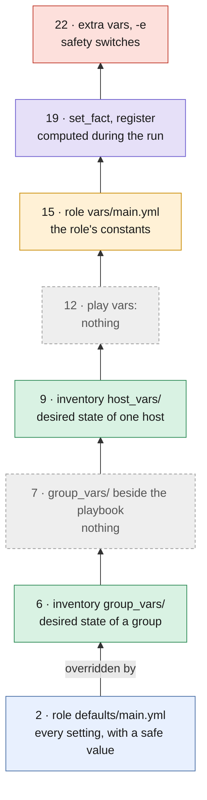

# Where a variable should live: role defaults, group_vars, host_vars, and extra vars as safety switches

Eighth entry in the Ansible inventory from scratch series. [Item 2](inventory-directory-group-vars-per-role.md) gave variables a place in the inventory, and [item 7](inventory-facts-or-variables-as-is-to-be.md) kept discovered facts out of it. Ansible accepts variables in 22 places, though, ranked by *precedence*: when two places set the same name, the higher one wins. This entry takes a playbook that uses several of them, moves each setting where the Red Hat Community of Practice's *automation good practices* say it belongs, and looks at the one place inside a role that catches people out, `vars/`. Everything below ran with ansible-core 2.21.4.

## The ranked list

A *role* is a packaged set of tasks, templates and variables that configures one thing; here, `pgconf` renders a `postgresql.conf` per host. The good practices, *Restrict your usage of variable types*, keep only a handful of the 22 places, and explain their order:

> . role defaults (defined in `defaults/main.yml`), they are... defaults and can be overwritten by anything.
> . inventory vars, they truly represent your desired state.

and, further down, *"role vars (defined in `vars/main.yml`) represent constants used by the role"*, runtime variables from `register` and `set_fact`, and *"lastly, extra_vars overwrite everything else"*. They also say to *"avoid playbook and play variables, as well as `include_vars`"*. In the precedence list of the Ansible docs, *Using Variables*, those places rank:

| Place | Rank of 22 | What belongs there |
|---|---|---|
| role `defaults/main.yml` | 2 | every setting the role reads, with a safe value |
| inventory `group_vars/` | 6 | the desired state of a group |
| `group_vars/` beside the playbook | 7 | nothing, if the inventory is the source of truth |
| inventory `host_vars/` | 9 | the desired state of one host |
| play `vars:` | 12 | nothing, by the good practices |
| role `vars/main.yml` | 15 | the role's own constants, never something a user sets |
| `set_fact`, `register` | 19 | values computed during the run |
| extra vars, `-e` | 22 | safety switches and troubleshooting, not desired state |

The same eight places as a ladder: each rung overrides every rung below it, and the colour says what belongs there.



Green is where desired state lives; grey, dashed, is what the good practices leave empty; orange sits above the inventory, which is why a role's `vars/` can't be overridden from it (below).

## A playbook with its settings in the wrong places

The messy version keeps its settings in the play, a `set_fact` and the command line:

```yaml
- name: Configure PostgreSQL, settings scattered
  hosts: postgresql
  vars:
    pgconf_max_connections: 200
  tasks:
    - name: Give db1 bigger buffers
      ansible.builtin.set_fact:
        pgconf_shared_buffers: 1GB
      when: inventory_hostname == 'db1'
    - name: Apply the role
      ansible.builtin.include_role:
        name: pgconf
```

run with `-e pgconf_port=5433`. It rendered `port = 5433 max_connections = 200 shared_buffers = 1GB` for db1, but:
- **The inventory can't see any of it.** `ansible-inventory --host db1`, which [item 6](inventory-checking-with-ansible-inventory.md) uses to check what a host gets, showed no `pgconf_*` variable at all. The port lived only in someone's shell history.
- **The inventory can't fix it either.** A `group_vars/postgresql` file setting `pgconf_max_connections: 300` was there, and `--host db1` reported 300; the rendered file still said 200. Play vars, rank 12, beat inventory `group_vars`, rank 6, and nothing in the inventory output says so.

## The same result, each setting in its place

The tidy version moves every value:
- **Role defaults** hold all the settings: `pgconf_port: 5432`, `pgconf_max_connections: 100`, `pgconf_shared_buffers: 128MB`.
- **`group_vars/postgresql/pgconf.yml`** sets `pgconf_max_connections: 200`, the desired state for every PostgreSQL server.
- **`host_vars/db1/pgconf.yml`** sets `pgconf_shared_buffers: 1GB`, for db1 alone.
- **The playbook** only says which role runs where:

```yaml
- name: Configure PostgreSQL
  hosts: postgresql
  roles:
    - role: pgconf
```

It rendered the same values, on the standard port, and `ansible-inventory --host db1` now listed them: `"pgconf_max_connections": 200, "pgconf_shared_buffers": "1GB"`. Whoever reads the inventory reads the configuration.

## group_vars beside the playbook, or inside a role

`group_vars/` isn't only read in the inventory. Ansible also reads a `group_vars/` directory next to the playbook, in the project's root folder when the playbook sits there, and ranks it just above the inventory's: playbook `group_vars/*` is 7th in the list, inventory `group_vars/*` 6th, and the same holds for `host_vars/`. The inventory guide, *Organizing host and group variables*, says it outright: *"the variables that Ansible sources relative to the playbook override the variables that it sources relative to the inventory source."*

With `pgconf_max_connections: 250` in a `group_vars/postgresql/` directory beside the tidy playbook, and 200 in the inventory's:
- **the host got 250**, from the playbook side;
- **`ansible-inventory --host db1` still said 200**: it doesn't know which playbook will run, so it reads only the inventory;
- **`--playbook-dir` with the playbook's directory showed 250**, as item 6 found.

So a `group_vars/` beside the playbook is a second, stronger source of desired state that the inventory doesn't show. In a project where the inventory directory and the playbooks are separate, keep `group_vars/` and `host_vars/` in the inventory only. A role has no `group_vars/` of its own: a `group_vars/all/` directory inside `roles/pgconf/`, setting 999, was never read. Settings a role reads go in its `defaults/`.

## Extra vars as safety switches

*Extra vars*, the variables given with `-e` on the command line, win over everything, rank 22. That makes them dangerous for desired state, which then exists only for one run, and useful for one thing the good practices name: a switch that protects a destructive step, *"something like `are_you_really_really_sure: true/false`"*. The role's defaults include `pgconf_allow_restart: false`, and its task reported *"restart skipped: pgconf_allow_restart is false"* on a normal run and *"restart allowed"* with `-e pgconf_allow_restart=true`. The role tests it with `| bool`: an extra var given as `key=value` arrives as the string `"true"`, which [part 9 of the data-shaping series](forcing-types-extra-vars-conditionals.md) explains.

## A role's vars/ beats the inventory

The second role, `pgconf_constants`, has its setting in `vars/main.yml`, `pgconf_constants_max_connections: 50`, where a default belongs. `group_vars/postgresql` set it to 300:
- `ansible-inventory --host db1` reported **300**;
- the role rendered **`max_connections = 50`**;
- with `-e pgconf_constants_max_connections=400`, it rendered **400**.

Role vars rank 15, above every inventory variable and below extra vars. The docs put it plainly: *"Anything in the vars directory of the role overrides previous versions of that variable in the namespace."* The inventory then looks right and has no effect, and the only override left is the command line, which the good practices reserve for safety switches. A role should put anything a user might set in `defaults/`, and keep `vars/` for constants, ideally with a `__` prefix, the good practices' convention for names that are internal to the role, so that no inventory variable can share their name.

## In short

- **Settings a role reads:** `defaults/main.yml`, every one, with a safe value.
- **Desired state:** `group_vars/` and `host_vars/` in the inventory, where `ansible-inventory` shows it; not beside the playbook, where they silently win.
- **Not in the playbook:** play `vars:` and `set_fact` hide settings from the inventory and override it.
- **Role `vars/`:** constants only; a user-facing value there silently beats the inventory.
- **Extra vars:** safety switches and troubleshooting, tested with `| bool`.

## The example repository

The series' companion repository, [abdelhousni/ansible-inventory-series](https://github.com/abdelhousni/ansible-inventory-series/tree/main/08-where-variables-live), holds both roles and both versions. `run.sh` renders the messy and tidy versions into its `out/` directory, prints what `ansible-inventory --host db1` shows for each, runs the safety switch both ways, and compares the `vars/` role's value with the inventory's and with `-e`. Its CI runs it on every push and compares the output with the expected one.

## Sources

- Red Hat Community of Practice, [automation good practices](https://github.com/redhat-cop/automation-good-practices): `inventories/README.adoc`, *Restrict your usage of variable types* and *Prefer inventory variables over extra vars to describe the desired state*; `roles/README.adoc`, on the `__` prefix for internal variables.
- Ansible docs, from [ansible/ansible-documentation](https://github.com/ansible/ansible-documentation): `playbook_guide/playbooks_variables.rst` (*Understanding variable precedence*) and `inventory_guide/intro_inventory.rst` (*Organizing host and group variables*).
- Every result above came from ansible-core 2.21.4 on 2026-10-03, on the local machine.
