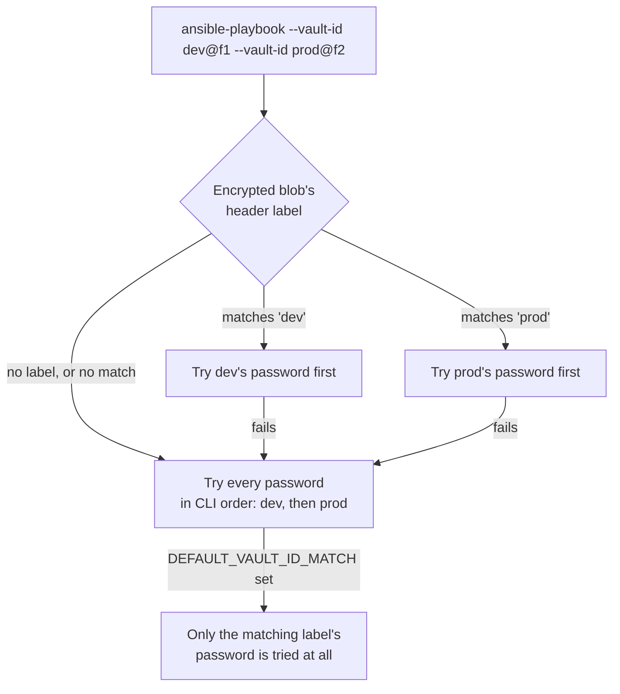
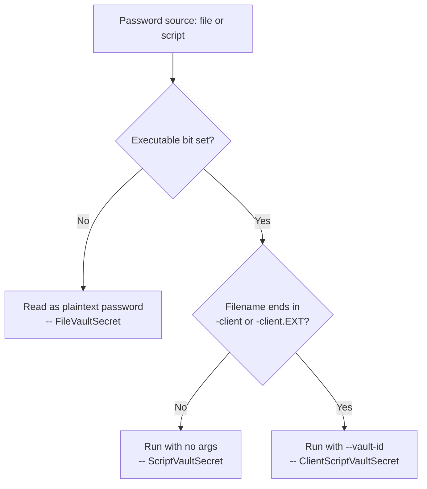

# What Ansible Vault actually encrypts, and where that protection stops

[Ansible's own vault guide](https://docs.ansible.com/ansible/latest/vault_guide/vault.html) opens with a warning worth reading before anything else about the tool: "Encryption with Ansible Vault ONLY protects 'data at rest'." That's a precise boundary, not a vague caveat, and it's worth tracing exactly where it falls — both what "at rest" covers on the encrypting side (there's more than one granularity, and the choice isn't reversible after the fact) and where it stops on the decrypting side, in three ordinary places that are easy not to think about.

## Two granularities, and only one survives a password rotation

`ansible-vault encrypt_string` encrypts a single value into a line that goes straight into an otherwise plain YAML file:

```sh
ansible-vault encrypt_string --vault-password-file vault-pass 'hunter2' --name 'db_password'
```

```yaml
db_password: !vault |
      $ANSIBLE_VAULT;1.1;AES256
      62313365396662343061393464336163383764373764613633653634306231386433626436623361
      ...
```

`ansible-vault create`/`encrypt` takes the other extreme — the entire file, whatever it contains, becomes ciphertext. Per [Ansible's own comparison](https://docs.ansible.com/ansible/latest/vault_guide/vault_encrypting_content.html), the two aren't just a size difference:

| | Encrypted variable | Encrypted file |
|---|---|---|
| How much is encrypted | Just the variable | The entire file |
| When it's decrypted | On demand, only when needed | Whenever loaded or referenced |
| Password rotation | Not supported — you cannot rekey a variable | `ansible-vault rekey` |

That middle row matters more than it looks: *"Ansible cannot know if it needs content from an encrypted file unless it decrypts the file, so it decrypts all encrypted files referenced in your playbooks and roles"* — a single unused variable buried in an otherwise-irrelevant encrypted vars file still costs a full decrypt on every run that references the file at all. And the rekey row is a one-way door: pick `encrypt_string` for a value, and if that password ever needs rotating, the fix is deleting the old block and re-encrypting the plaintext with the new password, not running a rekey command against it.

## Keeping vaulted variable names readable

Full-file encryption's real cost isn't the decrypt overhead — it's that the file stops being `grep`-able. [Ansible's own tips guide](https://github.com/ansible/ansible-documentation/blob/devel/docs/docsite/rst/tips_tricks/ansible_tips_tricks.rst) documents the standard way around that, verbatim:

1. Create a `group_vars/` subdirectory named after the group.
2. Inside it, create two files named `vars` and `vault`.
3. In `vars`, define all the variables needed, including the sensitive ones.
4. Copy the sensitive ones into `vault`, prefixed `vault_`.
5. Point `vars` at them: `db_password: "{{ vault_db_password }}"`.
6. Encrypt `vault`. Use the name from `vars` everywhere else.

*"When running a playbook, Ansible finds the variables in the unencrypted file, which pulls the sensitive variable values from the encrypted file."* The plain file stays searchable and reviewable in a diff; only the file with actual secret material is opaque. It's the file-level tradeoff's rekey advantage without the illegibility.

## Multiple passwords, and what a vault ID actually enforces

A vault ID attaches a label to a password, in `label@source` form:

```sh
ansible-vault encrypt_string --vault-id dev@a_password_file 'foooodev' --name 'the_dev_secret'
```

That changes the encrypted header from `$ANSIBLE_VAULT;1.1;AES256` to `$ANSIBLE_VAULT;1.2;AES256;dev` — the label is stored in plaintext right in the header, which is the point: it's a hint for which password to try, not part of the ciphertext.

The part worth sitting with is what "hint" means precisely. Per [Ansible's own docs on multiple vault IDs](https://docs.ansible.com/ansible/latest/vault_guide/vault_managing_passwords.html): *"Ansible does not enforce using the same password every time you use a particular vault ID label"* and, when running a playbook with several `--vault-id` options, *"the password with the same label as the encrypted data will be tried first, after that, each vault secret will be tried in the order they were provided."* That's a brute-force fallback, not a lookup — every password on the command line gets a shot at every encrypted blob, label or no label. Setting `DEFAULT_VAULT_ID_MATCH` is what turns the label into an actual constraint, restricting each password to content encrypted with the matching label — worth doing the moment a project has more than one or two vault IDs in play, since without it a wrong password guess just quietly succeeds on the wrong blob until the labels stop lining up by luck.



## The password source that isn't a script, and the one that gets `--vault-id`

`--vault-password-file` (or `--vault-id label@path`) can point at a plain file or an executable — and the code deciding which is which is worth reading directly, since the prose docs describe the naming convention without spelling out the mechanism behind it. In [`ansible/parsing/vault/__init__.py`](https://github.com/ansible/ansible/blob/devel/lib/ansible/parsing/vault/__init__.py), `get_file_vault_secret()` checks the executable bit first — an executable file is run as a script and its stdout becomes the password; a non-executable one is read directly as the password. The `-client`/`-client.EXTENSION` naming convention the docs describe doesn't decide script-versus-plaintext at all — `script_is_client()` only decides whether that already-executable script also gets invoked with `--vault-id <label>` appended, via a separate `ClientScriptVaultSecret` class instead of the plain `ScriptVaultSecret`. Name it `vault-keyring-client.py` and pull from a system keyring per vault ID; name the identical logic `get-password.sh` and it still runs, just without ever learning which label the caller asked for.



Either way, the plain-file path carries its own warning worth repeating exactly: *"Do not add password files to source control."* A vault password file is exactly as sensitive as the secrets it unlocks, and it's the one piece of this whole system that's never itself encrypted.

## Three ordinary ways past "data at rest"

The guide's own warning names the boundary; these are the concrete places it gets crossed, each one intentional rather than a bug.

**The editor.** `ansible-vault create` and `edit` decrypt to a temp file, launch `$EDITOR`, then re-encrypt and delete the temp file on close — but the docs are explicit that the editor itself can leave plaintext behind through mechanisms Ansible has no control over: *"Most editors have ways to prevent loss of data, but these normally rely on extra plain text files that can have a clear text copy of your secrets."* For vim specifically, that means `swapfile`, `backup`/`writebackup`, and `viminfo` — each one a plaintext copy of the decrypted content sitting on disk after the encrypted file is closed, unless explicitly disabled.

**Modules that write to a remote target.** Per [Ansible's own docs on when encrypted content becomes visible](https://docs.ansible.com/ansible/latest/vault_guide/vault_using_encrypted_content.html): *"If you pass an encrypted file as the `src` argument to the `copy`, `template`, `unarchive`, `script` or `assemble` module, the file will not be encrypted on the target host."* This is [the same shape of finding as this site's own Ansible Vault + Podman entry](ansible-vault-podman-secrets.md) — a vaulted value decrypted in memory and handed to something that stores it as plaintext — except here it's not a gap in a third-party tool's secrets backend, it's Ansible's own documented, intended behavior. The whole reason to vault a config template is to keep the *source* opaque in the repo; deploying it necessarily means the target machine gets the real, readable file.

**The shell.** `encrypt_string` accepts the plaintext as a bare command-line argument, and Ansible's own docs call this out directly: *"Typing secret content directly at the command line (without a prompt) leaves the secret string in your shell history. Do not do this outside of testing."* `--stdin-name` with a piped or typed value avoids that history entry — with one more footgun in the same section: pressing Enter after typing the string at the prompt adds a trailing newline to the encrypted value, which is why the docs specify Ctrl-D rather than Enter to end input.

None of these three are flaws in Ansible Vault. They're the exact edge of a promise that was always scoped to data at rest — the moment vaulted content is decrypted for actual use, whatever's about to read it inherits full responsibility for what happens next.
