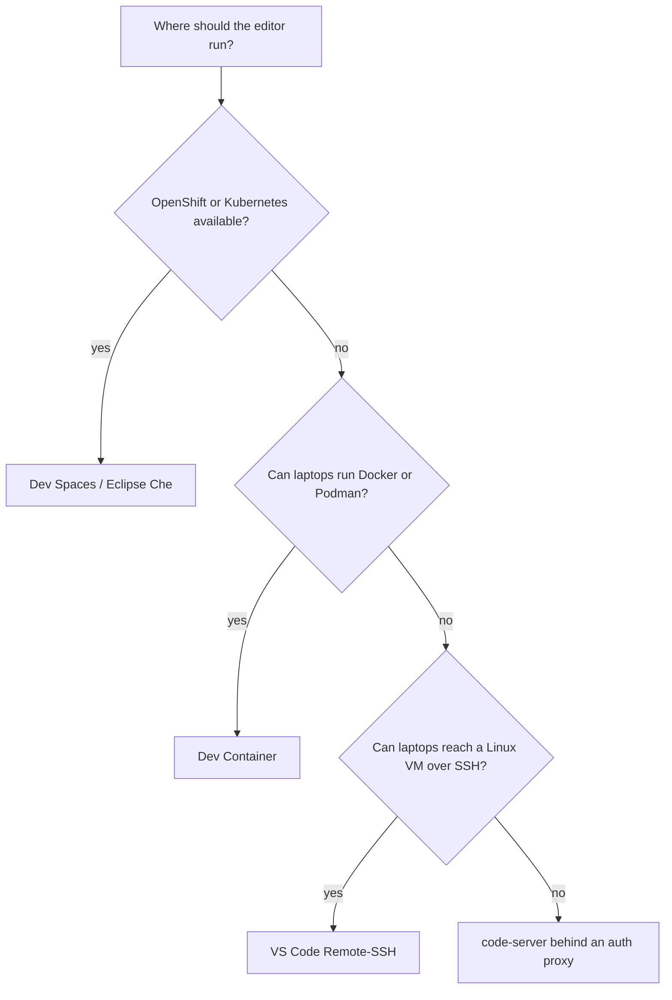

# Where to run an Ansible development environment: venv, Dev Container, Remote-SSH, code-server or Dev Spaces

Fourth entry in the Ansible development environment series. [The first three](locking-an-ansible-dev-environment-pip-to-ee.md) decide what the runtime is made of and how to lock it. This one decides where the editor and tools run. There are five common answers, and most of the choice comes down to three things:
- what the laptop is allowed to run;
- how users log in;
- whether the environment can run your *execution environment* (EE), the container image that AAP (Red Hat Ansible Automation Platform) runs jobs in. [Part 3](execution-environment-from-a-locked-requirements-file.md) builds one.

The options follow Alex Dworjan's [Ansible Development Environment](https://www.youtube.com/playlist?list=PLGyQDXV5H0G0tEyxVEZIH0UK67gnmkR_8) videos, updated for 2026 tooling. Every option here can use the same toolset. **ADT** (Ansible Development Tools) is the `ansible-dev-tools` Python package, which installs ansible-core, ansible-navigator, ansible-builder, ansible-lint, ansible-creator and Molecule together.

## The five options

| Option | Laptop needs | Login | Runs your EE | Fits |
|---|---|---|---|---|
| **Local venv** | Python, on Linux, macOS or WSL | the laptop's | No: it's the other side of that choice | one developer, or collection work before an EE exists |
| **Dev Container** | VS Code, plus Docker (or Podman) | the laptop's | Yes, nested Podman in the container | laptops allowed to run containers |
| **Remote-SSH** | VS Code and an OpenSSH client | SSH: keys, LDAP, your usual rotation | Yes, Podman on the server | VM-only shops |
| **code-server** | a browser | a single password, or none | Yes, Podman on the server | one or two people, behind an auth proxy |
| **Dev Spaces / Eclipse Che** | a browser | the cluster's SSO | Yes, nested containers on OpenShift 4.20+ | teams with OpenShift or Kubernetes |



A plain venv sits outside the diagram. It's fine for one person, but it's the option [part 1](locking-an-ansible-dev-environment-pip-to-ee.md) ranks as isolation without a lock, and it isn't the EE that production runs.

## Local venv

The quickest start is a *venv*, a directory with its own Python and packages, holding ADT and the collections. `ansible-dev-environment` (`ade`), part of ADT, creates one and installs collections along with their Python dependencies. Dworjan's view: this suits small teams and individuals. Managing venvs doesn't line up with EEs, and corporate Windows laptops often aren't allowed WSL, Microsoft's Linux layer for Windows.

## Dev Container

A *Dev Container* is a container that VS Code opens a project in. The **Dev Containers** extension reads `.devcontainer/devcontainer.json`, starts the image it names, and runs VS Code's server and extensions inside it. `ansible-creator init playbook` (26.9.0) generates three variants: Codespaces, Docker and Podman. Each uses `ghcr.io/ansible/community-ansible-dev-tools:latest`, the public ADT image. The Docker variant:

```json
{
  "name": "ansible-dev-container-docker",
  "image": "ghcr.io/ansible/community-ansible-dev-tools:latest",
  "containerUser": "root",
  "runArgs": [
    "--security-opt", "seccomp=unconfined",
    "--security-opt", "label=disable",
    "--cap-add=SYS_ADMIN",
    "--cap-add=SYS_RESOURCE",
    "--device", "/dev/fuse",
    "--security-opt", "apparmor=unconfined",
    "--hostname=ansible-dev-container"
  ],
  "updateRemoteUserUID": true,
  "customizations": {
    "vscode": { "extensions": ["redhat.ansible", "redhat.vscode-redhat-account"] }
  }
}
```

The extra privileges are what let Podman run *inside* the container: `SYS_ADMIN`, `/dev/fuse`, and seccomp, AppArmor and SELinux labels turned off. That's how ansible-navigator can start your EE from within it.

On 2026-09-29, the image was Fedora 44 with Python 3.14.7, ansible-core 2.21.4, and all the ADT tools at 26.9.0 (ansible-builder 3.1.1). Started with those arguments under Docker, it loaded part 3's EE into its nested Podman. `ansible-navigator run site.yml --eei <that EE> --mode stdout` then printed the EE's ansible-core, `2.21.4`.

What the laptop needs:
- **Docker** is what the Dev Containers extension officially supports. For other Docker-compatible CLIs, its docs say *"While other CLIs may work, they are not officially supported."* Podman works in practice; set `dev.containers.dockerPath` to `podman`, as Dworjan shows.
- **On Windows 10 Home**, Docker Desktop requires the WSL 2 back end. Where WSL isn't allowed, this option is out.

## VS Code Remote-SSH

VS Code stays on the laptop; the code, Podman, navigator and EEs live on a Linux server. The Remote-SSH extension connects over SSH and installs VS Code's server component on the host. The laptop needs only *"a supported OpenSSH compatible SSH client"*. The host needs at least 1 GB of RAM (2 GB recommended) and, since VS Code 1.99 (March 2025), glibc 2.28 or later: RHEL 8+, Debian 10+ or Ubuntu 20.04+. The Remote-SSH page's own list still says RHEL 7+, but the Remote Development FAQ rules it out. [Part 9](shared-dev-server-for-vscode-remote-ssh.md) builds such a server with a playbook.

Because it's plain SSH, users log in with whatever SSH already allows: keys, LDAP accounts, and password rotation from a privileged-access tool. No port opens beyond 22. Dworjan's [Ansible-Development](https://github.com/shadowman-lab/Ansible-Development) repository provisions such a server with Ansible, including a shared image store, so users on one server don't each keep their own copy of the same EE.

## code-server

[code-server](https://github.com/coder/code-server) is VS Code served to a browser from a server. Nothing is installed on the laptop, but two limits come from code-server itself:
- **Login is `auth: password` or `none`.** There's no per-user identity. For SSO, its guide points to *"a reverse proxy"* such as oauth2-proxy, Pomerium or Cloudflare Access; [this site's OIDC entry](../oauth2/gitlab-oauth2-oidc-principle.md) explains what that proxy does.
- **Sharing a server isn't its model.** Its FAQ answers *"Is multi-tenancy possible?"* with *"provide one VM per user"*.

Dworjan's role for it runs one code-server per user, each on its own port. He limits it to *"one or two people"*. Where laptops can reach a VM over SSH, Remote-SSH does the same job with real logins.

## OpenShift Dev Spaces / Eclipse Che

*Dev Spaces* is Red Hat's product built on Eclipse Che, the upstream project. It starts a browser VS Code per user, on demand, from a repository. Each repository carries a *devfile* (`devfile.yaml`), a YAML description of the workspace container. ansible-creator's playbook scaffold generates one pointing at `ghcr.io/ansible/ansible-devspaces:latest`. Login is the cluster's single sign-on (SSO), and git credentials and registry logins can be injected per user.

The EE used to be the catch. Before OpenShift 4.20, workspaces couldn't run containers, so each EE had to be rebuilt as a Dev Spaces image. In his March 2026 video, Dworjan shows OpenShift 4.20.5 and later running *nested containers* (Podman inside the workspace container) on new and upgraded clusters. One ADT image then runs every team's existing EE. Enabling it takes a SecurityContextConstraint and changes to Dev Spaces and the DevWorkspace operator, documented in his repository's `devspaces/README.md`.

## Sources

- Alex Dworjan, [Ansible Development Environment Options](https://www.youtube.com/watch?v=SWa8bPLteAA) (2024-02), [Dev Containers](https://www.youtube.com/watch?v=kOGs6Ntt8JY) (2024-10) and [Dev Spaces with Execution Environments](https://www.youtube.com/watch?v=Kej_7MeoxmE) (2026-03). His [shadowman-lab/Ansible-Development](https://github.com/shadowman-lab/Ansible-Development) repository holds the server roles and the Dev Spaces setup.
- VS Code docs: [Remote-SSH](https://code.visualstudio.com/docs/remote/ssh) and [Dev Containers](https://code.visualstudio.com/docs/devcontainers/containers), system requirements, and the [Remote Development FAQ](https://code.visualstudio.com/docs/remote/faq) (glibc 2.28 since 1.99).
- code-server's `docs/guide.md` (external authentication) and `docs/FAQ.md` (multi-tenancy), in [coder/code-server](https://github.com/coder/code-server).
- The `devcontainer.json` variants and `devfile.yaml` come from `ansible-creator init playbook` 26.9.0. The Dev Container test used `ghcr.io/ansible/community-ansible-dev-tools` (digest `sha256:775c81d5…`, built 2026-09-23) under Docker 29.3.1. This sandbox's kernel refused `--cap-add=SYS_RESOURCE`, so that one flag was dropped for the test; nested Podman still ran the EE.
