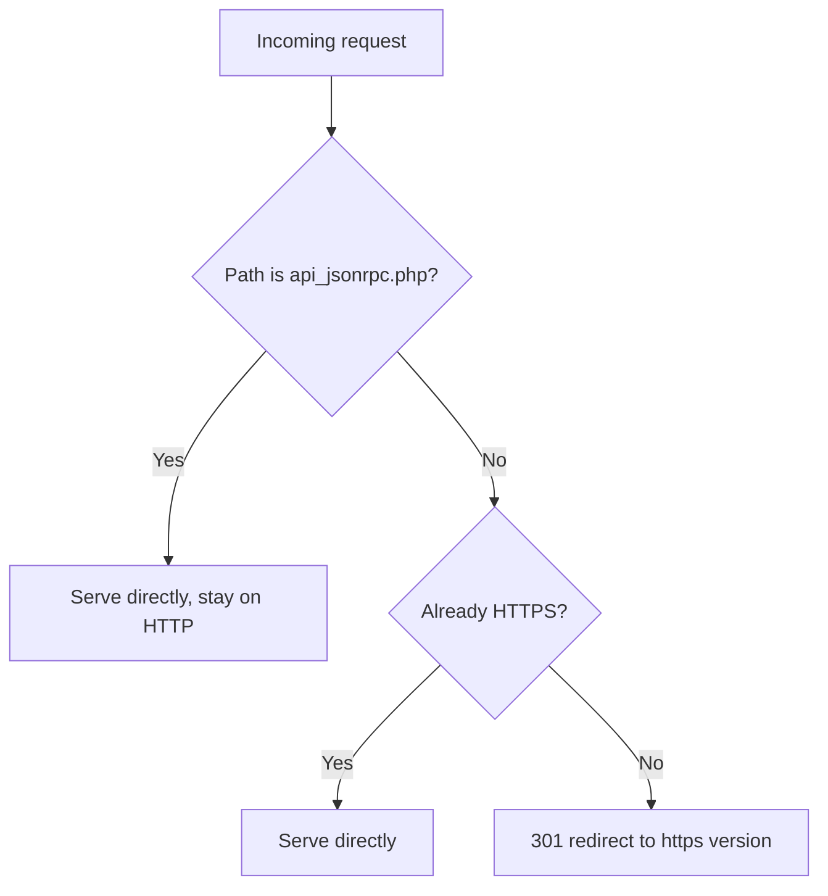

# A conditional redirect that skips one path, the current Apache way

A [2018 Stack Overflow question](https://stackoverflow.com/questions/48653179/apache-redirection-based-on-url-from-the-same-webserver) has a scenario worth revisiting on current Apache: redirect everything under `/zabbix/` to HTTPS, except `api_jsonrpc.php`, which a set of scripts needed to keep hitting over plain HTTP. The asker's attempt:

```apache
RedirectMatch /zabbix/(!api_jsonrpc.php)(.*) https://<servername>/zabbix/$2
```

didn't work, and it couldn't have — `(!api_jsonrpc.php)` isn't negation, it's a capturing group that matches the nine literal characters `!api_jsonrpc.php`. There's no "not" operator inside a plain group in any regex flavor; it just wasn't the syntax it looked like. The question was also running Apache 2.2, which [Apache's own docs now flag on every page](https://httpd.apache.org/docs/2.2/): "no longer maintained." Current stable is 2.4.68, and 2.4 actually has a cleaner way to solve this than either the broken attempt or a correct-but-uglier regex.

## Why RedirectMatch alone is the wrong tool here

Apache's regex engine is [PCRE](https://httpd.apache.org/docs/2.4/rewrite/intro.html), which does support real negative lookahead — `(?!api_jsonrpc\.php)` — so a working single-line `RedirectMatch` is possible. But `RedirectMatch` (from `mod_alias`) has no separate condition mechanism; per [its own directive docs](https://httpd.apache.org/docs/2.4/mod/mod_alias.html), it just matches a regex against the URL-path and substitutes. Every bit of "except this one thing" logic has to be crammed into the pattern itself, which is exactly how the original attempt went wrong. `mod_rewrite` splits the matching from the condition, and that split is what makes the exception readable instead of clever.

## The `mod_rewrite` way, in current syntax

```apache
RewriteEngine On
RewriteCond %{REQUEST_URI} !^/zabbix/api_jsonrpc\.php$
RewriteRule ^/zabbix/(.*)$ https://%{HTTP_HOST}/zabbix/$1 [R=301,L]
```

Per [`mod_rewrite`'s own docs](https://httpd.apache.org/docs/2.4/mod/mod_rewrite.html), prefixing a `CondPattern` with `!` inverts it — "the condition is determined to be true only if the CondPattern does not match." That line reads as what it means: skip this rule for `api_jsonrpc.php`. Two details worth carrying over from the original that are easy to miss:

- `%{HTTP_HOST}` instead of a hardcoded server name, so the rule survives being copied to a staging vhost without editing.
- `[R=301,L]` inside a `<VirtualHost>` needs nothing else, but the same rule inside a `<Directory>` or `.htaccess` context on Apache 2.3.9+ is more precisely stopped with `[R=301,END]` rather than `[L]` — `L` only ends the *current round* of rewrite processing and can still be re-evaluated from the top if the URI changed, where `END` "immediately stops the rewriting process" for good.

## The Apache 2.4 way, without `mod_rewrite` at all

This is the part that didn't exist yet in 2018. Apache 2.4 shipped a general expression syntax, [`ap_expr`](https://httpd.apache.org/docs/2.4/expr.html), usable directly in an `<If>` block — including around a plain `Redirect`, no `mod_rewrite` required:

```apache
<If "%{REQUEST_URI} != '/zabbix/api_jsonrpc.php'">
    RedirectMatch "^/zabbix/(.*)$" "https://%{HTTP_HOST}/zabbix/$1"
</If>
```

For a single exception this is arguably clearer than the `RewriteCond` version — the condition and the action are two separate, ordinary-looking directives rather one directive whose behavior depends on the directive above it. It also generalizes better once there's more than one condition to combine, since `ap_expr` supports `&&`, `||`, and function calls in one expression rather than stacking `RewriteCond` lines with `[OR]` flags.

## The general HTTP→HTTPS half, for context

The other half of the original problem — plain "redirect this vhost to HTTPS" — is the common case `mod_rewrite` docs use to demonstrate `%{HTTPS}`:

```apache
RewriteCond %{HTTPS} off
RewriteRule ^(.*)$ https://%{HTTP_HOST}%{REQUEST_URI} [R=301,L]
```

Combine the two and the exception simply becomes an additional `RewriteCond` line above the rule — the shape doesn't change, only the number of conditions stacked before it.



Whichever form is used, the fix for the original question was never "find the right regex trick" — it was moving the exception out of the match pattern and into an explicit condition, which `RedirectMatch` alone was never built to express.
