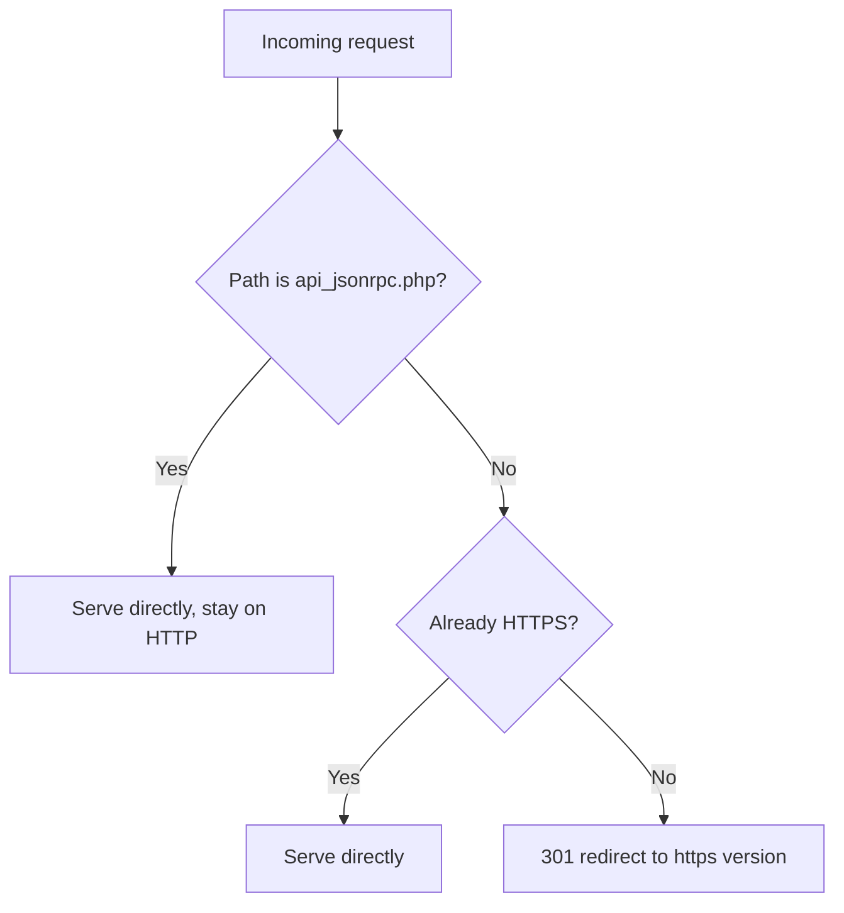

# A conditional redirect that skips one path, on Apache 2.2 through 2.4

A [2018 Stack Overflow question](https://stackoverflow.com/questions/48653179/apache-redirection-based-on-url-from-the-same-webserver) has a scenario worth revisiting: redirect everything under `/zabbix/` to HTTPS, except `api_jsonrpc.php`, which a set of scripts needed to keep hitting over plain HTTP. The asker's attempt, on Apache 2.2:

```apache
RedirectMatch /zabbix/(!api_jsonrpc.php)(.*) https://<servername>/zabbix/$2
```

didn't work, and it couldn't have — `(!api_jsonrpc.php)` isn't negation, it's a capturing group that matches the nine literal characters `!api_jsonrpc.php`. There's no "not" operator inside a plain group in any regex flavor; it just wasn't the syntax it looked like. That bug has nothing to do with which Apache version was running — which matters, because it's tempting to assume the fix is "upgrade." Below is what actually changed between 2.2 and current (stable is 2.4.68), and what didn't.

## The regex engine wasn't the problem, on either version

Apache 2.2's own `mod_rewrite` docs describe `CondPattern` as "a perl compatible regular expression," the same family 2.4 uses (2.4's docs are more specific, naming [PCRE2](https://httpd.apache.org/docs/2.4/rewrite/intro.html) directly). Real negative lookahead — `(?!api_jsonrpc\.php)` — was valid syntax on the asker's Apache 2.2 the whole time. A correct single-line `RedirectMatch` was always possible; nothing about 2.2 blocked it.

What *is* true on both versions: `RedirectMatch` (`mod_alias`) has no separate condition mechanism. Per [its directive docs](https://httpd.apache.org/docs/2.4/mod/mod_alias.html), unchanged in this respect since 2.2, it just matches a regex against the URL-path and substitutes — every bit of "except this one thing" logic has to be crammed into the pattern itself, which is exactly how the original attempt went wrong regardless of version. `mod_rewrite` splits the matching from the condition, and that split — not a newer regex engine — is what makes the exception readable instead of clever.

## The `mod_rewrite` fix, unchanged from 2.2 to 2.4

```apache
RewriteEngine On
RewriteCond %{REQUEST_URI} !^/zabbix/api_jsonrpc\.php$
RewriteRule ^/zabbix/(.*)$ https://%{HTTP_HOST}/zabbix/$1 [R=301,L]
```

Per [`mod_rewrite`'s own docs](https://httpd.apache.org/docs/2.4/mod/mod_rewrite.html), prefixing a `CondPattern` with `!` inverts it — "the condition is determined to be true only if the CondPattern does not match." Apache 2.2's docs describe the identical prefix in the identical words. This block would have worked, verbatim, on the asker's original 2.2 install. Two details worth carrying over from the original that are easy to miss:

- `%{HTTP_HOST}` instead of a hardcoded server name, so the rule survives being copied to a staging vhost without editing. Also unchanged since 2.2.
- `[R=301,L]` inside a `<VirtualHost>` needs nothing else on either version. Inside a `<Directory>` or `.htaccess` context, though, current Apache (2.3.9+) has a more precise stop: `[R=301,END]` instead of `[L]` — `L` only ends the *current round* of rewrite processing and can still be re-evaluated from the top if the URI changed, where `END` "immediately stops the rewriting process" for good. **On Apache 2.2, `END` doesn't exist at all** — it's absent from the 2.2 docs entirely, and `L` is the only stop flag available. That's a real gap, not a style choice: a 2.2 admin using `mod_rewrite` in per-directory context has no way to fully guarantee a rule doesn't get re-evaluated after a URI rewrite, something 2.3.9+ fixed outright.

## The Apache 2.4 way, without `mod_rewrite` at all

This is the one piece that's genuinely new, not just cleaner. `<If>` and `ap_expr` don't appear anywhere in the Apache 2.2 documentation — confirmed by their total absence from 2.2's `mod_core` docs, not merely undocumented. Apache 2.4 shipped this general expression syntax, [`ap_expr`](https://httpd.apache.org/docs/2.4/expr.html), usable directly in an `<If>` block — including around a plain `Redirect`, no `mod_rewrite` required:

```apache
<If "%{REQUEST_URI} != '/zabbix/api_jsonrpc.php'">
    RedirectMatch "^/zabbix/(.*)$" "https://%{HTTP_HOST}/zabbix/$1"
</If>
```

For a single exception this is arguably clearer than the `RewriteCond` version — the condition and the action are two separate, ordinary-looking directives rather one directive whose behavior depends on the directive above it. It also generalizes better once there's more than one condition to combine, since `ap_expr` supports `&&`, `||`, and function calls in one expression rather than stacking `RewriteCond` lines with `[OR]` flags.

## The general HTTP→HTTPS half, for context

The other half of the original problem — plain "redirect this vhost to HTTPS" — is the common case `mod_rewrite` docs use to demonstrate `%{HTTPS}`, and `%{HTTPS}` itself is listed as a server variable in Apache 2.2's docs too, word for word:

```apache
RewriteCond %{HTTPS} off
RewriteRule ^(.*)$ https://%{HTTP_HOST}%{REQUEST_URI} [R=301,L]
```

Combine the two and the exception simply becomes an additional `RewriteCond` line above the rule — the shape doesn't change, only the number of conditions stacked before it. This whole block is 2.2-compatible as written.

## What actually changed, summarized

| | Apache ≤ 2.2 | Apache 2.4 (current: 2.4.68) |
|---|---|---|
| `RewriteCond` `!` negation | Available, identical syntax | Unchanged |
| Regex engine for both modules | Perl-compatible (PCRE) | Perl-compatible, explicitly PCRE2 |
| `mod_rewrite` stop flags | `[L]` only | `[L]` plus `[END]` (2.3.9+) for a real full-stop in per-directory context |
| `<If>` / `ap_expr` | Doesn't exist | Available; lets `Redirect`/`RedirectMatch` be made conditional without `mod_rewrite` |
| `%{HTTPS}` variable | Available | Unchanged |

The only line in that table that would have changed the original asker's options is `<If>`. Everything else that solves this problem was sitting in their Apache 2.2 install the whole time.



Whichever form is used, the fix for the original question was never "find the right regex trick" — it was moving the exception out of the match pattern and into an explicit condition, which `RedirectMatch` alone was never built to express.
