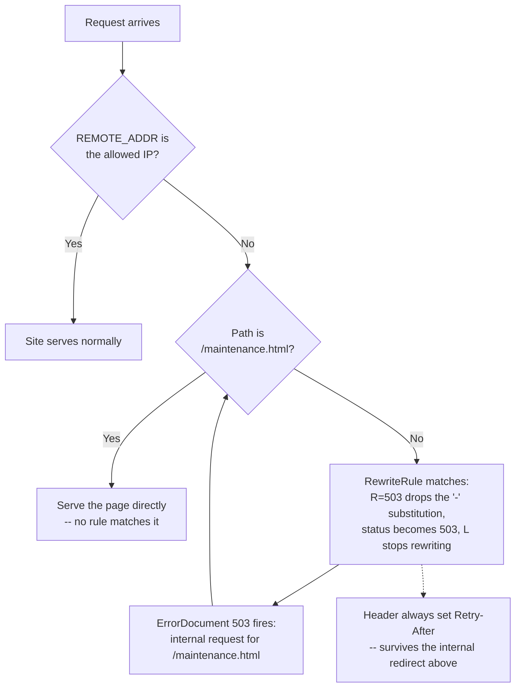

# A 503 maintenance page for everyone except your own IP, on current Apache

Taking a site down for maintenance while still being able to browse it yourself needs three things working together, not one directive: a status code that means "temporarily unavailable" rather than "forbidden" or "not found," a way to serve a real page instead of Apache's plain-text default, and an exception for your own IP. Verified against Apache's current docs (stable is 2.4.68) rather than assumed, because two parts of the usual recipe depend on behavior that isn't obvious from reading the directives alone.

## The recipe

```apache
RewriteEngine On

# TEST-NET-3 (RFC 5737) stands in for a real IP here
RewriteCond %{REMOTE_ADDR} !^203\.0\.113\.42$
RewriteCond %{REQUEST_URI} !^/maintenance\.html$
RewriteRule ^ - [R=503,L]

ErrorDocument 503 /maintenance.html
Header always set Retry-After "3600"
```

Four lines, three of which depend on something worth understanding rather than copying.

## Why `- [R=503,L]` actually returns 503, not a redirect to nowhere

`R` is documented as a *redirect* flag — it normally sends the browser to a new URL. Here the target is `-`, meaning "don't rewrite the path at all," which looks like it should conflict with "redirect." Per [`mod_rewrite`'s own flags documentation](https://httpd.apache.org/docs/2.4/rewrite/flags.html):

> The status code specified need not necessarily be a redirect (3xx) status code. However, if a status code is outside the redirect range (300-399) then the substitution string is dropped entirely, and rewriting is stopped as if the `L` were used.

503 is outside 300–399, so the `-` is discarded and Apache just returns 503 directly, no redirect involved. `L` is technically redundant in this specific branch — the docs say it behaves "as if `L` were used" regardless — but keeping it explicit is the same reasoning `mod_rewrite`'s own `[F]` (403) and `[G]` (410) flags use, both documented with the identical `-` target and both described as having `L` "implied." There's no dedicated flag for 503 the way there is for 403/410, so `R=503` on a dropped substitution is the documented way to get the same effect.

## Why the second `RewriteCond` isn't optional

Skip the `!^/maintenance\.html$` exclusion and the failure mode isn't "the maintenance page also 503s" — it's a loop. `ErrorDocument 503 /maintenance.html` triggers an *internal* request for `/maintenance.html`, which without the exclusion matches the same `RewriteRule` and gets turned into another 503, whose `ErrorDocument` triggers another internal request, and so on. Apache doesn't hang forever on this: [`LimitInternalRecursion`](https://httpd.apache.org/docs/2.4/mod/core.html#limitinternalrecursion) defaults to 10 and exists specifically to stop "the server from crashing when entering an infinite loop of internal redirects." Past that limit, the visitor gets a generic Apache error instead of the loop — closer to correct than a hang, but still not the maintenance page, and not obvious to debug from the outside since the misconfiguration and the symptom look unrelated.

## Why `Header` needs `always`, specifically here

Plain `Header set` only touches Apache's *onsuccess* header table — headers attached to a normal 2xx/3xx response. A 503 generated by `ErrorDocument` doesn't go through that table. Per [`mod_headers`' own directive docs](https://httpd.apache.org/docs/2.4/mod/mod_headers.html#header):

> The difference between the two lists is that the headers contained in the latter are added to the response even on error, **and persisted across internal redirects (for example, `ErrorDocument` handlers)**.

That's not incidental phrasing — `ErrorDocument` is the example the docs themselves give for why `always` exists. Without it, `Retry-After` silently never reaches the client: the page renders, the status is correctly 503, and nothing in the response looks broken unless you check response headers specifically.



## One thing this doesn't handle: a proxy in front

`REMOTE_ADDR` is whatever TCP peer opened the connection to Apache. Behind Cloudflare, a load balancer, or any reverse proxy, that's the proxy's IP, not the visitor's — the allowlist would only ever match the proxy. `mod_remoteip` (trusting the proxy's own header, not the client-supplied `X-Forwarded-For`) is the fix, and it's a different, larger topic than this recipe.

## Where this lives in an Ansible-managed fleet

The condition and the allowlisted IP are the only per-environment parts; everything else is identical across hosts. That maps directly onto a small Jinja template — `maintenance.conf.j2` with `{{ maintenance_allowed_ip }}` as a host or group variable — toggled into `conf-enabled/` by a single tagged task, rather than hand-editing vhost config on the box that actually needs the maintenance window.

## Worth knowing, not worth reaching for by default

Apache 2.4 added `<RequireAny>`/`<RequireNone>` (`mod_authz_core`) as the modern way to express IP-based *access control*. It's not a substitute here: `Require` governs authorization and produces 403 on a mismatch, with no mechanism to attach a custom status code or trigger `ErrorDocument` for a "temporarily unavailable" response the way this recipe does. For blocking access outright, `Require` is the current idiom over `mod_rewrite` conditions; for a maintenance page specifically, the status code you want is 503, and 403 would say the wrong thing to search engines and monitoring alike.
