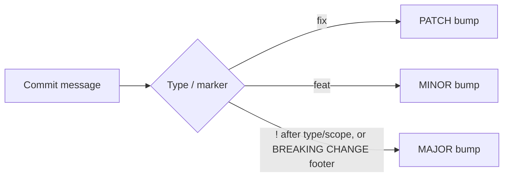

# Conventional Commits: only two types are actually required by the spec

Every "docs: add TIL on..." commit in this repo's own history follows this convention — `git log --oneline` on this exact repository is a live example, not a hypothetical. Worth knowing precisely what the spec actually mandates, because it's less than the taxonomy everyone uses.

## The structure

Per [the official specification, v1.0.0](https://www.conventionalcommits.org/en/v1.0.0/):

```
<type>[optional scope]: <description>

[optional body]

[optional footer(s)]
```

```
feat(auth): add OAuth2 login support

Replaces the old session-cookie flow. Existing sessions
are invalidated on deploy.

Refs: JIRA-1234
```

## The part that's surprising: the spec requires exactly two types

`feat` and `fix` are the only types the specification itself mandates — because they're the only two with a defined meaning for automated versioning. Everything else people write constantly (`docs`, `style`, `refactor`, `perf`, `test`, `build`, `ci`, `chore`) is convention layered on top, recommended by common practice rather than required by the 16 numbered rules in the spec text. A repo that only ever wrote `feat:` and `fix:` commits would be fully spec-compliant; one that invented its own additional type name (`ui:`, `deps:`) wouldn't be violating anything either, as long as the structure around it holds.

## Why it exists: the message is machine input, not just a label

The entire point is a direct, literal mapping to [Semantic Versioning](https://semver.org/):

- `fix:` → **PATCH**
- `feat:` → **MINOR**
- a breaking change, marked either way below → **MAJOR**



That's what separates this from just a house style for readable commit logs: a tool can walk the commit history since the last tag and compute the next version number without a human deciding it, because the message itself already encodes the answer.

## Marking a breaking change: two ways, same effect

```
feat!: drop support for config.yaml v1 format
```

or, keeping the header plain and pushing the detail into a footer:

```
feat: add config.yaml v2 loader

BREAKING CHANGE: v1 config files are no longer accepted; run the migration script first.
```

Both trigger a MAJOR bump under the spec's own SemVer mapping. The footer form is the one built for detail — a one-line header can't hold a migration note — but the `!` is the faster, greppable signal that something in this commit needs a second look before merging.

One case-sensitivity detail easy to get backwards: everyday types (`feat`, `fix`, `docs`, ...) are case-insensitive, but `BREAKING CHANGE` as a footer token must be exactly that — uppercase — for tooling to recognize it. `BREAKING-CHANGE` with a hyphen is defined as a synonym for the same footer, for compatibility with tools that can't easily emit a space inside a token name.
