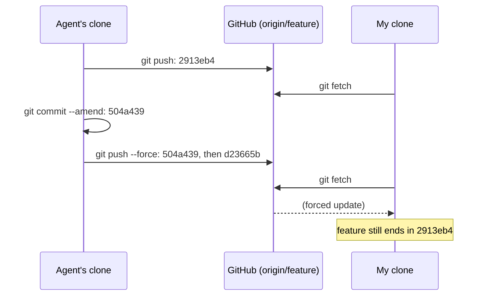
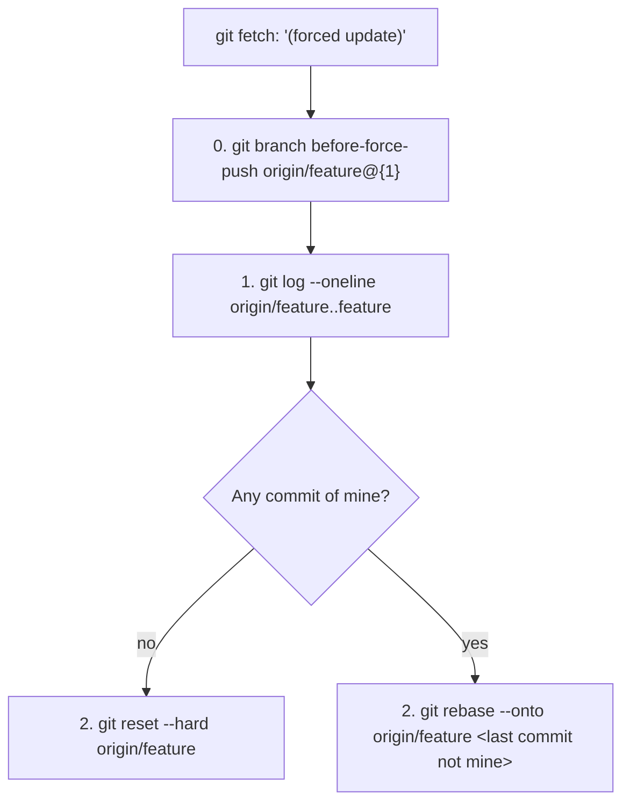

# A branch you fetched was force-pushed: keep the old tip, then `rebase --onto`

A coding agent pushed a commit to my branch (`2913eb4`), and I fetched it. It then amended the commit message, force-pushed the new version (`504a439`, same code), and pushed its next step (`d23665b`) on top. My clone was left on a commit GitHub no longer had.



This is for following a rewrite that was **intended** (an amend, squash or rebase). Tested with Git 2.43 in scratch clones, in three cases:
- a message-only rewrite;
- a rewrite that changed the code, with an unpushed commit of mine on top;
- a rewrite that discarded a commit I had pushed.

## Spot it

```text
 + 2913eb4...d23665b feature    -> origin/feature  (forced update)

Your branch and 'origin/feature' have diverged,
and have 1 and 2 different commits each, respectively.
```

The first line comes from `git fetch`: the old tip on the left, the new one on the right. The other two come from `git status`, whose counts include every commit on each side since the fork. After a rebase, that means all the old versions plus any of yours, without saying which is which. Don't follow `git status`'s hint to run `git pull` yet.



## 0. Keep the old tip

```sh
git branch before-force-push origin/feature@{1}
```

`@{1}` is the previous value of `origin/feature`, taken from its reflog; `git reflog show origin/feature` confirms it. This costs nothing, and it's the step to push (`git push origin before-force-push`) if the rewrite turns out to be a mistake.

## 1. See what's only yours

```sh
git log --oneline origin/feature..feature
git range-diff feature...origin/feature
```

The first command lists everything your branch has that the new remote doesn't: the old versions of rewritten commits, and your own commits. Git can't tell the two apart; the messages, and the authors with `--format='%h %an %s'`, can. `range-diff` pairs old and new versions (`1: 2913eb4 ! 1: 504a439`) and shows what changed, a message-only fix included. It only pairs them when the changes are similar, though. When the rewrite changed the code, it listed old and new versions separately, like my own commit.

## 2. Reset, or replay only your commits

Nothing of yours in the list:

```sh
git status        # reset --hard discards uncommitted changes
git reset --hard origin/feature
```

Commits of yours on top: name the last commit that isn't yours, and replay only what comes after it:

```sh
git rebase --onto origin/feature 2913eb4
```

This worked in both tests with commits of mine. They end up on top of `d23665b`, with new hashes.

## What not to run

**`git pull --rebase`**, like `git rebase` with no argument, skips every commit that `origin/feature` ever pointed to, reading them from its reflog (`--fork-point`). That reflog includes **your own pushes**. In the third test, `git pull --rebase` answered `Successfully rebased and updated refs/heads/feature`, and my pushed commit was gone, with no conflict and no warning.

| Command, on the diverged branch | Result in the tests |
|---|---|
| `git pull`, no config | Refuses: `Need to specify how to reconcile divergent branches` |
| `git pull` with `pull.rebase false` | Merges: a conflict here, or both versions kept for good |
| `git pull` with `pull.ff only` | Refuses: `Not possible to fast-forward` |
| `git pull --rebase`, `git rebase` | Old versions dropped, and **your pushed commits too** |
| `git rebase origin/feature` | Old versions replayed: skipped if identical, conflict if not |
| `git rebase --onto origin/feature <old>` | Only your commits replayed |
| `git reset --hard origin/feature` | Branch equals the remote; old tip kept by step 0 |

`git config pull.ff only` (per repository, or `--global`) makes every `git pull` stop on a diverged branch, even with `pull.rebase` set. Many people set `pull.rebase false` long ago to silence a hint, which turns the refusal into a merge.

## On the pushing side

Don't rewrite a branch others have fetched; a commit message can be fixed in a later commit. If you must, use `git push --force-with-lease`. It refuses when the remote moved since your last fetch. In the third test it rejected the agent's push (`stale info`), which would have saved my commit. Then tell the others the old and new hashes.

## Sources

- Git documentation:
  - [git-rebase](https://git-scm.com/docs/git-rebase) (`--onto`, `--fork-point`) and [git-pull](https://git-scm.com/docs/git-pull) (`pull.ff`, `pull.rebase`);
  - [git-range-diff](https://git-scm.com/docs/git-range-diff) and [gitrevisions](https://git-scm.com/docs/gitrevisions) (`A..B`, `A...B`, `@{1}`);
  - [git-push](https://git-scm.com/docs/git-push) (`--force-with-lease`).
- The three reproductions above, with Git 2.43.0.
