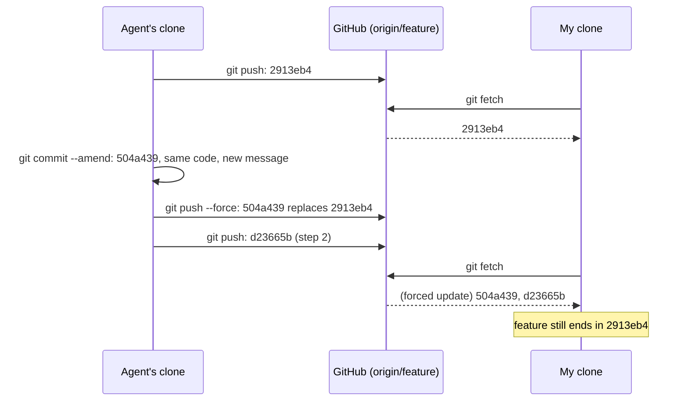
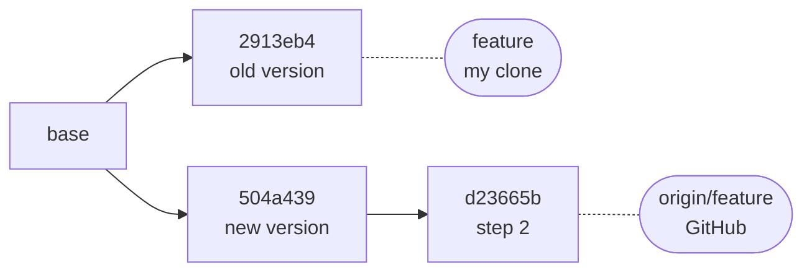
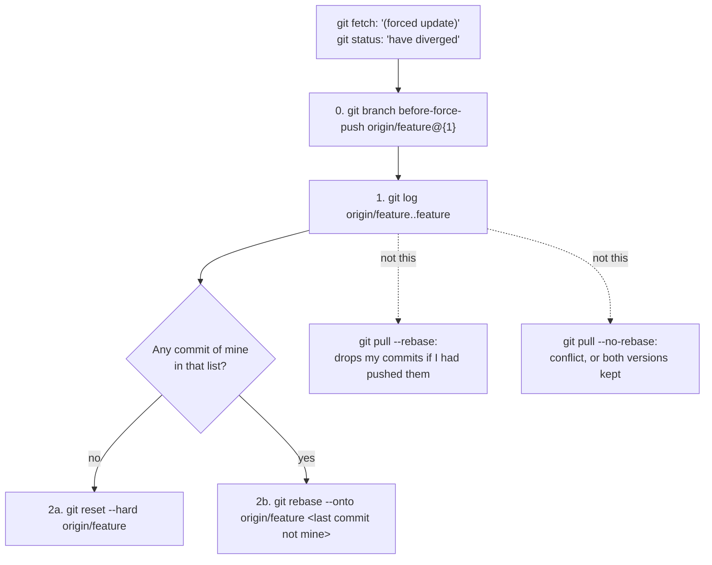
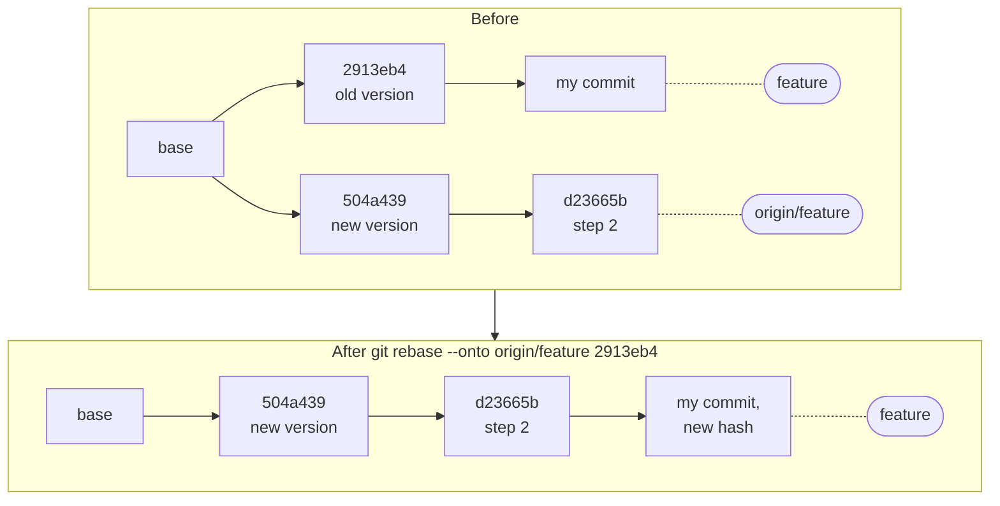
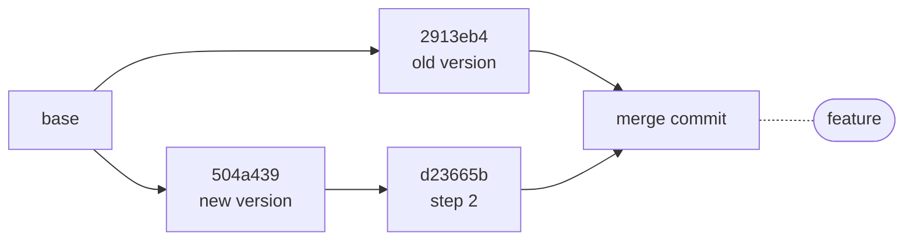

# A branch you fetched was force-pushed: keep the old tip, then replay your commits with `--onto`

A coding agent working on my branch pushed a commit (`2913eb4`), and I fetched it. It then noticed a typo in the commit message and fixed it with `--amend` and a force-push. That gave a new commit, `504a439`, with the same code. Then it pushed its next step, `d23665b`, on top. My clone still had `2913eb4`, which GitHub no longer had.



This entry is about bringing a clone back in line with a rewrite that was **intended**: an amend, a squash, or an interactive rebase, followed by `git push --force`. If the rewrite itself was a mistake, step 0 still applies, but don't reset onto it: point a branch at the old tip, push it, and agree on whether the shared branch should move back.

Everything below was reproduced with Git 2.43, in clones of a scratch bare repository. One clone force-pushed. The other had fetched before, in three variants:
- the rewrite only changed the message;
- the rewrite also changed the code, and I had an unpushed commit on top;
- I had **pushed** a commit that the force-push then discarded.

## What it looks like

`git fetch` says so, but only in one line, easy to miss:

```text
 + 2913eb4...d23665b feature    -> origin/feature  (forced update)
```

The left hash is where `origin/feature` pointed before, and the right one where it points now. `git status` then reports:

```text
Your branch and 'origin/feature' have diverged,
and have 1 and 2 different commits each, respectively.
  (use "git pull" if you want to integrate the remote branch with yours)
```

The two numbers count every commit on each side since the last common one. Here the "1" is the old version of the amended commit. After an interactive rebase, it's all the old versions, plus any commits of yours, and the numbers don't say which is which. Don't follow the hint to use `git pull` yet; see below.



`2913eb4` and `504a439` hold the same change. Git doesn't know that: they are different commits, with different messages, so different hashes.

## Which way out



## 0. Keep the old tip first

Before anything moves your branch, give the old remote tip a name:

```sh
git branch before-force-push origin/feature@{1}
```

`origin/feature@{1}` is the previous value of the remote-tracking branch, taken from its reflog: the left hash of the fetch line. Check it with `git reflog show origin/feature`. After two fetches, the entry you want may be further down. The branch costs nothing. If the rewrite was a mistake, push it too, so the old history is back on the server under another name:

```sh
git push origin before-force-push
```

The same reflog is the only local record of that old tip. A clone that never fetched it has nothing to recover from.

## 1. Find out what exists only on your side

```sh
git log --oneline origin/feature..feature
```

`A..B` lists commits reachable from `B` but not from `A`: here, everything your branch has that the new remote branch doesn't. That's the old versions of the rewritten commits, and anything you committed. Git can't tell the two apart for you, but the messages, and the authors with `--format='%h %an %s'`, usually can. In this case the list is a single line, the agent's old commit:

```text
2913eb4 Fix empty output on current coreutils and run under POSIX sh
```

To pair old and new versions, compare both sides as patch series. The three-dot range needs no hash from the fetch line:

```sh
git range-diff feature...origin/feature
```

`1: 2913eb4 ! 1: 504a439` pairs an old commit with its new version, and the lines below it show what changed. For a message-only fix, the only `-`/`+` pair is in the `## Commit message ##` section. `range-diff` pairs commits only when their changes are similar enough, though. In the test where the rewrite changed the code, it listed the old commit as `<` (only on my side) and the new one as `>` (only on theirs), the same way it listed my own commit. So read the list; don't rely on the pairing.

For a single pair, `git diff 2913eb4 504a439` with no output means the two commits have identical trees. With the same parent, that is the same change.

## 2a. Nothing of yours: reset to the remote

```sh
git status        # no uncommitted changes, or stash them first
git reset --hard origin/feature
git log --oneline -3
```

The log now starts with `d23665b`, then `504a439`. `reset --hard` discards uncommitted changes to tracked files without asking, hence the `git status` first. The old tip survives on `before-force-push` from step 0. Without that branch, it would only survive in the reflog, which `git gc` prunes after 30 days by default (`gc.reflogExpireUnreachable`).

## 2b. Commits of yours on top: `git rebase --onto`

If step 1 lists commits of yours, replay exactly those onto the new remote branch. Name the last commit in the list that isn't yours: here, the old version `2913eb4`, with one commit of mine on top of it.

```sh
git rebase --onto origin/feature 2913eb4
```

`--onto origin/feature <old>` takes the commits after `<old>` on your branch and replays them onto `origin/feature`. It worked in both tests that had commits of mine, including the one where the rewrite changed the code.



My commit gets a new hash because its parent changed.

### Not `git pull --rebase`

`git pull --rebase`, like `git rebase` with no argument, uses the remote-tracking branch's **reflog**: every commit `origin/feature` ever pointed to counts as upstream's, and it isn't replayed. The rebase documentation calls this `--fork-point`. It's meant for exactly this situation: commits upstream deliberately discarded stay discarded.

The trouble is that the reflog also records **your own pushes**. In the third test, I pushed a commit, the agent force-pushed over it without having fetched it, and I ran `git pull --rebase`:

```text
Successfully rebased and updated refs/heads/feature.
```

My commit was gone from the branch. There was no conflict and no warning, although step 1 had listed it. `git pull --rebase` only gave the right result when my commits had never been pushed. `rebase --onto` replayed the pushed commit correctly.

`git rebase origin/feature`, with the upstream named, doesn't use the reflog. It replays everything step 1 listed, old versions included:

- **Identical change** (message-only fix): Git recognizes the patch as already applied and skips it, with `warning: skipped previously applied commit 2913eb4`.
- **Different change**: `CONFLICT (content)`, on a commit that isn't even yours.

## Don't merge

`git pull --no-rebase` merges the old and new histories. In the test, the next commit on the remote changed the same line as the rewritten one, so the merge stopped with `CONFLICT (content): Merge conflict in s.sh`. Without that overlap, you'd get a merge commit keeping both versions of the rewritten commit in the history for good:



## `git pull` refuses, unless it was told not to

In Git 2.43, a plain `git pull` on diverged branches stops before doing anything:

```text
fatal: Need to specify how to reconcile divergent branches.
```

That holds only while `pull.rebase` and `pull.ff` are unset. Many people set `pull.rebase false` once, to silence the hint that some older Git versions printed on each pull. With it set, the same `git pull` merges straight away, and here it hit the conflict above. `pull.rebase true` rebases with the fork-point behaviour described above.

`pull.ff only`, set in the repository or with `--global`, makes the refusal explicit, and it wins over either `pull.rebase` setting:

```sh
git config pull.ff only
```

With it, `git pull` fails with `fatal: Not possible to fast-forward, aborting.` whenever the branches have diverged, so a force-push always stops you at step 0.

| Command, on the diverged branch | Result in the tests |
|---|---|
| `git pull`, no config | Refuses: `Need to specify how to reconcile divergent branches` |
| `git pull` with `pull.rebase false` | Merges; here, a conflict |
| `git pull` with `pull.ff only` | Refuses: `Not possible to fast-forward` |
| `git pull --rebase`, or `git rebase` | Old versions dropped; **commits of yours dropped too if you had pushed them** |
| `git rebase origin/feature` | Old versions replayed: skipped if identical, conflict if not |
| `git rebase --onto origin/feature <old>` | Only the commits after `<old>` replayed |
| `git reset --hard origin/feature` | Your branch equals the remote; old tip kept only by step 0 or the reflog |

## On the pushing side

Don't rewrite a branch someone else has fetched. A wrong commit message can wait for a later commit, or for the squash at merge time.

If you must force-push, use `git push --force-with-lease`. It refuses the push when the remote branch has moved since you last fetched. In the third test, it rejected the agent's push with `! [rejected] feature -> feature (stale info)`, which would have saved my pushed commit. It does nothing for clones that had fetched the old commits without pushing anything new, as in the first test. Tell them the old and new hashes, and step 1 becomes a quick check.

## Sources

- The Git documentation:
  - [git-rebase](https://git-scm.com/docs/git-rebase) (`--fork-point`, `--onto`, skipped cherry-picks) and [git-pull](https://git-scm.com/docs/git-pull) (`pull.ff`, `pull.rebase`);
  - [git-range-diff](https://git-scm.com/docs/git-range-diff) and [gitrevisions](https://git-scm.com/docs/gitrevisions) (`A..B`, `A...B`, `@{1}`);
  - [git-push](https://git-scm.com/docs/git-push) (`--force-with-lease`).
- Reproductions in scratch clones with Git 2.43.0: a message-only rewrite, a rewrite that changed the code with an unpushed commit on top, and a rewrite that discarded a commit I had pushed.
