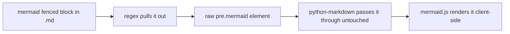

# Rendering Mermaid diagrams in a Python-Markdown static site

Wanted to drop a [Mermaid](https://mermaid.js.org/) diagram into a TIL and found out `build_site.py` had no idea what to do with one. [simonw/til](https://github.com/simonw/til) (the site this repo's pattern is adapted from) doesn't support it either — it's Datasette-backed, and there's no Mermaid anywhere in its templates or requirements. So this one's homegrown.

## Why a fenced ` ```mermaid ` block doesn't just work

The build already runs everything through Python-Markdown with `fenced_code` and `codehilite`:

```python
markdown.markdown(
    body_text,
    extensions=["fenced_code", "tables", "codehilite"],
    extension_configs={"codehilite": {"guess_lang": False}},
)
```

`codehilite` hands each fenced block to Pygments by language name. Pygments has no `mermaid` lexer, so a ` ```mermaid ` block doesn't error — it just falls back to a plain, unhighlighted `<div class="codehilite"><pre><code>...</code></pre></div>`, indistinguishable from any other fenced block Pygments doesn't recognize. Nothing in that output says "this one's a diagram," so there's no hook left afterwards for anything to render it as one.

## Pulling it out before Python-Markdown sees it

The fix is to intercept ` ```mermaid ` blocks in the raw text first, before they reach `codehilite`, and swap them for a raw `<pre class="mermaid">` element instead:

```python
MERMAID_FENCE_RE = re.compile(r"^```mermaid[ \t]*\n(.*?)\n^```[ \t]*$", re.DOTALL | re.MULTILINE)

body_text, has_mermaid = MERMAID_FENCE_RE.subn(
    lambda m: f'<pre class="mermaid">\n{escape(m.group(1))}\n</pre>', body_text
)
```

Python-Markdown passes block-level raw HTML straight through unchanged by default, so that `<pre class="mermaid">` survives the rest of the conversion untouched — `codehilite` never gets a chance to touch it, because it's no longer a fenced code block by the time Python-Markdown sees it. `escape()` (the same `xml.sax.saxutils.escape` already used for the Atom feed) keeps a stray `<` or `&` in a diagram from being read as real HTML.

## Rendering it client-side, only on pages that need it

Mermaid ships an ESM build that scans the page for `.mermaid` elements and renders them on load:

```html
<script type="module">
  import mermaid from "https://cdn.jsdelivr.net/npm/mermaid@11/dist/mermaid.esm.min.mjs";
  mermaid.initialize({ startOnLoad: true });
</script>
```

`has_mermaid` (the second value `.subn` returns — the substitution count) decides whether that script tag gets added to a given page at all. Most TILs have no diagram, so most pages stay exactly as light as before; only a page that actually used a ` ```mermaid ` fence pays for loading Mermaid.

## What it looks like


