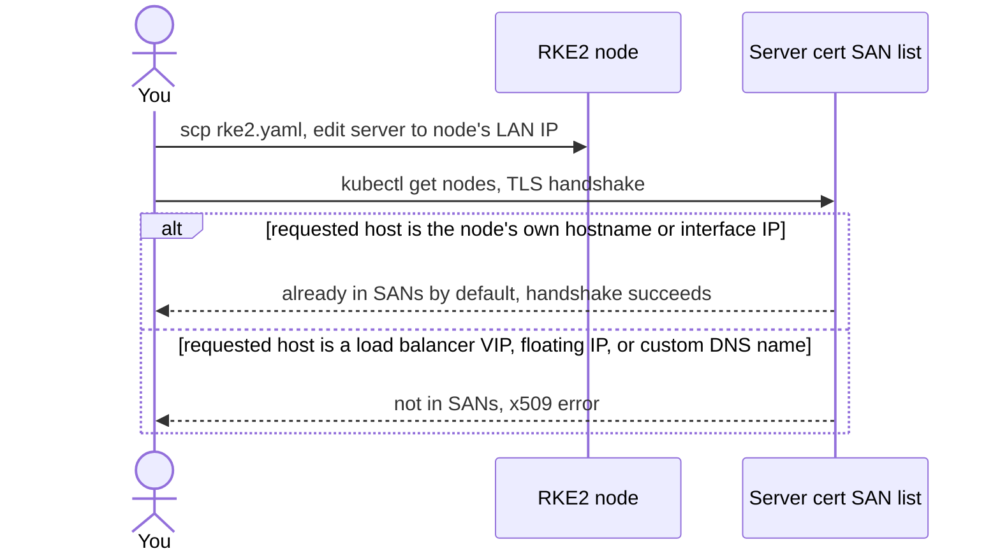

# Getting kubectl to work against RKE2 from off the node

Fourth entry in the RKE2/Kubernetes series. The [lab-install entry](rke2-single-node-lab-install.md) got a node running and pointed out the trap without fixing it: the generated kubeconfig only works from the node itself. Here's why, and what actually needs to change to run `kubectl` from a workstation instead.

## kubectl is a standalone binary here, not a subcommand

RKE2 [installs `kubectl`, `crictl`, and `ctr` to `/var/lib/rancher/rke2/bin/`](https://docs.rke2.io/install/quickstart), not on `PATH` by default. Worth calling out for anyone coming from k3s: k3s wraps kubectl as `k3s kubectl ...`, a subcommand of the `k3s` binary itself. RKE2 doesn't — [its `main.go` only registers `server`, `agent`, `etcd-snapshot`, `cert`, `secrets-encrypt`, `token`, and `completion`](https://github.com/rancher/rke2/blob/master/main.go) as subcommands. There's no `rke2 kubectl`; the `kubectl` next to it in `/var/lib/rancher/rke2/bin/` is the real, independent binary.

## Pointing kubectl at the right kubeconfig

Standard kubectl has two ways to do this, both equally valid: the `KUBECONFIG` environment variable, or the `--kubeconfig` flag on each invocation.

```sh
export KUBECONFIG=/etc/rancher/rke2/rke2.yaml
kubectl get nodes
# or, per-invocation, no export needed:
kubectl --kubeconfig /etc/rancher/rke2/rke2.yaml get nodes
```

That file's permissions were the [previous entry's](rke2-single-node-lab-install.md) topic — root-only by default, fixed at install time with `write-kubeconfig-mode`. Getting read access to the file is only half the problem, though.

## Why the file says `127.0.0.1`, specifically

RKE2 vendors its control plane from [k3s](https://github.com/k3s-io/k3s), and the admin kubeconfig's server URL is built directly from k3s's own loopback logic. In [`pkg/daemons/control/deps/deps.go`](https://github.com/k3s-io/k3s/blob/master/pkg/daemons/control/deps/deps.go):

```go
apiEndpoint := fmt.Sprintf("https://%s:%d", config.Loopback(true), config.APIServerPort)
```

and `Loopback()` in [`pkg/daemons/config/types.go`](https://github.com/k3s-io/k3s/blob/master/pkg/daemons/config/types.go) just returns `127.0.0.1` (or `::1` for an IPv6-only service CIDR). This isn't a placeholder that happens to work locally — it's a deliberate choice, because the same kubeconfig also has to work for every in-cluster controller talking to the local apiserver over loopback. Copy the file to your workstation unedited and `127.0.0.1` now means *your* laptop, not the node.

The fix is direct: copy the file off the node, then edit the `server:` line to point at an address that actually reaches the node.

```sh
scp root@rke2-node:/etc/rancher/rke2/rke2.yaml ~/.kube/rke2-lab.yaml
sed -i 's#127.0.0.1#rke2-node.example.lan#' ~/.kube/rke2-lab.yaml
KUBECONFIG=~/.kube/rke2-lab.yaml kubectl get nodes
```

## The part that isn't obvious: does the TLS cert even accept that name?

Editing the URL is necessary but not sufficient — TLS still checks the hostname/IP you connect to against the server certificate's SAN (Subject Alternative Name) list. The good news, easy to assume otherwise: RKE2 already populates that list with more than just `127.0.0.1`. Per [`pkg/cli/server/server.go`](https://github.com/k3s-io/k3s/blob/master/pkg/cli/server/server.go):

```go
serverConfig.ControlConfig.SANs = append(serverConfig.ControlConfig.SANs, "127.0.0.1", "::1", "localhost", nodeName)
serverConfig.ControlConfig.SANs = append(serverConfig.ControlConfig.SANs, util.SplitStringSlice(cmds.AgentConfig.NodeExternalIP.Value())...)
// ...
for _, ip := range nodeIPs {
    serverConfig.ControlConfig.SANs = append(serverConfig.ControlConfig.SANs, ip.String())
}
```

So by default, the cert is already valid for the node's hostname, its short hostname, and every IP on every network interface it detected at first start — including whatever LAN IP you'd naturally reach it on. For the single-node lab from the previous entry, swapping `127.0.0.1` for that node's real IP is usually the entire fix.



## When you actually need `tls-san`

The `tls-san` config option only matters for a name or address that *isn't* already covered above — a load balancer VIP in front of an HA control plane, a floating/public IP not bound to any local interface, or a custom DNS name you want in the cert instead of the raw IP. RKE2's [own config docs](https://docs.rke2.io/install/configuration) show it as a list in `config.yaml`:

```yaml
# /etc/rancher/rke2/config.yaml
tls-san:
  - "rke2.example.com"
```

It has to be set before the certificates are first generated — adding it later means regenerating the server certs, not just editing a running cluster's config. For a single-node lab reachable by its own IP or hostname, it's usually not needed at all; it earns its place once there's a stable name in front of the cluster that outlives any one node's own address.

## Where this series goes next

A working `kubectl` from off the node is what makes the rest of the series possible. Next: the minimum object model — Pods, Deployments, Services — run against this same lab node.
