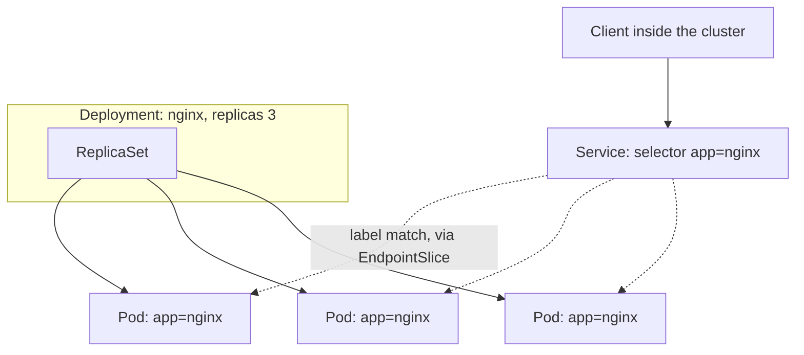

# Pods, Deployments, Services — the minimum object model

Fifth entry in the RKE2/Kubernetes series. `kubectl` has been reachable from off the node since [the previous entry](kubectl-off-node-rke2-tls-san.md); this is the first one to actually point it at something — the three objects that account for almost everything you'll run day to day, and one RKE2-specific gap between "the API server answers" and "traffic actually reaches your Pod."

## Pod: the unit that isn't self-healing on its own

A Pod is one or more containers sharing a network namespace — same IP, `localhost` works between them. The detail worth sitting with: **a bare Pod is not self-healing.** Its `restartPolicy` (`Always`, `OnFailure`, `Never`) only governs what happens when a *container inside it* exits — nothing about it recreates the Pod itself if it's deleted or its node dies. Per [Kubernetes' own Pod docs](https://kubernetes.io/docs/concepts/workloads/pods/): "usually you don't need to create Pods directly, even singleton Pods... instead, create them using workload resources."

```sh
kubectl run nginx-standalone --image=nginx --restart=Never
kubectl delete pod nginx-standalone
kubectl get pods
# No resources found -- nothing brought it back
```

That's the entire reason Deployments exist.

## Deployment: you talk to it, it talks to a ReplicaSet, that owns the Pods

A Deployment doesn't own Pods directly. Per [Kubernetes' own Deployment docs](https://kubernetes.io/docs/concepts/workloads/controllers/deployment/), the actual chain is **Deployment → ReplicaSet → Pods**: the Deployment creates and manages a ReplicaSet, and the ReplicaSet is what actually watches the Pod count and creates or removes Pods to match it. Updating the Deployment's Pod template doesn't edit existing Pods in place — it creates a *new* ReplicaSet and scales it up while scaling the old one down, which is what makes a rolling update a rolling update rather than a hard cutover.

```yaml
apiVersion: apps/v1
kind: Deployment
metadata:
  name: nginx-deployment
spec:
  replicas: 3
  selector:
    matchLabels:
      app: nginx
  template:
    metadata:
      labels:
        app: nginx
    spec:
      containers:
        - name: nginx
          image: nginx
```

```sh
kubectl apply -f nginx-deployment.yaml
kubectl get rs                    # the ReplicaSet the Deployment created
kubectl get pods -l app=nginx     # the 3 Pods that ReplicaSet is keeping alive
```

Delete one of those Pods and, unlike the standalone one above, it comes back within seconds — the ReplicaSet noticed the count drop below 3 and created a replacement. That's [the same reconcile loop](what-is-kubernetes-and-how-it-works.md) from the fundamentals entry, just watching a different object.

## Service: a stable address for Pods whose IPs keep changing

Every Pod created above got its own IP, and that IP is gone the moment the Pod is replaced. A Service is a stable ClusterIP address in front of a *set* of Pods, chosen entirely by a label selector — no direct reference to any Pod's name or IP.

```yaml
apiVersion: v1
kind: Service
metadata:
  name: nginx-service
spec:
  selector:
    app: nginx
  ports:
    - port: 80
      targetPort: 80
```

Per [Kubernetes' own Service docs](https://kubernetes.io/docs/concepts/services-networking/service/), the Service's controller continuously scans for Pods matching `selector: app: nginx` and keeps an EndpointSlice object updated with whichever Pod IPs currently qualify — [`kube-proxy`](what-is-kubernetes-and-how-it-works.md), on every node, is what turns that EndpointSlice into actual routing rules. `ClusterIP` (this example) is the default type when none is set, and it's deliberately internal-only: reachable from any Pod or node in the cluster, not from outside it.



## The RKE2-specific gap: `ClusterIP` reachable ≠ reachable from your workstation

This is a different problem from the `127.0.0.1` kubeconfig issue two entries back — that one was about reaching the *API server*; this one is about reaching a *Service*, and fixing the first doesn't touch the second at all. Two other Service types exist for exactly this:

- **`NodePort`** opens the same port on every node in the default `30000–32767` range and forwards it to the Service — reachable at `https://<any-node-IP>:<nodeport>` from off the cluster, no extra components needed.
- **`LoadBalancer`** is where RKE2 diverges from k3s in a way worth knowing before you `kubectl apply` one and wonder why `EXTERNAL-IP` says `<pending>` forever: RKE2 bundles the same Klipper-based ServiceLB k3s uses, but per [RKE2's own flag definition](https://github.com/rancher/rke2/blob/master/pkg/cli/cmds/server.go) (`enable-servicelb`, a bare `BoolFlag` with no default set — meaning `false`) and [its networking docs](https://docs.rke2.io/networking/networking_services), **it's off by default**, unlike k3s where the equivalent ships enabled. Without `--enable-servicelb` at server start, a `LoadBalancer` Service on RKE2 just never gets an external IP — there's nothing watching for it.

For the single-node lab from this series, `NodePort` needs nothing extra; `LoadBalancer` needs that flag set before it'll do anything at all.

## Where this series goes next

Everything above assumed pod-to-pod networking already works — the next entry looks at what actually provides that: RKE2's default CNI, Canal, and what changes if you swap it for something else.
