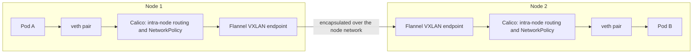

# RKE2's default CNI is Canal, and you pick it before the first start

Sixth entry in the RKE2/Kubernetes series. Everything in [the previous entry](pods-deployments-services-object-model.md) — Pods getting IPs, a Service reaching Pods that might be on another node — quietly assumed pod networking already worked. The component providing that is the CNI plugin, and on RKE2 it's the one decision in this series you genuinely cannot walk back.

## What the CNI is actually responsible for

Kubernetes itself doesn't implement pod networking. It defines the contract — every Pod gets its own IP, every Pod can reach every other Pod without NAT — and delegates the implementation to a CNI plugin. Concretely the plugin owns three jobs: handing each Pod an IP out of the cluster CIDR, getting a packet from a Pod on one node to a Pod on another, and enforcing `NetworkPolicy` objects (or ignoring them entirely, if the plugin doesn't implement them).

## Canal is two projects wearing one name

RKE2's default is Canal, which isn't a single project — it's a specific pairing. Per [RKE2's own networking docs](https://docs.rke2.io/networking/basic_network_options): *"Canal uses Flannel for inter-node traffic and Calico for intra-node traffic and network policies."* So Flannel moves packets between nodes (VXLAN by default), while Calico handles what happens on a node and, importantly, is the half that actually enforces `NetworkPolicy`. Flannel on its own famously does not — that pairing is the whole reason Canal exists.

The default is verifiable rather than folklore: RKE2's `cni` flag is defined in [its own source](https://github.com/rancher/rke2/blob/master/pkg/cli/cmds/server.go) as `cli.NewStringSlice("canal")`, and the supported set is a four-item list — `calico`, `canal`, `cilium`, `flannel` — with `multus` accepted as a *prefix* to layer the meta-plugin on top of one of them, not as a choice of its own.



## The part that's permanent

This is the sentence worth reading twice, straight from [the same docs](https://docs.rke2.io/networking/basic_network_options):

> "RKE2 does not support changing the primary CNI Plugin, CNI backend, or cluster/service CIDRs on a running cluster."

The recommended fix for picking wrong is to rebuild the cluster. That's an unusually hard line compared to most Kubernetes settings, and it puts the CNI in the same category as the `config.yaml` values from [the lab-install entry](rke2-single-node-lab-install.md): things to decide before the first `systemctl start`, not after.

Same applies to the CIDRs themselves, which are worth knowing since they're also frozen at first start. Neither is documented on that page, but both are plain defaults in the k3s core RKE2 builds on ([`pkg/util/net.go`](https://github.com/k3s-io/k3s/blob/master/pkg/util/net.go)): **`10.42.0.0/16`** for the cluster (Pod) CIDR and **`10.43.0.0/16`** for the Service CIDR. If either overlaps something real on your network, that's a pre-install conversation.

## Configuring it without fighting RKE2

The CNI ships as a packaged component — a HelmChart AddOn — and that changes how you configure it. Per [RKE2's packaged components docs](https://docs.rke2.io/install/packaged_components), anything in `/var/lib/rancher/rke2/server/manifests` is auto-applied like `kubectl apply`, but those specific files are RKE2's: *"Manifests for packaged components are managed by RKE2, and should not be altered"*, and RKE2 rewrites them to disk on every start to guarantee that. Editing `rke2-canal.yaml` directly means your change survives exactly until the next restart.

The supported way is a separate `HelmChartConfig` in the same directory, named for the chart you're customizing:

```yaml
# /var/lib/rancher/rke2/server/manifests/rke2-canal-config.yaml
apiVersion: helm.cattle.io/v1
kind: HelmChartConfig
metadata:
  name: rke2-canal
  namespace: kube-system
spec:
  valuesContent: |-
    flannel:
      iface: "eth1"
```

## When you'd pick something other than Canal

Cilium is the usual reason — mainly for eBPF-based `kubeProxyReplacement`, which removes `kube-proxy` from the path entirely rather than layering on top of it. RKE2's docs are specific about the floor there: it's *"not recommended to replace kube-proxy by Cilium if your kernel is not v5.8 or newer"* — the same 5.8 kernel line that [cgroup v2 on Kubernetes](../linux/cgroups-v2-podman-kubernetes.md) draws. Calico alone (no Flannel) is the other common pick, typically when you want BGP rather than VXLAN encapsulation. Both are bundled; neither is a post-install decision.

## Where this series goes next

Networking is provided; storage isn't. The next entry covers what RKE2 deliberately *doesn't* ship, and why a `PersistentVolumeClaim` on a fresh cluster sits in `Pending` indefinitely.
