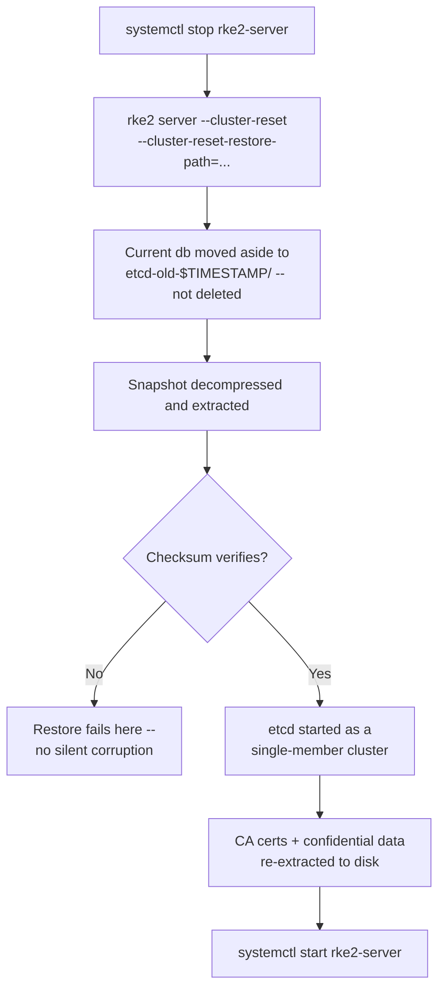

# Restoring RKE2 etcd across an HA cluster, and backing snapshots up to S3

[The etcd snapshot/restore drill on this site](rke2-etcd-snapshot-restore-drill.md) covers the single-node case end to end, including the two gotchas that aren't in RKE2's own docs — the `server:` URL check that blocks `cluster-reset`, and the teardown that runs before that check does. This entry is the reference for what changes once there's more than one server, or the backup needs to survive the disk it's sitting on: the flags, the S3 backend, and two behaviors that look like manual steps but are actually automatic. Verified against [RKE2's own backup/restore docs](https://docs.rke2.io/datastore/backup_restore) throughout, including one place worth catching before it sends you chasing a file that was never named what you think it was.

## An on-demand snapshot isn't named what you passed to `--name`

```sh
sudo rke2 etcd-snapshot save --name pre-upgrade
```

Per RKE2's own docs: *"On-demand snapshots have a name that starts with `on-demand`, followed by the node name and timestamp"* — and `--name` "sets the base name," replacing `on-demand` with whatever you pass, but the node name and timestamp are still appended after it. `pre-upgrade` becomes something like `pre-upgrade-controlplane-1-1758312000`, not a file literally called `pre-upgrade`. Passing that literal string straight to `--cluster-reset-restore-path` finds nothing. `rke2 etcd-snapshot list` before every restore isn't optional caution here — it's the only way to get the exact name RKE2 actually gave the file.

## What a restore actually does, in RKE2's own documented order

```sh
sudo systemctl stop rke2-server
sudo rke2 server --cluster-reset \
  --cluster-reset-restore-path=/var/lib/rancher/rke2/server/db/snapshots/<exact-name-from-list>
sudo systemctl start rke2-server
```

The command is one line, but RKE2 runs through several steps behind it, per the docs: decompress the snapshot if needed, move the *current* etcd database to `${data-dir}/server/db/etcd-old-$TIMESTAMP/` — nothing is deleted, just moved aside — extract the snapshot, **verify its checksum**, start etcd as a single-member cluster, then extract CA certificates and other confidential data back out to disk for the running node to use. "Verify snapshot integrity before restoring" isn't a separate step to remember: the checksum check is built into the restore itself, and a corrupt snapshot fails loudly right there rather than restoring silently-wrong data.



## The `reset-flag` file manages itself

RKE2 drops an empty file at `/var/lib/rancher/rke2/server/db/reset-flag` during every reset. Per the docs, it's a deliberate guard, not leftover state: *"a safety mechanism... that prevents users from accidentally running multiple cluster resets in succession. This file is deleted when RKE2 starts normally."* There's nothing to clean up by hand — start RKE2 normally after the restore, and it clears itself. Deleting it manually before RKE2 has done that normal start defeats the one thing it exists to prevent.

## Bringing the other servers back in an HA cluster

Only the server holding the snapshot runs `--cluster-reset`. Per the docs, for the rest:

```sh
sudo rm -rf /var/lib/rancher/rke2/server/db
sudo systemctl start rke2-server
```

They rejoin as fresh members against the restored cluster rather than restoring anything themselves — there's no snapshot involved on their side at all. And they come back **one at a time**: [this site's node-maintenance entry](rke2-node-maintenance-drain-reboot.md) already traced RKE2's own HA docs to the exact formula — quorum for `n` servers is `(n/2)+1`, so a standard 3-server cluster only tolerates one server being down at once. Restoring counts as downtime the same as a reboot does.

Also worth ruling out first, since it looks identical from the outside: `rke2-killall.sh` is **not** a way to stop a node before restoring. Verified from [the script itself](https://github.com/rancher/rke2/blob/master/bundle/bin/rke2-killall.sh) in that same entry — it force-kills containerd-shim trees and deletes CNI interfaces and static pod manifests, a full teardown for uninstalling, not a stop step. The restore procedure above only ever calls for `systemctl stop rke2-server`.

## S3: a genuinely separate retention counter, and a way to skip plaintext credentials

```yaml
# /etc/rancher/rke2/config.yaml
etcd-s3: true
etcd-s3-bucket: my-rke2-backups
etcd-s3-region: eu-west-1
etcd-s3-access-key: <ACCESS_KEY>
etcd-s3-secret-key: <SECRET_KEY>
etcd-s3-folder: cluster-prod
```

This works, and covers both scheduled and on-demand snapshots per the docs. Two things not obvious from that block alone:

**`--etcd-s3-retention` is a separate setting from `--etcd-snapshot-retention`**, defaulting to 5 independently. Raising the local retention count doesn't touch how many copies pile up in the bucket, and vice versa — they're two counters, not one shared setting.

**`--etcd-s3-config-secret` avoids writing the access key and secret key into `config.yaml` at all**, pointing instead at a Kubernetes Secret in `kube-system` that holds them — worth reaching for over the plaintext block above on anything that isn't a scratch lab, since `config.yaml` on disk is exactly the kind of file that ends up in a config-management repo or a support bundle.

Restoring from a local snapshot while S3 is configured needs one explicit override, exactly as the docs show it:

```sh
sudo rke2 server --cluster-reset \
  --etcd-s3=false \
  --cluster-reset-restore-path=/path/to/local/snapshot
```

Without `--etcd-s3=false`, RKE2 treats the restore path as an object to fetch from the bucket rather than a local file already on disk.
