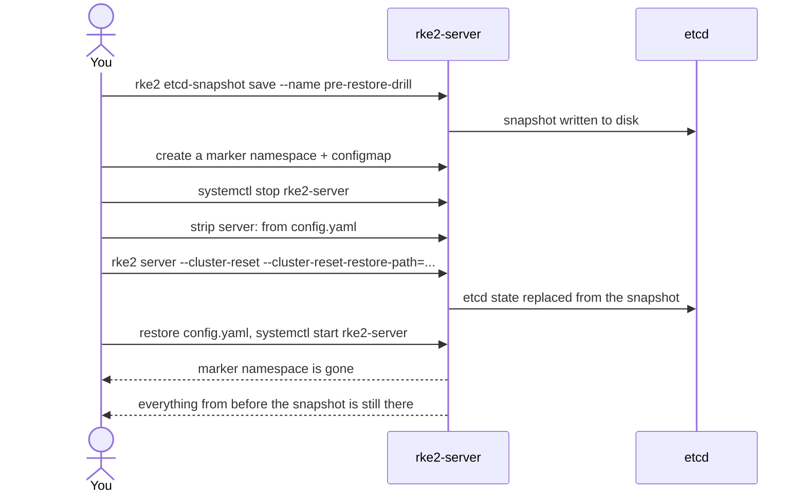

# RKE2's etcd snapshots run on schedule, but a fresh cluster starts with none

Tenth entry in the RKE2/Kubernetes series. The [HA entry](rke2-ha-embedded-etcd-external-datastore.md) closed on a warning: snapshots run without being configured, but quorum surviving a node dying and cluster state being *recoverable* are different guarantees. This entry actually tests that second one — snapshot, corrupt the cluster on purpose, restore — on a real single-server homelab cluster with Rook-Ceph running on top.

## "Enabled by default" isn't "you have a backup yet"

The schedule and retention defaults were already verified from source in the HA entry: `--etcd-snapshot-schedule-cron "0 */12 * * *"`, `--etcd-snapshot-retention 5`. Per [RKE2's own backup/restore docs](https://docs.rke2.io/datastore/backup_restore), that cron pattern actually means fixed wall-clock times — **00:00 and 12:00 system time**, not "every 12 hours from when the server started." The practical effect: a cluster built at 12:05 waits nearly 12 hours for its first snapshot; one built at 11:55 waits five minutes. There's no way to know which side of that you're on without checking:

```sh
rke2 etcd-snapshot list
```

On the cluster this was tested against, that command came back completely empty three hours after bootstrap — exactly the unlucky side of the window. Scheduled snapshots being on by default doesn't mean a fresh cluster has one; it means it will, eventually, on the clock's schedule rather than yours.

## Taking one on demand

```sh
rke2 etcd-snapshot save --name pre-upgrade
```

Written to `${data-dir}/db/snapshots` (`/var/lib/rancher/rke2/server/db/snapshots/` at the default data dir), same as the scheduled ones. One asymmetry worth knowing before it surprises you: per the same docs, on-demand snapshots aren't subject to the retention count at all — *"there is no retention for these on-demand snapshots and the user needs to remove them manually."* Take one before every risky change and never clean them up, and `db/snapshots/` grows forever; the `retention 5` setting only prunes the scheduled ones.

(A completely unrelated trap that lives in the same `config.yaml`: `snapshotter: overlayfs` configures containerd's storage driver — nothing to do with etcd snapshots despite the name. Easy to conflate when skimming the file for backup settings.)

## Restoring: the documented four lines, and the two that aren't

The restore command itself is exactly what the docs show:

```sh
rke2 server --cluster-reset --cluster-reset-restore-path=/var/lib/rancher/rke2/server/db/snapshots/<snapshot>
```

Two things a from-scratch attempt runs into that neither this nor the backup/restore docs page mention:

**`cluster-reset` hard-fails if a `server:` URL is set in `config.yaml`** — and a role like `lablabs.rke2` writes one even on the first server (used for later joins, harmless normally). The exact check is in [k3s's own `server.go`](https://github.com/k3s-io/k3s/blob/master/pkg/cli/server/server.go), which RKE2's server command is built on:

```go
if serverConfig.ControlConfig.JoinURL != "" {
    return errors.New("cannot perform cluster-reset while server URL is set - remove server from configuration before resetting")
}
```

So the config has to be edited and put back:

```sh
sudo cp -a /etc/rancher/rke2/config.yaml /etc/rancher/rke2/config.yaml.bak
sudo sed -i '/^server:/d' /etc/rancher/rke2/config.yaml
# ... run the restore ...
sudo mv /etc/rancher/rke2/config.yaml.bak /etc/rancher/rke2/config.yaml
```

**That check isn't the first thing that happens.** Looking at the same function, a `ClusterReset` invocation disables the API server, controller-manager, scheduler, and service load balancer, and resets the local load-balancer state files — all before it reaches the `JoinURL` check above. Directly observed running this on a live cluster: a reset attempt that fails on the server-URL check still leaves the node down, because the teardown already started before validation ran. Fix the config and re-run rather than assuming the failed attempt was a no-op.



The actual drill: snapshot, then create a namespace and configmap as a marker, then restore. Result — the marker gone, every StorageClass and object that predated the snapshot intact, all nodes back `Ready`.

## Rook-Ceph needed nothing special

The restore only touches etcd — the Kubernetes API objects. Rook-Ceph's actual data lives on the OSD disks and in `/var/lib/rook` on the node, entirely outside etcd. As long as the snapshot postdates the Ceph install, the `CephCluster` object and its StorageClasses come back from the snapshot, Rook's operator reconciles against the OSDs that were never touched, and Ceph returns to `HEALTH_OK` on its own — no separate Ceph-specific restore step. The general shape: an etcd restore only rewinds *what Kubernetes knows*, not any storage system's own on-disk state.

## One open question, left open on purpose

Worth flagging rather than papering over: RKE2 logs `Unknown flag --snapshotter / --cluster-cidr / --service-cidr / --ingress-controller found in config.yaml, skipping` on this same cluster — several settings a role writes into `config.yaml` are being silently ignored by whichever parser reads that file in that context. Not root-caused here; a config key an admin believes is active may not be, and the only way to know is checking the logs for exactly this line after every config change.

## Where this series goes next

RBAC — who's actually allowed to run any of the commands in this entry.
