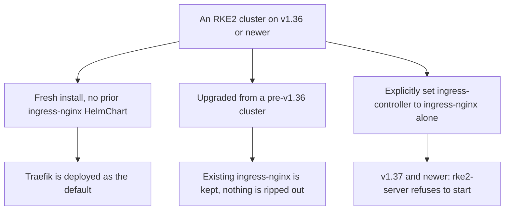

# RKE2's ingress default moved to Traefik, because ingress-nginx is ending

Eighth entry in the RKE2/Kubernetes series. The [storage entry](rke2-no-default-storageclass.md) was about something RKE2 never shipped. This one is about something it did ship, for years, as the obvious default — and has now moved away from, because the upstream project is shutting down.

## The upstream event driving all of this

This isn't a Rancher preference change. `ingress-nginx`, the Kubernetes-project ingress controller, is being retired. From [the project's own README](https://github.com/kubernetes/ingress-nginx), which now opens with a retirement notice pointing at [the Kubernetes blog announcement](https://www.kubernetes.io/blog/2025/11/11/ingress-nginx-retirement/):

> "Best-effort maintenance will continue until March 2026. Afterward, there will be no further releases, no bugfixes, and no updates to resolve any security vulnerabilities that may be discovered."

The README has already switched to the past tense — *"ingress-nginx **was** an Ingress controller for Kubernetes"* — and tells new users plainly: *"If you are not already using ingress-nginx, you should not be deploying it."* Existing deployments keep working and the published images and charts stay available; they just stop receiving CVE fixes. For anything internet-facing that's a clock, not a preference.

## What RKE2 did about it

Per [RKE2's ingress migration reference](https://docs.rke2.io/reference/ingress_migration): *"Starting with v1.36, Traefik will be the default for new clusters."* Three distinct behaviors now, depending on how a given cluster got here:



That last branch isn't a warning in a log somewhere. RKE2's current source treats standalone ingress-nginx as a fatal startup condition, with the message spelled out in [`pkg/cli/cmds/server.go`](https://github.com/rancher/rke2/blob/master/pkg/cli/cmds/server.go):

> `"ingress-nginx is no longer supported as a standalone ingress controller, please use traefik. Using ingress-nginx in dual mode for migration is still supported."`

The upgrade-keeps-nginx behavior is deliberate and is decided by detection rather than by config: RKE2 picks ingress-nginx *"if its HelmChart is present in the cluster, otherwise traefik."* An upgrade doesn't silently swap the thing serving your production traffic — but it also doesn't migrate you, which means the clock above is still running and the migration is yours to schedule.

## The migration is dual-mode on purpose

The supported path runs both controllers side by side rather than cutting over. The config option takes a list, and the order is the point:

```yaml
# /etc/rancher/rke2/config.yaml -- during migration
ingress-controller:
  - ingress-nginx
  - traefik
```

Both run, on separate ports, so you can duplicate Ingress objects onto Traefik and validate them against real traffic before anything moves. Once that's proven, the list collapses to one entry and nginx is uninstalled:

```yaml
ingress-controller:
  - traefik
```

RKE2's docs also gate this on a minimum patch level per branch — `v1.32.11+rke2r1`, `v1.33.7+rke2r1`, `v1.34.3+rke2r1`, or anything past v1.35 — so a cluster sitting on an older patch of a supported minor needs to move up before it can start the migration at all.

## Two things worth knowing before you land on Traefik

**It's the same choice k3s already made.** k3s has shipped [`manifests/traefik.yaml`](https://github.com/k3s-io/k3s/blob/master/manifests/traefik.yaml) as its bundled ingress for years. RKE2 moving to Traefik converges the two distributions rather than inventing a third answer — the same convergence the [what-is-RKE2 entry](what-is-rke2-and-how-it-works.md) described at the architectural level.

**Upstream's actual recommendation is further than Traefik.** The retirement notice doesn't say "switch controllers," it says identify a [Gateway API](https://gateway-api.sigs.k8s.io/guides/) implementation — the successor API to Ingress itself, not just a different implementation of it. RKE2 has a `rke2-gateway-api-crd` chart in [its bundled chart list](https://github.com/rancher/rke2/blob/master/charts/chart_versions.yaml), so the CRDs are available without hunting for them. Traefik is the low-friction move that keeps your existing `Ingress` objects working; Gateway API is the one that doesn't need repeating in a few years.

## Where this series goes next

Three entries on what RKE2 bundles and what it doesn't. Next: what happens when one node isn't enough — embedded etcd, quorum, and what "HA" actually costs.
