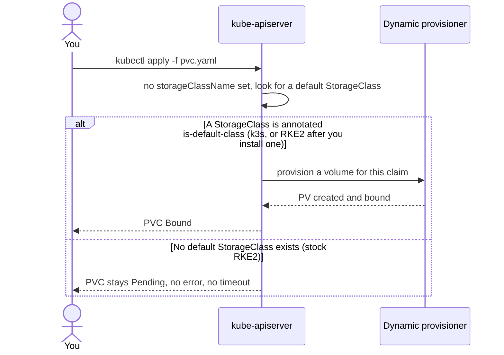

# RKE2 ships no default StorageClass, and a PVC will sit Pending forever

Seventh entry in the RKE2/Kubernetes series. The [CNI entry](rke2-cni-canal-and-alternatives.md) covered something RKE2 bundles and makes permanent; this one covers the opposite — a thing it deliberately doesn't bundle at all, where the failure mode is silence rather than an error.

## The symptom

Apply a `PersistentVolumeClaim` to a fresh single-node RKE2 cluster:

```yaml
apiVersion: v1
kind: PersistentVolumeClaim
metadata:
  name: data
spec:
  accessModes: ["ReadWriteOnce"]
  resources:
    requests:
      storage: 1Gi
```

```sh
kubectl get pvc
# NAME   STATUS    VOLUME   CAPACITY   ACCESS MODES   STORAGECLASS   AGE
# data   Pending                                                     3m
```

`Pending`, with an empty `STORAGECLASS` column, indefinitely — and any Pod mounting it is `Pending` too, because the scheduler won't place a Pod whose volume can't be satisfied. Nothing errors out, nothing times out. There's simply no provisioner listening, and nothing in the cluster is obliged to tell you that.

## RKE2 genuinely ships nothing here

This is worth stating carefully because it's easy to assume otherwise, and the assumption is the trap. Three independent checks, all pointing the same way:

- RKE2's [bundled chart manifest](https://github.com/rancher/rke2/blob/master/charts/chart_versions.yaml) lists CNI plugins, CoreDNS, Traefik, ingress-nginx, metrics-server, Multus, the snapshot controller, and vendor CSI drivers for vSphere/Harvester/oVirt — no general-purpose storage provisioner.
- The string `local-path` does not appear anywhere in [the RKE2 source tree](https://github.com/rancher/rke2).
- [docs.rke2.io](https://docs.rke2.io/)'s sitemap has no storage page at all. There's nothing to read because there's nothing shipped.

## The k3s assumption that causes this

If this surprises you, it's probably because k3s behaves the opposite way, and the two get mentally merged. k3s ships [`manifests/local-storage.yaml`](https://github.com/k3s-io/k3s/blob/master/manifests/local-storage.yaml) — Rancher's `local-path-provisioner` — and that manifest carries:

```yaml
annotations:
  storageclass.kubernetes.io/is-default-class: "true"
```

That annotation is the entire difference. A PVC that names no `storageClassName` gets the default class if one is marked default, and gets nothing at all if none is. On k3s a bare PVC binds within seconds; on RKE2 the identical YAML hangs forever.



## What to actually install

Checking first is one command, and an empty result is the whole diagnosis:

```sh
kubectl get storageclass
# No resources found
```

From there it depends on what the cluster is for:

- **A lab on one node**, matching this series: install [`local-path-provisioner`](https://github.com/rancher/local-path-provisioner) directly — it's the same component k3s bundles, it just isn't pre-installed here. It provisions a directory on the node's own disk, which is exactly right for a lab and exactly wrong for anything that needs to survive the node.
- **A real cluster**: Longhorn (Rancher's own replicated block storage) or a CSI driver for whatever storage actually exists underneath. RKE2 bundling vSphere, Harvester, and oVirt CSI drivers but no generic provisioner is a fair signal of who it expects to be talking to — clusters with real infrastructure beneath them, where guessing at a default would be wrong.

Whichever you pick, mark it default explicitly unless you want every PVC to name its class:

```sh
kubectl patch storageclass local-path \
  -p '{"metadata":{"annotations":{"storageclass.kubernetes.io/is-default-class":"true"}}}'
```

## The general shape of this

Both of the last two entries are the same lesson from opposite directions. The CNI is bundled, opinionated, and permanent. Storage is absent, unopinionated, and entirely yours. "Enterprise-ready distribution" in [RKE2's own framing](https://docs.rke2.io/) turns out to mean fewer defaults, not more — it declines to guess where guessing wrong would be expensive, and the cost of that is failure modes that look like nothing happening.

## Where this series goes next

Ingress — which is bundled, and which just changed its default underneath everyone.
