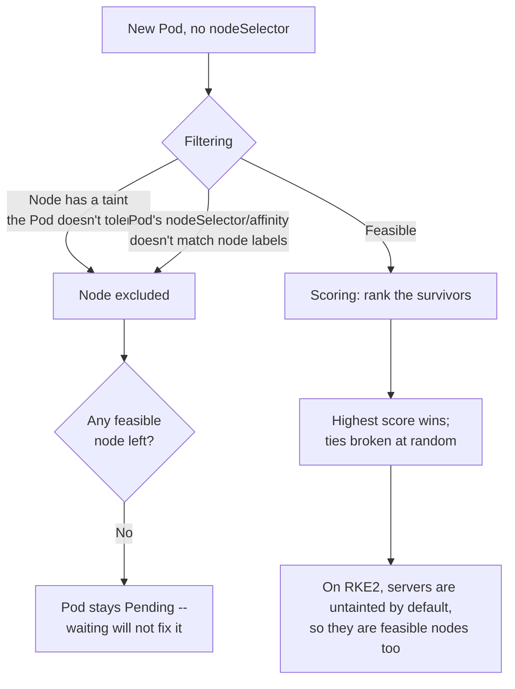

# RKE2 leaves its servers schedulable, so your workloads have been running on the control plane all along

Eleventh entry in the RKE2/Kubernetes series. Ten entries in, every Pod created along the way has landed on a node without anyone choosing which one — including on the multi-server cluster from [the HA entry](rke2-ha-embedded-etcd-external-datastore.md), where some of those Pods were sharing a machine with etcd and the API server. That isn't an accident or an oversight in the setup. It's RKE2's documented default, and it's the opposite of what the most common Kubernetes installer does.

## The scheduler picks, in two stages

Nothing in [the object model entry](pods-deployments-services-object-model.md) said where those three nginx Pods went, because nothing had to: a Deployment names no node. Per [Kubernetes' own scheduler docs](https://kubernetes.io/docs/concepts/scheduling-eviction/kube-scheduler/), `kube-scheduler` resolves that in *"a 2-step operation: Filtering [and] Scoring."*

> The filtering step finds the set of Nodes where it's feasible to schedule the Pod... If the list is empty, that Pod isn't (yet) schedulable.

> In the scoring step, the scheduler ranks the remaining nodes... Finally, kube-scheduler assigns the Pod to the Node with the highest ranking. If there is more than one node with equal scores, kube-scheduler selects one of these at random.

Both halves matter for reading symptoms later. A Pod stuck in `Pending` forever means *filtering* returned nothing — no amount of waiting fixes it. A Pod that landed somewhere surprising but did land means filtering passed and scoring simply preferred that node, which is a tuning question, not a bug.

## Labels and `nodeSelector`: the narrow half

Node labels are ordinary labels on the Node object, and `nodeSelector` is the blunt instrument that filters on them:

```yaml
spec:
  nodeSelector:
    disktype: ssd
```

```sh
kubectl label nodes worker-1 disktype=ssd
kubectl get nodes --show-labels
```

Kubernetes populates a standard set of labels on every node by itself, but the docs attach a caveat worth carrying: *"The value of these labels is cloud provider specific and is not guaranteed to be reliable. For example, the value of `kubernetes.io/hostname` may be the same as the node name in some environments and a different value in other environments."*

`nodeSelector` is all-or-nothing — every listed label must match. [Node affinity](https://kubernetes.io/docs/concepts/scheduling-eviction/assign-pod-node/) is the expressive version, in two flavours whose names say exactly what they do: `requiredDuringSchedulingIgnoredDuringExecution` (*"The scheduler can't schedule the Pod unless the rule is met"*) and `preferredDuringSchedulingIgnoredDuringExecution` (*"If a matching node is not available, the scheduler still schedules the Pod"*).

The shared suffix is the part people get bitten by: *"`IgnoredDuringExecution` means that if the node labels change after Kubernetes schedules the Pod, the Pod continues to run."* Relabelling a node does not relocate anything already on it. Affinity is a placement decision made once, not a standing constraint.

## Taints and tolerations: the other direction

`nodeSelector` and affinity let a *Pod* express a preference. Taints let a *node* refuse. Per [Kubernetes' taints and tolerations docs](https://kubernetes.io/docs/concepts/scheduling-eviction/taint-and-toleration/), there are exactly three effects, and the difference between them is entirely about what happens to Pods that are already running:

| Effect | New Pods without a toleration | Pods already on the node |
|---|---|---|
| `NoSchedule` | Not scheduled | *"not evicted"* — left alone |
| `PreferNoSchedule` | Avoided if possible, *"but it is not guaranteed"* | Left alone |
| `NoExecute` | Not scheduled | *"evicted immediately"* |

`NoExecute` is the one to be careful with, and it has a third case the other two don't: a Pod that tolerates a `NoExecute` taint *and* sets `tolerationSeconds` stays bound for that long and is then evicted by the node lifecycle controller. Toleration isn't necessarily permanent.

```yaml
tolerations:
  - key: "CriticalAddonsOnly"
    operator: "Equal"
    value: "true"
    effect: "NoExecute"
```

## What RKE2 actually does, and what kubeadm does instead

Here is the divergence, stated plainly in [RKE2's own HA installation docs](https://docs.rke2.io/install/ha):

> By default, server nodes will be schedulable and thus your workloads can get launched on them.

And the consequence RKE2 draws from it, in the same document:

> Because RKE2 server nodes are schedulable by default, the minimum number of nodes for an HA RKE2 server cluster is three server nodes and zero agent nodes.

Compare what [Kubernetes' own well-known labels reference](https://kubernetes.io/docs/reference/labels-annotations-taints/) says about the other common path — note that `node-role.kubernetes.io/control-plane` exists as **both** a label and a taint, which is a genuine source of confusion:

- As a **label**: *"A marker label to indicate that the node is used to run control plane components. The kubeadm tool applies this label to the control plane nodes that it manages."* Purely descriptive — it is what fills in the `ROLES` column of `kubectl get nodes` and it blocks nothing.
- As a **taint** (`node-role.kubernetes.io/control-plane:NoSchedule`): *"Taint that kubeadm applies on control plane nodes to restrict placing Pods and allow only specific pods to schedule on them."*

kubeadm applies both. RKE2 applies the role label without the matching taint, which is why the same `kubectl get nodes` output can look identical on the two while behaving completely differently. **Read the taints, not the roles**, when the question is what can land where:

```sh
kubectl get nodes -o custom-columns='NAME:.metadata.name,TAINTS:.spec.taints[*].key'
```

To opt in to a dedicated control plane, RKE2 documents one specific taint:

```yaml
# /etc/rancher/rke2/config.yaml
node-taint:
  - "CriticalAddonsOnly=true:NoExecute"
```

## The trap in doing that, which RKE2 documents and is easy to skim past

> Note: The NGINX Ingress and Metrics Server addons will not be deployed when all nodes are tainted with `CriticalAddonsOnly`. If your server nodes are so tainted, these addons will remain pending until untainted agent nodes are added to the cluster.

So tainting a three-server cluster with no agents doesn't produce a tidy dedicated control plane — it produces a cluster whose bundled addons sit `Pending` indefinitely, which looks exactly like the `PersistentVolumeClaim` failure mode from [the storage entry](rke2-no-default-storageclass.md): silence, not an error. The taint and the agent nodes are one decision, not two.

One caveat on that quote's own wording: it names *NGINX Ingress*, while [the ingress entry](rke2-ingress-traefik-nginx-retirement.md) established that RKE2 moved its default ingress controller to Traefik in v1.36. Whether the replacement addon behaves identically under a blanket `CriticalAddonsOnly` taint isn't something this doc note has been updated to say — worth checking against the cluster rather than assuming the note transferred.

## Labels and taints set by RKE2 are registration-time only

This is the operational gotcha, and it applies to both flags. From [RKE2's advanced configuration docs](https://docs.rke2.io/advanced):

> The two options only add labels and/or taints at registration time, and can only be added once and not removed after that through rke2 commands. If you want to change node labels and taints after node registration you should use `kubectl`.

Editing `node-label` or `node-taint` in `config.yaml` and restarting the service does nothing to a node that has already joined. The change looks applied — it's in the config file, the service restarted cleanly, no error anywhere — and the Node object is unchanged. After registration, `kubectl taint` and `kubectl label` are the only things that move it. That is the same shape of silent no-op as the *"Unknown flag ... found in config.yaml, skipping"* line flagged at the end of [the restore drill entry](rke2-etcd-snapshot-restore-drill.md): config that is read but not acted on.

When multiple config files are in play, the accumulating form matters too — per [RKE2's configuration docs](https://docs.rke2.io/install/configuration), a bare `node-taint:` in a later file in `config.yaml.d/` *replaces* the accumulated list, while `node-taint+:` appends to it.

## Split roles are built from these same taints

[The HA entry](rke2-ha-embedded-etcd-external-datastore.md) covered separating etcd from the control plane. The scheduling half of that separation is taints, and RKE2's own split-server integration test spells out both halves of the pattern — dedicated etcd nodes:

```yaml
disable-apiserver: true
disable-controller-manager: true
disable-scheduler: true
node-taint:
  - node-role.kubernetes.io/etcd:NoExecute
```

and dedicated control-plane nodes:

```yaml
disable-etcd: true
node-taint:
  - node-role.kubernetes.io/control-plane:NoSchedule
```

Worth noticing *why* that test has to write those taints into `config.yaml` at all: if RKE2 applied them itself, there would be nothing to configure. The test is its own evidence that these are opt-in.

Note the deliberate asymmetry in effects. Etcd nodes get `NoExecute` — evict anything already there, because an etcd member competing for disk with a workload is the problem being solved. Control-plane nodes get `NoSchedule` — stop new arrivals, don't forcibly evict.



## The connection back to draining a node

[The node-maintenance entry](rke2-node-maintenance-drain-reboot.md) used `kubectl drain` and `kubectl uncordon` without saying what cordoning actually *is*. It's a taint. `node.kubernetes.io/unschedulable` is one of the built-in taints the control plane adds automatically, and `uncordon` removes it — which is why a cordoned node still shows `Ready` while accepting nothing new.

That also explains `--ignore-daemonsets`, which that entry described as necessary without explaining why it's necessary. Per the taints docs, the DaemonSet controller automatically adds `NoSchedule` tolerations for a specific list of built-in taints to every daemon it creates — `node.kubernetes.io/unschedulable` among them — *"to prevent DaemonSets from breaking."* DaemonSet Pods therefore tolerate the cordon by design and will never leave on their own, so `drain` would block on them forever without that flag. Not a quirk of the command: a direct consequence of how cordoning is implemented.

## Where this series goes next

RBAC — who is actually allowed to run `kubectl taint`, `kubectl label`, or any of the other commands in this entry.
