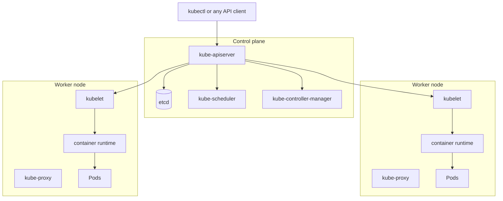
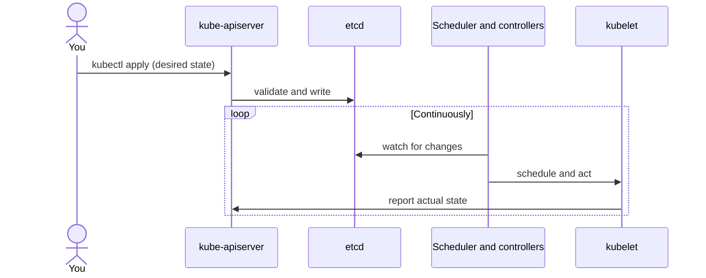

# What Kubernetes actually is, and how it works

Starting a series on learning Kubernetes via RKE2 from scratch. Before touching RKE2 specifically, the part worth getting solid first: what a Kubernetes cluster is made of, and the one idea — reconcile actual state toward desired state, continuously — that everything else is built on.

## The shape of a cluster

A cluster splits into two kinds of machines: a small number of **control plane** nodes that decide things, and any number of **worker** nodes that actually run your containers.

- **`kube-apiserver`** is the only thing anyone talks to — `kubectl`, every controller, every kubelet, all go through it. Nothing reads or writes `etcd` directly except the API server.
- **`etcd`** is the actual database: every object you create (a Pod, a Deployment, a Secret) is a record in etcd. If etcd is gone, the cluster's state is gone.
- **`kube-scheduler`** watches for Pods that don't have a node assigned yet and picks one, based on requested resources, taints/tolerations, affinity rules.
- **`kube-controller-manager`** runs the reconciliation loops for the built-in object types — a Deployment's controller noticing it has 2 ReplicaSets when it should have 3, that kind of thing.
- **`kubelet`**, one per worker node, is the thing that actually makes Pods exist — it watches the API server for Pods assigned to its node and tells the **container runtime** (via the CRI) to start/stop containers to match.
- **`kube-proxy`** sets up the networking rules on each node so a Service's stable IP actually reaches whichever Pod is currently backing it.

## The one loop everything runs on

Kubernetes is declarative: you never tell it "start a container." You tell it "I want 3 replicas of this," write that desired state down, and something keeps nudging reality toward it until they match — indefinitely, not just once.

That loop is why killing a Pod by hand doesn't work the way it looks like it should: the Deployment controller notices the replica count dropped below desired, and starts a new one before you've finished reading the output of `kubectl get pods`. It's also why a `kubectl apply` you ran an hour ago can still be "reconciling" — nothing about this model promises the desired state is reached instantly, only that the system keeps working toward it.

## Where RKE2 fits into this picture

RKE2 doesn't reinvent any of the above — it packages it. Concretely: RKE2 bundles `containerd` as the container runtime, and rather than you standing up `kube-apiserver`/`etcd`/`kube-scheduler`/`kube-controller-manager` as separate system services (the way `kubeadm` has you do it), a single `rke2-server` systemd unit runs them all as **static pods** — Kubernetes manifests read directly off disk and started by `kubelet`, before the cluster even has an API server to talk to. The rest of the series works through what that packaging choice actually buys you, one subject at a time.
