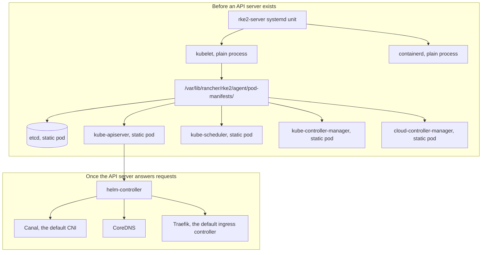

# What RKE2 actually is, and how its pieces fit together

A closer look at the "packaging" [the Kubernetes-fundamentals entry](what-is-kubernetes-and-how-it-works.md) waved at: what RKE2 specifically is, why it exists as a separate thing from plain `kubeadm` Kubernetes or Rancher's own older RKE, and how its control plane actually starts up given that a Kubernetes control plane normally needs itself to already be running.

## What RKE2 is, and why it exists

RKE2 — also called **RKE Government** — is Rancher's Kubernetes distribution built for environments with real compliance requirements. Per [RKE2's own docs](https://docs.rke2.io/), it's meant to combine RKE1's close conformance to upstream Kubernetes with K3s's operational simplicity, while providing "defaults and configuration options that allow clusters to pass the CIS Kubernetes Benchmark ... with minimal operator intervention" and supporting FIPS 140-2 validated cryptography. The other concrete break from RKE1: RKE1 depended on Docker, RKE2 uses `containerd` directly.

## The bootstrapping problem, and how static pods solve it

Kubernetes objects normally exist because something asked `kube-apiserver` to create them. That's a problem for the control plane's own components — `kube-apiserver` can't be "a Pod the API server created" before the API server exists to create it. RKE2's answer, [confirmed in its own `staticpod` executor source](https://github.com/rancher/rke2/blob/master/pkg/executor/staticpod/staticpod.go): `etcd`, `kube-apiserver`, `kube-scheduler`, `kube-controller-manager`, and `cloud-controller-manager` are all generated as **static pod manifests** — plain YAML files kubelet reads directly off disk, with no API server involved at all. Only `kubelet` and `containerd` themselves run as ordinary supervised OS processes; everything else in the control plane is a static pod kubelet starts on its own.

Everything in the top half exists the moment kubelet starts reading manifests off disk — no chicken-and-egg problem, because none of it went through the API server to get there. Everything in the bottom half is ordinary Kubernetes: `helm-controller` (an RKE2-specific controller watching `/var/lib/rancher/rke2/server/manifests`) applies HelmCharts as regular API objects, once there's an API server to apply them against.

## What ships by default, and one thing worth double-checking per version

Verified directly against current RKE2 source and the live release-channel API (`update.rke2.io`, showing `stable` at `v1.36.4+rke2r1` as of this writing) rather than assumed from memory:

- **CNI**: [Canal](https://github.com/rancher/rke2/blob/master/pkg/cli/cmds/server.go) (Calico's network policy engine + Flannel's overlay networking) — the `cni` flag's default value in RKE2's own source is literally `canal`.
- **Ingress**: **Traefik**, as of RKE2 v1.36 — and this one is worth double-checking against whatever version you're actually running. `rke2-ingress-nginx` was the default for a long time and plenty of existing writeups (including this series' own backlog notes) still say so, but per [RKE2's ingress migration docs](https://docs.rke2.io/reference/ingress_migration), ingress-nginx is deprecated as of v1.36 (end-of-life March 2026) and RKE2's own source now hard-fails if you try to run it as a standalone controller: `"ingress-nginx is no longer supported as a standalone ingress controller, please use traefik"`. A cluster upgraded from an older version keeps ingress-nginx; a fresh cluster gets Traefik.
- **DNS**: CoreDNS, deployed by default unless explicitly disabled.

## Where the earlier entries in this series fit on this map

The [single-node lab install](rke2-single-node-lab-install.md) entry is what starts the `rke2-server` unit in the diagram above. The [kubectl-from-off-the-node](kubectl-off-node-rke2-tls-san.md) entry is about reaching the `kube-apiserver` static pod once it's up. The [node-maintenance](rke2-node-maintenance-drain-reboot.md) entry is about what has to happen to the `etcd` static pod specifically before a control-plane node reboots. Next up: the object model those bottom-half components actually run — Pods, Deployments, Services.
