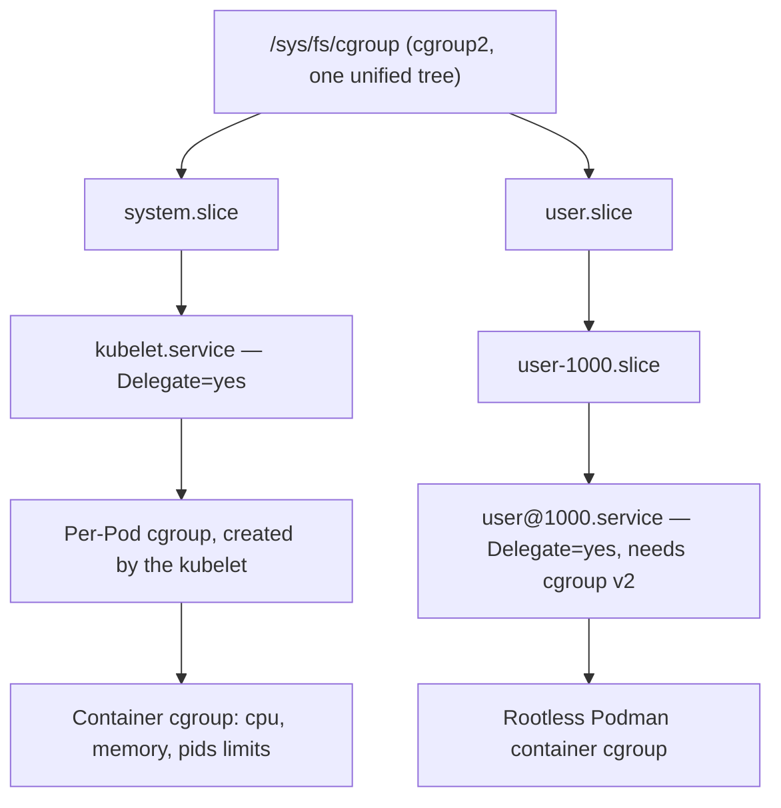

# What cgroups v2 actually is, and how Podman and Kubernetes use it

Both Podman and Kubernetes ultimately enforce container resource limits the same way: by writing numbers into files under `/sys/fs/cgroup`. What "cgroup v2" changes is the shape of that filesystem, who's allowed to write to which part of it, and — as of a genuinely recent Kubernetes change — whether the cluster starts at all.

## The one structural change that matters: a single unified tree

cgroup v1 mounted a **separate hierarchy per controller** — `/sys/fs/cgroup/cpu/`, `/sys/fs/cgroup/memory/`, `/sys/fs/cgroup/pids/`, each its own independent tree, a process could sit in different positions in each. cgroup v2 replaces all of that with **one tree**, mounted once, where every controller applies to the same hierarchy of groups. A cgroup enables specific controllers for its children by writing to its own `cgroup.subtree_control` file — nothing is available by default, each level has to explicitly opt its children in.



## Delegation: how a non-root process gets to manage part of the tree

Only one thing is allowed to manage the cgroup tree on a systemd system: PID 1. Everything else — a container engine, your own login session — gets a **delegated subtree**: systemd sets `Delegate=yes` on a service or scope unit, and from that point down, the tree belongs to whatever's running in it. Per [systemd's own cgroup delegation documentation](https://github.com/systemd/systemd/blob/main/docs/CGROUP_DELEGATION.md), the controllers actually available for delegation differ by cgroup version — `cpu`, `cpuacct`, `blkio`, `memory`, `devices`, `pids` under v1, versus `cpu`, `io`, `memory`, `pids` under v2's unified model.

This is also where a fairly recent, easy-to-miss default change lives: **`user@.service` didn't always get the `cpu` controller delegated to it.** Per [systemd's own NEWS file](https://github.com/systemd/systemd/blob/main/NEWS), systemd 252 was the release that added `cpu` to the set delegated to per-user manager instances by default — `memory` and `pids` were already there. That's what makes rootless resource limits ("what CPU share does my user session's containers get") a function of the systemd version underneath, not just Podman's own configuration.

## Podman: rootless mode has a hard cgroup v2 dependency

Podman's cgroup manager is a plain choice — `--cgroup-manager systemd` or `cgroupfs`, `systemd` by default per [Podman's own man page](https://docs.podman.io/en/latest/markdown/podman.1.html) — but rootless mode isn't symmetric between the two cgroup versions. Per [Podman's own `rootless.md`](https://github.com/containers/podman/blob/main/rootless.md), stated plainly, no hedging: **"No support for setting resource limits on systems using cgroups v1."** `podman run --memory 512m` or `--cpus 2` as a non-root user simply doesn't enforce anything on a cgroup v1 host — the flags are accepted, the limit isn't applied. Root Podman can still fall back to cgroupfs manipulation directly on v1; rootless Podman has no such fallback, because writing anywhere in the cgroup tree as a non-root user requires the delegation systemd provides, and that delegation mechanism is what cgroup v2 is built around. Podman's default OCI runtime, `crun`, has supported cgroup v2 natively since early on — it was never the constraint here.

## Kubernetes: stable since 1.25, and now enforced going forward

cgroup v2 support in Kubernetes has been [stable since v1.25](https://kubernetes.io/docs/concepts/architecture/cgroups/). The part worth knowing if you haven't rebuilt a cluster recently: as of **v1.35** (current stable is 1.37 at time of writing), Kubernetes has *deprecated* cgroup v1 outright, and per [the same docs](https://kubernetes.io/docs/concepts/architecture/cgroups/), stated as current default behavior, not a future warning:

> "Kubelet will no longer start on a cgroup v1 node by default. To disable this setting a cluster admin should set `failCgroupV1` to false in the kubelet configuration file."

That's a hard boot-time refusal, not a log warning — a kubelet pointed at a genuinely old host (kernel older than 5.8, or one that never switched off cgroup v1) won't join the cluster until either the host is upgraded or that setting is explicitly overridden. Checking which version a given node is actually running is a one-line stat call, per Kubernetes' own docs:

```sh
stat -fc %T /sys/fs/cgroup/
# cgroup2fs -> cgroup v2
# tmpfs     -> cgroup v1
```

Worth knowing this defaults the other way on current distros regardless: Fedora (since 31), Debian (since 11), Ubuntu (since 21.10), Arch (since April 2021), and RHEL and its rebuilds (since RHEL 9) all boot with cgroup v2's unified hierarchy out of the box — the RKE2 lab node from [an earlier entry](../kubernetes/rke2-single-node-lab-install.md) is running on it without anyone having configured that explicitly.
