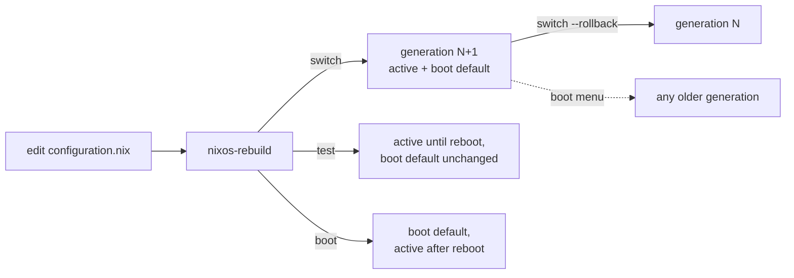

# First steps on NixOS: the whole system is one file, and every change is a boot entry

Coming to NixOS from RHEL or Ubuntu, the instinct is to install a package, edit something under `/etc`, and restart a service. NixOS supports a version of that, but it isn't the model. The model is one file describing the whole machine, a command that builds that description into a new system, and a boot menu that keeps every previous build around. This entry covers those first moves, checked against the [NixOS 26.05 manual](https://nixos.org/manual/nixos/stable/), plus the one setting the manual tells you never to touch.

## The machine is `/etc/nixos/configuration.nix`

Per the manual: *"The file `/etc/nixos/configuration.nix` contains the current configuration of your machine."* Users, services, the firewall, the bootloader, the packages: all of it is declared there, in the Nix language. A minimal change looks like this:

```nix
{ config, pkgs, ... }:
{
  environment.systemPackages = [ pkgs.htop pkgs.git ];
  services.openssh.enable = true;
}
```

Setting `services.openssh.enable` is not the same as installing the `openssh` package. It turns on a NixOS *module*, which writes the systemd unit, the config file and the firewall hole. The manual says so directly for packages in general: *"Some packages require additional global configuration such as D-Bus or systemd service registration so adding them to `environment.systemPackages` might not be sufficient."* So check whether a `services.<name>` option exists before reaching for `systemPackages`. Adding a daemon's package alone usually gets you the binary and nothing running.

## Applying it: `switch`, `test`, and `boot` aren't interchangeable

Nothing happens when you save the file. You build it:

```sh
sudo nixos-rebuild switch
```

The manual describes that as: *"build the new configuration, make it the default configuration for booting, and try to realise the configuration in the running system."* Two siblings do only part of that, and the difference matters the first time you change something risky:

| Command | Activates now | Becomes the boot default |
|---|---|---|
| `nixos-rebuild switch` | Yes | Yes |
| `nixos-rebuild test` | Yes | No |
| `nixos-rebuild boot` | No | Yes |

`test` is the safe one for network or bootloader experiments. In the manual's words: *"if (say) the configuration locks up your machine, you can just reboot to get back to a working configuration."* The reboot itself is the undo button.

There's one caveat worth knowing before you rely on `switch` to restart everything: *"This command doesn't start/stop user services automatically. `nixos-rebuild` only runs a daemon-reload for each user with running user services."* System services get restarted. User-level units, like the rootless Quadlet containers covered [elsewhere on this site](../podman/caddy-php-fpm-automatic-https.md), don't.

## Every build is a generation, and rollback is one command

Each successful rebuild becomes a numbered *generation*: a symlink under `/nix/var/nix/profiles/`, and an entry in the boot menu. Nothing is overwritten in place. To go back while the system is running:

```sh
sudo nixos-rebuild switch --rollback
```

Per the manual, that's equivalent to running `/nix/var/nix/profiles/system-N-link/bin/switch-to-configuration switch` for the previous generation. To see what you have:

```sh
ls -l /nix/var/nix/profiles/system-*-link
```

If the new generation won't boot at all, pick an older one from the bootloader menu. That's the practical difference from a traditional distro, where rollback means snapshots, backups, or remembering what you changed.



## Old generations cost disk until you collect them

Keeping every build has a price: old generations pin their packages in `/nix/store`. The manual's command for cleaning up is `nix-collect-garbage`, with an important distinction. The plain form *"do[es] not remove garbage collector roots, such as old system configurations. Thus they do not remove the ability to roll back."* The `-d` form does:

```sh
sudo nix-collect-garbage -d   # deletes old generations, then collects
```

After that, the rollback menu is gone. To automate the safe part, the manual gives:

```nix
{
  nix.gc.automatic = true;
  nix.gc.dates = "03:15";
}
```

One more gotcha from the same section: if `/boot` fills up, clearing old profiles isn't enough on its own. You *"must rebuild your system with `nixos-rebuild boot` or `nixos-rebuild switch` to update the `/boot` partition."*

## `nix-env` exists, and it's the other model

`nix-env -iA nixos.thunderbird` installs a package imperatively, into a per-user profile. The manual calls this *ad hoc* package management and spells out how it differs: packages installed this way are upgraded individually, whereas *"running `nixos-rebuild switch` causes all packages to be updated to their current versions in the NixOS channel."* Mixing the two means some software on the machine isn't in `configuration.nix`, which defeats the reason to use NixOS. For a first system, put everything in the file. For a one-off tool you need for five minutes, `nix-shell -p <package>` gives you a temporary shell without installing anything.

## Channels are per user, and upgrades come from them

A fresh install is subscribed to the channel matching the ISO. On 26.05 that's `nixos-26.05`, which *"only get[s] conservative bug fixes and package upgrades."* To upgrade within it:

```sh
sudo nixos-rebuild switch --upgrade
```

That's the manual's shorthand for `nix-channel --update nixos; nixos-rebuild switch`. The trap is that *"channels are set per user."* Running `nix-channel --add` without `sudo` changes your user's channel, not the one `configuration.nix` is built from. The upgrade appears to do nothing, because the system never saw it.

## The one line you should leave alone: `system.stateVersion`

The generated config ends with something like `system.stateVersion = "26.05";`. It looks like a version number to bump on each upgrade. It isn't. From the option's own definition in [nixpkgs](https://github.com/NixOS/nixpkgs/blob/nixos-26.05/nixos/modules/misc/version.nix):

> Most users should **never** change this value after the initial install, for any reason, even if you've upgraded your system to a new NixOS release.

It records which NixOS release first created the machine's *data*, so modules for things like databases keep defaults compatible with data that can't migrate itself. The same description states the misconception outright: *"This value does **not** affect the Nixpkgs version your packages and OS are pulled from, so changing it will **not** upgrade your system."* The upgrade comes from the channel. Leave `stateVersion` at whatever the installer wrote.

## Flakes: you'll see them everywhere, and they're still experimental

Most NixOS guides online use `flake.nix` rather than `configuration.nix` alone. The installer supports it (`nixos-generate-config --flake`), but in the [Nix 2.34 reference manual](https://nix.dev/manual/nix/stable/development/experimental-features) both `flakes` and the new `nix` subcommands are still listed as experimental features you have to opt into. You can learn NixOS without them. Everything above works with the plain `configuration.nix` and channels, and flakes make more sense once that model is familiar.

## How this compares to tools already on this site

This is the same declarative idea as [Terraform/OpenTofu](../terraform/what-is-terraform-opentofu-and-how-it-works.md), applied to one machine's whole OS instead of cloud resources. It shares one property with Terraform: there's no agent watching for drift. Nothing reapplies `configuration.nix` until you run `nixos-rebuild`. The difference is that the previous state is still sitting on the boot menu, which Terraform's state file can't give you.
