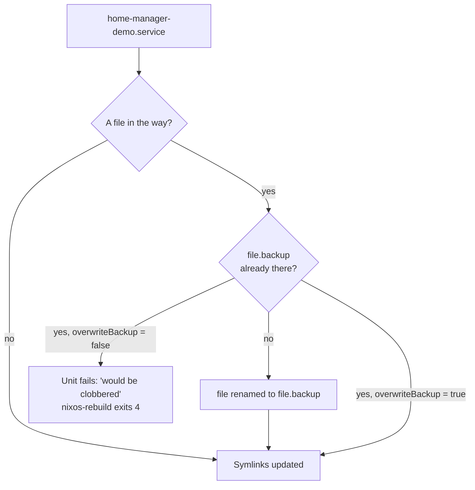

# Home Manager as a NixOS module: dotfiles in the same rebuild, and the file that's in the way

[Home Manager](https://nix-community.github.io/home-manager/) declares a user's packages and dotfiles in Nix. As a NixOS module, it is built and activated by `nixos-rebuild`, with the rest of the machine. Checked against Home Manager `release-26.05` and nixpkgs `nixos-26.05`, in a VM test that boots the configuration and then deliberately breaks it.

## Setup

Add the channel as root, on the same release as NixOS:

```sh
sudo nix-channel --add https://github.com/nix-community/home-manager/archive/release-26.05.tar.gz home-manager
sudo nix-channel --update
```

```nix
{ ... }:
{
  imports = [ <home-manager/nixos> ];

  home-manager = {
    useGlobalPkgs = true;           # the system's nixpkgs, overlays and config
    useUserPackages = true;         # packages in /etc/profiles/per-user/<user>
    backupFileExtension = "backup"; # see "The file that's in the way"

    users.demo = { pkgs, ... }: {
      home.stateVersion = "26.05";  # like system.stateVersion: set once, leave it
      home.packages = [ pkgs.ripgrep ];
      programs.git = {
        enable = true;
        settings.user = { name = "Demo"; email = "demo@example.invalid"; };
      };
      xdg.configFile."dar-nixos/hello.txt".text = "Managed by Home Manager.\n";
    };
  };
}
```

The user must still exist in `users.users`.

Both `use*` options default to `false`, and the manual's flake example sets both:
- **`useGlobalPkgs`**: without it, each user gets a private nixpkgs imported from `NIX_PATH`, which a flake's pure evaluation doesn't have.
- **`useUserPackages`**: without it, packages go to `~/.nix-profile`. The manual notes it's needed for `nixos-rebuild build-vm`.

## What `nixos-rebuild` does with it

Each user gets a oneshot unit, `home-manager-<user>.service`. It runs **as that user**, and it is ordered before `systemd-user-sessions.service`, so the dotfiles are in place before anyone can log in. `switch` restarts it when that user's configuration changed. So:

- managed files are symlinks into `/nix/store`, and editing them in place fails;
- there's no `home-manager` command, and `nixos-rebuild` is the only entry point;
- a system rollback also rolls back the dotfiles;
- activation logs go to `journalctl -u home-manager-demo.service`.

## The file that's in the way

Home Manager won't replace a file it doesn't own, such as a `~/.config/git/config` that existed before, or a symlink someone replaced with a copy to edit it. Activation stops before changing anything:

```text
Existing file '/home/demo/.config/dar-nixos/hello.txt' would be clobbered
```

The ways out are:
- `backupFileExtension` renames the file to `*.backup`;
- `backupCommand` runs your own command on the file instead;
- `force = true` on one file option overwrites it.

**The backup works only once.** The next collision finds `*.backup` already there and fails again:

```text
Existing file '...hello.txt.backup' would be clobbered by backing up '...hello.txt'
```

To avoid that second failure, either delete the old backup or set `home-manager.overwriteBackup = true`.

**The system switches anyway.** Only the user's unit fails. `nixos-rebuild switch` activates the new generation, prints `warning: the following units failed: home-manager-demo.service`, and exits with status 4. That user's files stay as they were.



## Keep the two releases together

When NixOS moves to the next release, move the `home-manager` channel with it. I ran Home Manager 25.11 against nixpkgs 26.05, and a mismatch fails in one of two ways:

- **With `home.stateVersion = "26.05"`**, evaluation fails, because Home Manager 25.11 doesn't know that release (`is not of type one of "18.09", ..., "25.11"`).
- **Otherwise it's only a warning** (`You are using Home Manager version 25.11 and Nixpkgs version 26.05`), and the system builds. The companion repo's CI fails on it, since nobody reads warnings in CI logs.

Releases also rename options. Home Manager 25.11 moved `programs.git.userName` and `userEmail` to `programs.git.settings.user.*`. The old names still work, with a warning.

## Session variables need a managed shell

`home.sessionVariables` goes into `hm-session-vars.sh`, which only a shell configured by Home Manager sources. With Zsh kept at system level, as in [the Oh My Zsh entry](zsh-oh-my-zsh-declarative.md), source it yourself:

```bash
. "/etc/profiles/per-user/$USER/etc/profile.d/hm-session-vars.sh"
```

## Without a channel

A channel is state outside the repo. Pinning a commit and its hash makes the import reproducible. It also works in pure evaluation, so a flake can import the same file:

```nix
let
  home-manager = builtins.fetchTarball {
    url = "https://github.com/nix-community/home-manager/archive/<commit>.tar.gz";
    sha256 = "<hash>";
  };
in
{ imports = [ "${home-manager}/nixos" ]; }
```

A configuration that is a flake from the start uses `home-manager.nixosModules.home-manager` instead, from an input on `release-26.05`, with `inputs.nixpkgs.follows = "nixpkgs"`.

## Checked in CI

The companion repo [dar-nixos](https://github.com/abdelhousni/dar-nixos) carries this setup as [`home.nix`](https://github.com/abdelhousni/dar-nixos/blob/main/home.nix). Its VM test checks the unit's ordering and user, the store symlinks, `rg` from the per-user profile, and both collisions. See [the GitHub Actions entry](nixos-config-tests-github-actions.md) and [the GitLab CE entry](nixos-config-tests-gitlab-ce.md).

## Sources

- The Home Manager manual: [NixOS module](https://nix-community.github.io/home-manager/#sec-install-nixos-module) and [flake setup](https://nix-community.github.io/home-manager/#sec-flakes-nixos-module).
- Home Manager `release-26.05` source:
  - `nixos/default.nix` and `nixos/common.nix` (the unit, and the two `use*` options);
  - `modules/files/check-link-targets.sh` (collisions and backups);
  - `modules/home-environment.nix` (release check, session variables).
- nixpkgs `nixos-26.05`: `switch-to-configuration-ng`, for exit status 4.
