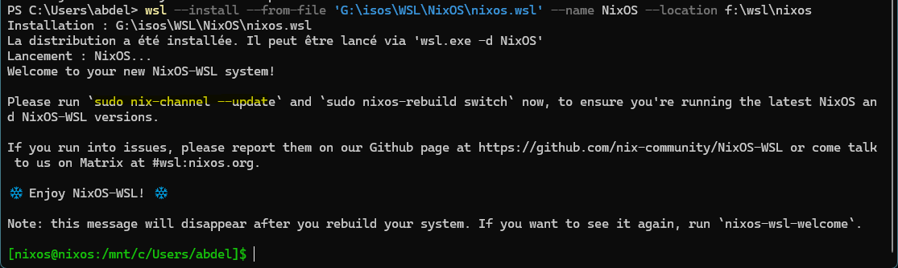

# NixOS on WSL2: a short admin runbook, and the files WSL manages instead of NixOS

[NixOS-WSL](https://github.com/nix-community/NixOS-WSL) runs a full NixOS inside WSL2, with systemd, `nixos-rebuild` and generations included. Everything in [the first-steps entry](first-steps-configuration-generations-rollback.md) still applies. What changes is that WSL owns a few files NixOS normally manages. This runbook checks install, configuration and recovery against the project's own docs and module source (release `2605.7.2`, which tracks NixOS 26.05).

## Prerequisites

- **WSL from the Microsoft Store.** The [install docs](https://nix-community.github.io/NixOS-WSL/install.html) say it's "tested with the Windows Store version of WSL 2", and support for older inbox versions is "best-effort". Check with `wsl --version`. If that command doesn't work, the troubleshooting docs say you're "probably not using the Microsoft Store version". Update with `wsl --update`.
- **WSL 2.4.4 or later** for the one-step `.wsl` install. Older versions use `wsl --import` instead.
- **Systemd is not something you enable yourself.** On other distros you add `[boot] systemd=true` to `/etc/wsl.conf`. Here, `/etc/wsl.conf` is generated from the `wsl.wslConf` option, and `wsl.wslConf.boot.systemd` defaults to `true`. The module warns that turning it off "is strongly discouraged and WILL break things". The old workaround for WSL builds without systemd is gone. `wsl.nativeSystemd` is now a removed option whose message reads *"Native systemd is now always enabled as support for syschdemd has been removed"*, so you need a WSL build that supports systemd natively.

## Install

Download `nixos.wsl` from the [latest release](https://github.com/nix-community/NixOS-WSL/releases/latest). Releases before 2411 called it `nixos-wsl.tar.gz`. Then, in PowerShell:

| WSL version | Command |
|---|---|
| 2.4.4 or later | `wsl --install --from-file nixos.wsl` (or double-click the file). Use `--name` and `--location` to change the defaults. |
| Older | `wsl --import NixOS $env:USERPROFILE\NixOS nixos.wsl --version 2` |

On WSL 2.4.4 and later, the install starts the distro immediately and prints the NixOS-WSL welcome banner:

<figure>
<a href="nixos-wsl-install.png"></a>
<figcaption>Installing from <code>nixos.wsl</code> with a custom <code>--name</code> and <code>--location</code>. The first shell opens in the Windows directory the command was run from, under <code>/mnt/c</code>. Select the image for full size.</figcaption>
</figure>

The banner asks for two commands, not just the channel update the install docs mention. Run both, and set a password first:

```sh
passwd                       # user "nixos", in wheel; sudo asks for a password by default
sudo nix-channel --update    # needed once before the first nixos-rebuild
sudo nixos-rebuild switch    # picks up the latest NixOS and NixOS-WSL; also removes the banner
```

The banner only comes from the configuration baked into the tarball, which is used until the first `nixos-rebuild`. After that, `nixos-wsl-welcome` shows it again on demand. Later, start the distro with `wsl -d NixOS`.

Make it the default distro with `wsl -s NixOS`.

## Configuration

### Channels or flakes

The installed `/etc/nixos/configuration.nix` imports `<nixos-wsl/modules>`. The installer adds a `nixos-wsl` channel next to the usual `nixos` one, so `sudo nix-channel --update` updates both. That setup is fine to keep.

To switch to flakes, follow the [project's flakes how-to](https://nix-community.github.io/NixOS-WSL/how-to/nix-flakes.html): add a `nixos-wsl` input and put `nixos-wsl.nixosModules.default` in your module list with `wsl.enable = true`. Two things to watch:

- Remove the `<nixos-wsl/modules>` import when you move to flakes, so the module isn't loaded twice from two sources.
- The how-to's example sets `system.stateVersion = "25.05"`. Don't copy that line. Keep whatever your install wrote, [for the reasons here](first-steps-configuration-generations-rollback.md).

### Interop with Windows

Four switches control how Windows binaries and PATH leak into NixOS. All are verified in the module source:

| Option | Default | What it does |
|---|---|---|
| `wsl.wslConf.interop.enabled` | `true` | Allows running `.exe` files from the Linux shell |
| `wsl.wslConf.interop.appendWindowsPath` | `true` | Tells WSL to add the Windows PATH to `$PATH` |
| `wsl.interop.includePath` | `true` | "Include Windows PATH in WSL PATH", applied by NixOS-WSL's shell init |
| `wsl.interop.register` | `false` | Re-registers the binfmt handler for Windows executables |

The last one is the trap. If you add *any* `binfmt` registration, for example `boot.binfmt.emulatedSystems = [ "aarch64-linux" ]` to build ARM images, the module warns that doing so "without re-registering WSLInterop (`wsl.interop.register`) will break running .exe files from WSL2". Set `wsl.interop.register = true` alongside it.

### GPU acceleration

The module already sets `hardware.graphics.enable = true`. To use the Windows host's GPU driver, add:

```nix
wsl.useWindowsDriver = true;
```

That links the host libraries from `/usr/lib/wsl/lib` into a package NixOS can use. The generic WSL approach, `wsl.wslConf.automount.ldconfig`, doesn't help here. Its own option description says it "does not work with NixOS and `wsl.useWindowsDriver` should be used instead".

## `/etc/wsl.conf` changes need a distro restart

Because `/etc/wsl.conf` is generated, edit `wsl.wslConf.*` in `configuration.nix`, never the file itself. A rebuild overwrites the file. WSL also only reads it at startup ([Microsoft's docs](https://learn.microsoft.com/en-us/windows/wsl/wsl-config) have you restart with `wsl --shutdown` after editing it). So after any `nixos-rebuild switch` that touches `wsl.wslConf`, run:

```powershell
wsl -t NixOS      # this distro only
wsl --shutdown    # all distros, if -t isn't enough
```

The troubleshooting docs note that "some issues will only be resolved after a _full_ restart of WSL".

## Troubleshooting

### Recovery shell

If a bad generation leaves the distro unusable, this bypasses your system's normal startup:

```powershell
wsl -d NixOS --system --user root -- /mnt/wslg/distro/bin/nixos-wsl-recovery
```

Per the [recovery docs](https://nix-community.github.io/NixOS-WSL/troubleshooting/recovery-shell.html), it loads WSL's system distro, activates your configuration and chroots into it, "similar to what `nixos-enter` would do". To boot into an older generation, add `--system /nix/var/nix/profiles/system-42-link`. That path is relative to the NixOS root.

### Networking: WSL owns `/etc/hosts` and `resolv.conf`

`wsl.wslConf.network.generateHosts` and `generateResolvConf` both default to `true`, so WSL writes both files at startup.

For `/etc/hosts`, NixOS-WSL then disables NixOS's own copy (`hosts.enable = false` in the module). NixOS builds that file from `networking.hosts` and `networking.extraHosts`, so both are silently ignored.

For `resolv.conf`, WSL and NixOS's resolvconf service can both end up writing it. If you want `networking.nameservers` to be the only source, turn WSL's generation off:

```nix
wsl.wslConf.network.generateHosts = false;      # networking.extraHosts works again
wsl.wslConf.network.generateResolvConf = false; # NixOS alone manages resolv.conf
networking.nameservers = [ "1.1.1.1" ];
```

Rebuild, then restart the distro, as with any other `wsl.wslConf` change. The WSL hostname follows `networking.hostName` by default, through `wsl.wslConf.network.hostname`.

### File permissions on `/mnt/c`

Windows drives are mounted with `metadata,uid=1000,gid=100` by default (`wsl.wslConf.automount.options`). Microsoft's docs describe `metadata` as adding metadata "to Windows files to support Linux system permissions". So `chmod` on `/mnt/c` files works and persists. Everything also appears owned by UID 1000, the default `nixos` user. If your user has a different UID, change the mount options to match.

### Renaming the default user

Set `wsl.defaultUser`, then follow the [documented order](https://nix-community.github.io/NixOS-WSL/how-to/change-username.html) exactly. Use `nixos-rebuild boot`, not `switch`, which the docs say "may lead to the new user account being misconfigured". Then run `wsl -t NixOS`, `wsl -d NixOS --user root exit`, and `wsl -t NixOS` again, and open a new shell.
