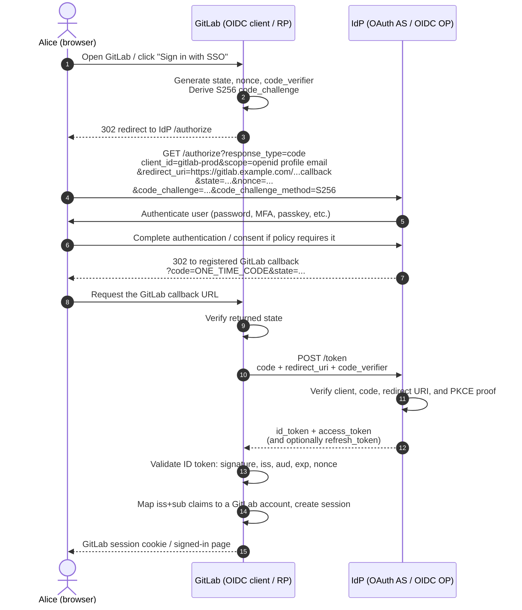
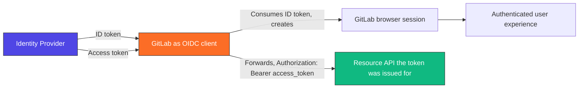
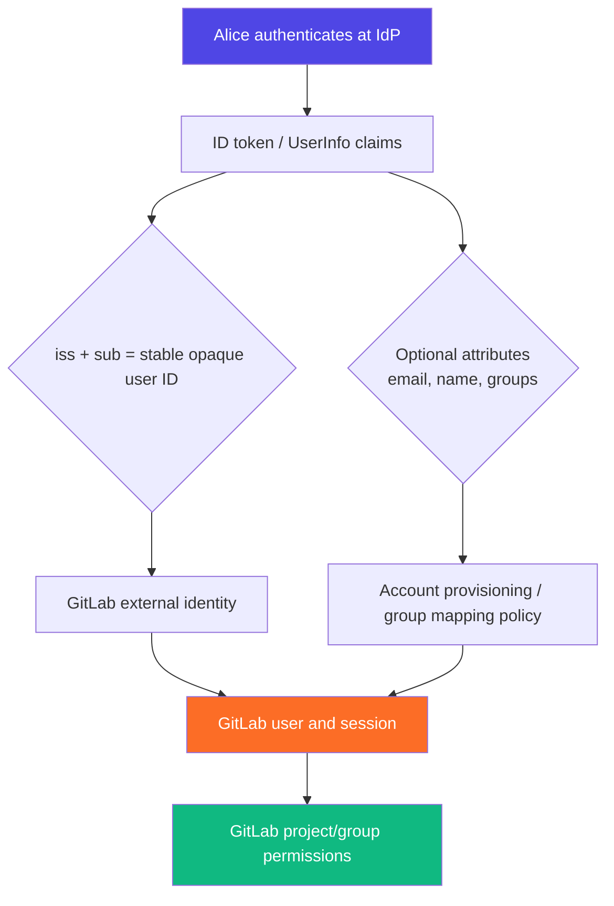

# GitLab with OAuth 2.0 / OIDC — the simple principle

This guide uses **GitLab** as the application a user wants to access and an external identity provider (IdP)—for example Keycloak, Microsoft Entra ID, Okta, or Authentik—as the OAuth 2.0 / OpenID Connect (OIDC) source.

> **Short version:** OIDC verifies *who the user is*; OAuth 2.0 supplies constrained access tokens for *what an application or API may do*. For an interactive browser login, use **Authorization Code flow with PKCE**.

---

## 1. The people and systems involved

| Term | In this example | Responsibility |
|---|---|---|
| **User** | Alice | Wants to use GitLab |
| **Client / Relying Party (RP)** | GitLab | Redirects Alice to the IdP and creates her GitLab session |
| **Authorization Server / OpenID Provider (OP)** | `https://id.example.com` | Authenticates Alice and issues tokens |
| **Resource Server** | GitLab API, or another protected API | Validates an access token before serving an API request |

GitLab is registered at the IdP as a client. The registration includes a `client_id`, a secure client-authentication method where appropriate, and exact allowed redirect URIs.

```text
GitLab client_id: gitlab-prod
Allowed callback: https://gitlab.example.com/users/auth/openid_connect/callback
Issuer:           https://id.example.com
```

The actual GitLab callback depends on its configured provider and must be copied from the GitLab/IdP configuration—never guessed or made broadly wildcarded.

---

## 2. Login flow: Authorization Code + PKCE



### What matters in this flow

- **`state`** binds the response to the login request and protects the browser flow against request/response confusion and CSRF-style attacks.
- **`nonce`** binds the OIDC ID token to the original authentication request and helps prevent replay.
- **PKCE** means that a stolen authorization `code` is not enough: the attacker also needs the original `code_verifier` held by GitLab. Send `code_challenge_method=S256` explicitly — [RFC 7636 §4.3](https://datatracker.ietf.org/doc/html/rfc7636#section-4.3) defaults a request that omits it to `plain`, which sends the verifier itself over the wire and gives up most of what PKCE is for.
- The authorization code is **short-lived and single-use**. It is exchanged server-to-server at `/token`; it is not the login session or an API credential.
- GitLab should accept a callback only at an **exact pre-registered redirect URI**.

---

## 3. The tokens: do not interchange them



The token endpoint hands GitLab both tokens in the same response (step 12 of the flow above). The split that matters is what GitLab does with each: it **consumes** the ID token itself to establish who Alice is, and only **forwards** the access token to the API that token was issued for.

| Artifact | Audience / receiver | Purpose | Never do this |
|---|---|---|---|
| **ID token** | GitLab, the OIDC client | Proves the authenticated identity and carries claims | Send it to an API as a bearer credential |
| **Access token** | A particular resource API | Grants constrained API access through scopes and audience | Treat it as GitLab's proof that a user logged in |
| **Refresh token** | IdP token endpoint | Obtains replacement access tokens | Put it in a browser URL, logs, Git, or shell history |
| **Authorization code** | IdP token endpoint | One-time bridge from browser authorization to tokens | Reuse it or expose it as a general credential |

An **ID token** typically identifies the subject with `sub` and is validated by GitLab. An **access token** is presented to the API and checked by the API. Both may be JWTs, but their format does not make their roles interchangeable.

---

## 4. Claim and permission mapping

The identity provider owns authentication. GitLab decides how external identities and attributes map to GitLab accounts and access policy.



Use the **(`iss`, `sub`) pair** as the stable external identifier. [OIDC Core §2](https://openid.net/specs/openid-connect-core-1_0.html#IDToken) only guarantees `sub` is locally unique *within one issuer*, so `sub` on its own is not a globally unique key: add a second provider, or migrate IdPs, and two different people can collide on the same `sub` value and end up sharing one GitLab account. Email and display name are useful attributes, but they can change; group claims also require explicit lifecycle and authorization design.

**Authentication is not authorization:** a valid IdP login tells GitLab who Alice is. GitLab's groups, roles, project membership, protected branches, and CI/CD permissions determine what Alice can do inside GitLab.

---

## 5. A secure configuration baseline

- Use OIDC **Authorization Code** flow with **PKCE (`S256`)** for browser login.
- Use HTTPS, exact registered redirect URIs, and no arbitrary redirect forwarding.
- Discover IdP endpoints and signing keys from `/.well-known/openid-configuration`; pin or strictly validate the expected issuer.
- Validate the ID token before creating a GitLab session: signature/JWKS key, `iss`, `aud`, `exp`, `nonce`, and applicable authorized-party semantics.
- Request only necessary scopes: start with `openid profile email`; add API-specific OAuth scopes only when an integration truly needs them.
- Ensure the API validates access-token signature or introspects it, then enforces expiry, issuer, intended audience, and required scopes/permissions.
- Keep access tokens short-lived. Protect and rotate refresh tokens; detect reuse when the provider supports refresh-token rotation.
- Never log tokens, authorization codes, client secrets, or PKCE verifiers. Redact them in reverse proxies, application logs, APM, support bundles, and CI job output.
- Prefer GitLab's own session cookie for the browser experience instead of exposing bearer tokens to frontend JavaScript where an architecture permits it.

---

## 6. Configuration questions to answer

Before enabling SSO for GitLab, document these decisions:

1. What is the exact OIDC issuer URL?
2. What GitLab public URL and exact callback URI are registered?
3. Which claims identify a user? Is the (`iss`, `sub`) pair retained as the durable identity key?
4. Will GitLab create users automatically, link existing accounts, or restrict login to pre-provisioned users?
5. Are groups sent as claims? What is the authoritative source and removal/offboarding process?
6. Which scopes are required, and which are deliberately not requested?
7. Where are client credentials stored and rotated (for example, a secrets manager rather than GitLab variables or repository files)?
8. What are the session duration, token lifetime, MFA, logout, and break-glass-access policies?

---

## Reference reading

- [OAuth 2.0 Security Best Current Practice — RFC 9700](https://datatracker.ietf.org/doc/rfc9700/): current security baseline for OAuth 2.0 deployments.
- [OpenID Connect Core 1.0](https://openid.net/specs/openid-connect-core-1_0.html): ID tokens, claims, authentication requests, and validation requirements.
- [OpenID Connect Discovery 1.0](https://openid.net/specs/openid-connect-discovery-1_0-final.html): discovery metadata and standard endpoint configuration.
- [OWASP OAuth 2.0 Protocol Cheat Sheet](https://cheatsheetseries.owasp.org/cheatsheets/OAuth2_Cheat_Sheet.html): practical implementation security guidance.

> **One-line operational rule:** Use OIDC to establish the GitLab user's identity and session; use OAuth 2.0 access tokens only for the APIs they are issued to access.
