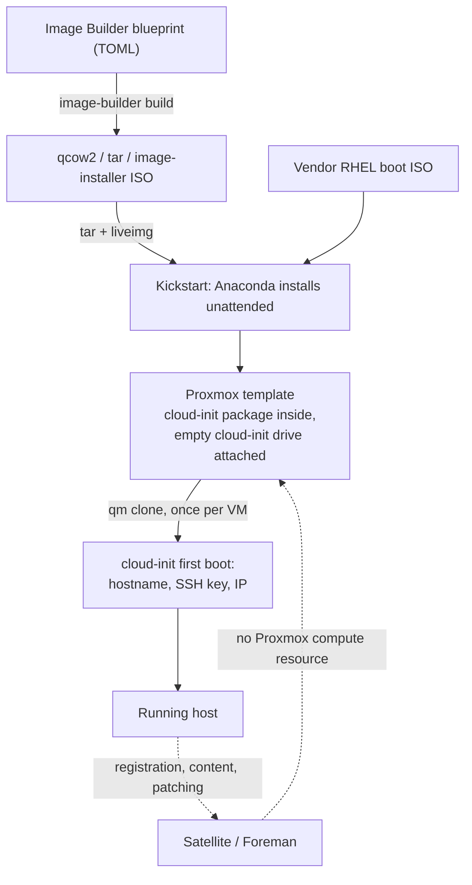

# Kickstart, cloud-init and Image Builder are three layers, not three choices

Asking which of kickstart, cloud-init or Red Hat Image Builder is the right way to provision a RHEL 9/10 template with Packer sounds like a three-way comparison. Checked against each tool's own documentation, it isn't one — they operate at different moments, and the two that look most like rivals are the ones a working Proxmox pipeline uses *together*. Image Builder, the one that looks like the modern replacement for both, turns out to deliver its output through kickstart in both places Red Hat documents it.

## The three moments

| | Kickstart | cloud-init | Image Builder |
|---|---|---|---|
| **When it runs** | During the OS install, inside Anaconda | On a booted machine's first start | Before either — it builds an artifact |
| **What it needs to exist first** | A vendor installer ISO | An already-installed OS with the package in it | A RHEL host with 20 GiB free and root |
| **What it produces** | An installed disk | A configured running machine | A file: `.qcow2`, `.tar`, `.iso`, … |
| **Runs once per** | Template build | VM boot | Build |
| **Packer's relationship to it** | Packer types the boot argument | Packer enables the drive, doesn't fill it | Packer doesn't call it at all |

Kickstart and cloud-init aren't competing because they never both want the same job. Kickstart's work ends when the installer reboots into a finished system; cloud-init's begins when a *clone of that system* boots for the first time with a fresh identity. For a Packer-built Proxmox template that's not an awkward overlap — it's the whole shape of the thing. The build runs once and bakes; the template is then cloned many times, and each clone needs a different hostname, SSH key and IP.

The clearest proof that they're layers rather than options is what [Proxmox's own cloud-init documentation](https://pve.proxmox.com/wiki/Cloud-Init_Support) asks of the image: *"Simply install the Cloud-Init packages **inside the VM** that you want to prepare."* Installing that package is a kickstart `%packages` line. Kickstart's job includes making cloud-init possible later.

## What Packer's Proxmox builder actually gives you for each

The `proxmox-iso` builder has first-class configuration for both layers, and they're clearly separate keys.

For the kickstart layer, [the builder documents](https://developer.hashicorp.com/packer/integrations/hashicorp/proxmox/latest/components/builder/iso) `http_directory` — *"Path to a directory to serve using an HTTP server"* — plus the `{{ .HTTPIP }}`/`{{ .HTTPPort }}` template variables, described as *"The IP and port, respectively of an HTTP server that is started serving the directory specified by the `http_directory` configuration parameter."* The builder's own example `boot_command` is, verbatim, a RHEL-family kickstart invocation:

```
"<up><tab> ip=dhcp inst.cmdline inst.ks=http://{{ .HTTPIP }}:{{ .HTTPPort }}/ks.cfg<enter>"
```

That is the same `inst.ks=http://...` mechanism [the libvirt Kickstart port entry](../proxmox/rhel-kickstart-libvirt-example-ported.md) had to assemble by hand from `args:` and a manually started `python3 -m http.server`. Packer's contribution isn't a different mechanism — it's that both halves, the HTTP server and the keystrokes at the boot prompt, come from the template instead of from the operator.

For the cloud-init layer there is a separate, unrelated key: `cloud_init`, documented as *"If true, add an empty Cloud-Init CDROM drive after the virtual machine has been converted to a template. Defaults to false."* Note **empty**, and note **after**. Packer isn't writing cloud-init config; it's attaching the drive Proxmox will later populate per clone — the Proxmox docs' own `qm set 9000 --ide2 local-lvm:cloudinit` step, expressed as a builder option. There's a companion `cloud_init_storage_pool` for where that drive lives, and `cloud_init_disk_type` (`scsi`, `sata`, or `ide`, defaulting to `ide`).

So a single source block carries both layers without either touching the other:

```hcl
source "proxmox-iso" "rhel10" {
  iso_file     = "local:iso/rhel-10.0-x86_64-boot.iso"
  http_directory = "http"
  boot_command = ["<up><tab> ip=dhcp inst.cmdline inst.ks=http://{{ .HTTPIP }}:{{ .HTTPPort }}/ks.cfg<enter>"]
  boot_wait    = "10s"

  cloud_init              = true
  cloud_init_storage_pool = "local-lvm"
}
```

The top half decides what gets installed, once. The bottom half decides nothing at all — it just leaves a slot open for whoever clones the template. Filling that slot is where [layering vendor-data alongside Terraform's generated user-data](../cloud-init/vendor-data-alongside-terraform-user-data.md) comes in, at a stage Packer has already exited.

## Image Builder is a different kind of thing, and it still ends in a kickstart

Red Hat Image Builder isn't a mechanism for getting config into an installer or a booting machine — it's a service that composes a finished image from a declarative TOML blueprint. On RHEL 10 that's worth restating precisely, because the command changed: RHEL 9's documentation is built around `composer-cli` and `osbuild-composer`, while [the RHEL 10 image builder guide](https://docs.redhat.com/en/documentation/red_hat_enterprise_linux/10/html-single/composing_a_customized_rhel_system_image/index) mentions neither and uses a new `image-builder` CLI throughout:

```sh
image-builder build qcow2 --distro rhel-10
image-builder list-images --filter "distro:rhel-10"
```

A RHEL 9-era pipeline that shells out to `composer-cli compose start` does not carry across to RHEL 10 unchanged.

Two things decide whether it fits a Proxmox pipeline at all. First, the output formats: the documented list covers `ami`, `vhd`, `vmdk`, `ova`, `gce`, `wsl`, `tar`, `image-installer`, and `qcow2` — there is no Proxmox-native type, though `qcow2` imports fine, so the gap is one `qm importdisk` rather than a wall. Second, the host requirement, which is stricter than it looks: *"A dedicated host or virtual machine. RHEL image builder is not supported in containers, including Red Hat Universal Base Images (UBI)"*, plus root, 2 cores, 4 GiB, and 20 GiB free in `/var/cache/`. It will not run as a step inside a CI container the way a Packer build can.

The part worth knowing before treating it as the modern replacement for kickstart: **its unattended installer output is a kickstart file**. Setting `unattended = true` under `[customizations.installer]` in a blueprint generates exactly this, quoted from the guide:

```
liveimg --url file:///run/install/repo/liveimg.tar.gz
lang en_US.UTF-8
keyboard us
timezone UTC
zerombr
clearpart --all --initlabel
text
autopart --type=plain --fstype=xfs --nohome
reboot --eject
network --device=link --bootproto=dhcp --onboot=on --activate
```

`liveimg` is a kickstart command; `zerombr`, `clearpart`, `autopart` and `network` are kickstart commands. Anaconda is still doing the install. And Red Hat files it that way themselves — "Creating a custom image by using Image Builder" is a section of the *Automatically installing RHEL* guide, the kickstart manual, not a competing document. There's also a `[customizations.installer.kickstart]` block whose `contents` field takes raw kickstart, for when the generated one isn't enough.



## Where Satellite and Foreman sit in each layer

This is where the answer changes depending on which hypervisor is underneath, so it's worth separating what Satellite does from what it can't reach.

**Kickstart is Foreman's native ground.** Satellite renders a per-host kickstart from ERB provisioning templates rather than storing a static file — [the 6.19 provisioning guide](https://docs.redhat.com/en/documentation/red_hat_satellite/6.19/html-single/provisioning_hosts/index) lists the kinds as `provision` (*"The main template for the provisioning process. For example, a Kickstart template"*), `PXELinux`/`PXEGrub2` for BIOS and UEFI network boot, and `finish` for post-install scripts over SSH. That templating is a genuine answer to the `REPLACE_WITH_ORG_ID` placeholder problem a hand-written kickstart has: the org ID, activation key and SSH key come from the host's own record. Satellite also redirects `rhsm` registration away from the CDN to itself, and pins package versions through content views.

**cloud-init is Foreman's image-based path,** and it splits into two template kinds that are easy to confuse. `user_data` is for platforms that accept custom data and, per the same guide, *"does not require Satellite to be able to reach the host; the cloud or virtualization platform is responsible for delivering the data to the image."* `cloud_init` is the variant for platforms that don't, and it does require the host to reach Satellite. On Proxmox — where the platform itself generates the cloud-init ISO — the `user_data` shape is the conceptual match.

**Image Builder has explicit Satellite integration, and it too arrives as kickstart.** 6.19 documents uploading an Image Builder TAR into a custom file repository and setting a host-group parameter named `kickstart_liveimg` to its URL; provisioning then happens by network boot, where *"Anaconda installer partitions disks, downloads and mounts the image, and copies files over to a host."* Same `liveimg` mechanism as the standalone blueprint, driven from Satellite's side. The guide lists the minimum packages such an image must contain — `NetworkManager`, `authselect`, `chrony`, `dnf`, `dracut`, `efibootmgr`, `firewalld`, `grub2` and friends, `subscription-manager`, `wget` — which is a useful checklist even if the image is never going near Satellite. Image Builder can also consume Satellite content views as its repositories, so the blueprint builds from the same pinned content as everything else.

**And then the gap.** Satellite 6.19 (Foreman 3.18.0.3, per its package manifest) ships compute resources for KVM/libvirt, VMware vSphere, OpenShift Virtualization, OpenStack Services on OpenShift, EC2, GCE and Azure. Proxmox appears zero times across the 6.19 Provisioning hosts, Managing hosts, Administering and Release Notes guides. Upstream Foreman does have [`theforeman/foreman_fog_proxmox`](https://github.com/theforeman/foreman_fog_proxmox), which is real, actively released ([1.0.0 on RubyGems](https://rubygems.org/gems/foreman_fog_proxmox), September 2026) and lives under the theforeman organization — but it is not in Satellite's package manifest, and its own README compatibility table hasn't been updated past 0.14.0, so it's a community path rather than a supported one.

The practical consequence is narrow and worth stating plainly: on Satellite plus Proxmox, Foreman cannot drive the VM lifecycle, so it cannot be the thing that builds the template. Packer builds it; Satellite handles registration, content and patching from first boot onward, which is exactly the boundary [the Foreman dynamic inventory entry](../ansible/foreman-dynamic-inventory-plugin.md) already assumes — hosts that are *registered*, however they got created.

## RHEL 9 to RHEL 10: what breaks in a kickstart file

Since the question spans both versions, the kickstart commands RHEL 10 removed matter more than anything about tooling. From the RHEL 10 [Automatically installing RHEL guide](https://docs.redhat.com/en/documentation/red_hat_enterprise_linux/10/html-single/automatically_installing_rhel/index):

- `auth` and `authconfig` are **removed** — use `authselect`.
- `btrfs` and `pwpolicy` are **removed**.
- `%anaconda` is **removed**; use kernel arguments instead.
- `%packages` options `--excludeWeakdeps` and `--instLangs` are **removed**, renamed to `--exclude-weakdeps` and `--inst-langs`.
- `timezone --isUtc`, `--ntpservers` and `--nontp` are **removed** — `--utc`, and the `timesource` command's `--ntp-server`/`--ntp-disable`.
- `network --teamslaves`/`--teamconfig` are **removed**; bonding replaces teaming.
- `module` is **deprecated**, following Anaconda deprecating DNF modularity.
- `inst.xdriver` and `inst.usefbx` are **removed**, because the installer moved from Xorg to a Wayland compositor.

None of these are subtle at runtime — a removed command is a failed install, not a silent difference — but several are the kind of line that sits unnoticed in a kickstart file copied forward for years.

One cloud-init-side equivalent worth checking against a template's config: Red Hat publishes a list of cloud-init modules it explicitly does **not** support, including `apt_configure`, `apt_pipeline`, `byobu`, `chef`, `emit_upstart`, `grub_dpkg` and `ubuntu_init_switch`. Most are Debian-family modules that were never going to fire on RHEL anyway, but `chef` is a real one to notice if a config was inherited from a mixed fleet.

## So which one

For a Packer-built RHEL 9/10 template on Proxmox, the honest answer is **kickstart plus cloud-init, and Image Builder only if you have a reason**:

- **Kickstart** for the build, because Packer's Proxmox builder documents exactly that mechanism, it works from a stock vendor ISO with nothing to pre-stage, and it's the only one of the three that can express an arbitrary partition layout for an OS with no suitable cloud image.
- **cloud-init** for the deploy, because a template is cloned many times and per-clone identity is the one thing the build cannot bake. One `cloud_init = true` line, and the package installed by the kickstart that came before it.
- **Image Builder** when the *content* of the image is what you want declarative and reproducible — blueprints in git, built from Satellite content views, OpenSCAP hardening applied at compose time. It doesn't remove the kickstart; it changes what the kickstart installs from. And it brings a real constraint: a dedicated RHEL host, not a CI container.

The framing that stops this being confusing: Image Builder answers *what is in the image*, kickstart answers *how it gets onto a disk*, and cloud-init answers *what makes this copy different from the others*. A pipeline usually wants answers to all three.
