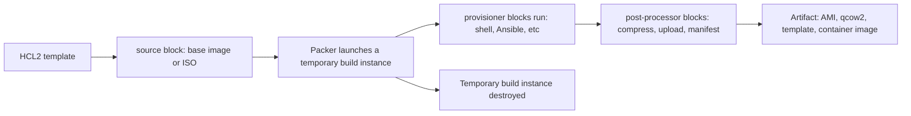

# What Packer actually is, and how it works

Second entry in the HashiCorp infrastructure series. Terraform/OpenTofu manages the lifecycle of infrastructure over time; Packer's job stops the moment it hands you a finished image. That single-shot, no-state nature is the thing to understand before anything else about it.

## The template pieces

Per [Packer's own HCL2 template docs](https://developer.hashicorp.com/packer/docs/templates/hcl_templates/blocks), a template is built from a small set of block types:

- **`source`** blocks hold builder-plugin config — which platform to build for (AMI, qcow2, a Proxmox template, a Docker image) and how to reach it.
- **`build`** blocks tie one or more `source`s to the `provisioner` and `post-processor` steps that turn that source into a finished artifact.
- **`provisioner`** blocks, nested inside `build`, are the steps that configure the machine while it's temporarily running — shell scripts, Ansible, file uploads.
- **`post-processor`** blocks, also nested inside `build`, run after provisioning — compress the result, upload it somewhere, write a manifest.

This is the same HCL2 language Terraform/OpenTofu uses — same variable/local syntax, same `.pkrvars.hcl` convention mirroring `.tfvars`. If the syntax from the previous entry in this series looked familiar, that's why.

## What actually happens during a build

`packer build` launches a genuinely real, temporary instance of whatever the `source` describes, runs every `provisioner` against it in order — same as configuring any other machine — then runs the `post-processor` chain against the result, and only then tears the temporary instance down. What survives is the artifact; the instance that built it doesn't.

## No state file, on purpose

Terraform/OpenTofu's state file exists because it has to reconcile a *running, changing* resource against desired config indefinitely. Packer never has that problem: once `packer build` finishes, there's nothing left for it to track — no drift to detect, because there's no persistent resource left under its management. Run the same template again and it builds a brand-new artifact from scratch; it doesn't diff against the last one. That's also why "updating" a Packer-built image almost always means building a new one and replacing references to it (in a Terraform variable, an autoscaling group's launch template, whatever consumes the artifact) rather than patching the existing image in place.

## Where this fits with the rest of the series

The artifact a Packer build produces is exactly the kind of thing a Terraform/OpenTofu resource block references — an AMI ID, a template name — to actually provision infrastructure from. Next up: Nomad, and then how all three tie together.
