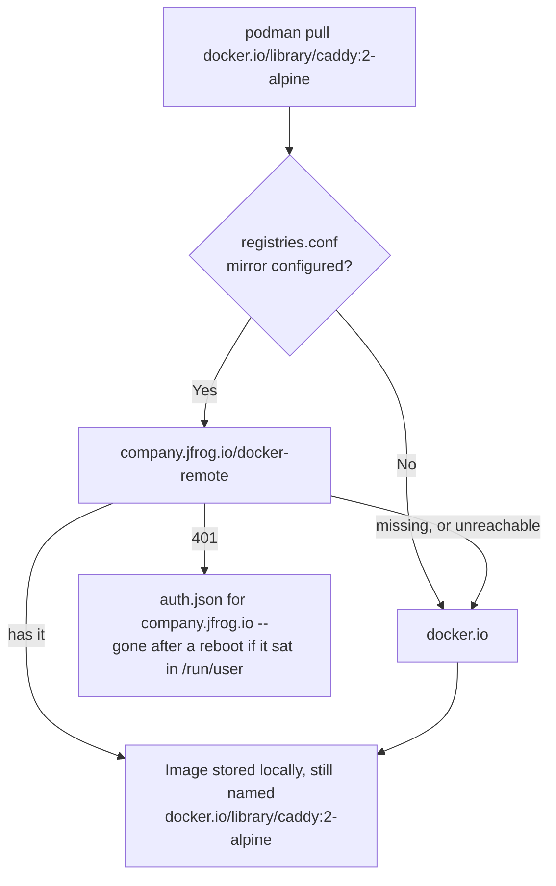

# Pointing Podman at an Artifactory mirror without editing a single image name

Putting a local Artifactory in front of Docker Hub has two quite different implementations, and the choice decides whether every unit file on every host has to be rewritten. The interesting parts — which one keeps the files portable, what happens when the mirror doesn't have the image, and where the credentials have to live — aren't obvious from either project's documentation.

## Two ways to do it

| | Rewrite the image reference | Configure a mirror |
|---|---|---|
| What changes | Every `Image=` line, everywhere | One config file, units untouched |
| Name recorded for the image | `company.jfrog.io/docker-remote/library/caddy:2-alpine` | stays `docker.io/library/caddy:2-alpine` |
| If Artifactory is down or missing the image | Pull fails | Falls back to the real registry |
| Works on a host with no Artifactory | No | Yes |

The second exists because, per [`containers-registries.conf(5)`](https://github.com/containers/image/blob/main/docs/containers-registries.conf.5.md), an image reference is *"primarily, a 'logical' image name, always used for naming the image"* — where the bytes are actually fetched from is a separate, configurable question, specifically so you can *"support configurations with no access to the internet without having to change `Dockerfile`s, or to add redundancy."*

```toml
# /etc/containers/registries.conf.d/artifactory.conf
[[registry]]
prefix = "docker.io"
location = "docker.io"

[[registry.mirror]]
location = "company.jfrog.io/docker-remote"
```

Rootless Podman reads a per-user override at `$HOME/.config/containers/registries.conf` instead of the system file, which is worth knowing before wondering why a root-level test worked and the rootless one didn't — the same root/rootless split [the root-vs-rootless entry](root-vs-rootless-rhel10-ubuntu2604.md) covers for storage paths.

## Two behaviours of that block to know before relying on it

**The primary is tried last, not first.** Mirrors are *"attempted in the specified order; the first one that can be contacted and contains the image will be used"*, and [the code implementing it](https://github.com/containers/image/blob/main/docker/docker_image_src.go) says why the original location goes at the end: *"Always try the non-mirror original location last; this both transparently handles the case of no mirrors configured, and ensures we return the error encountered when accessing the upstream location if all endpoints fail."*

So an image missing from Artifactory is a **silent** fallback to Docker Hub. Nothing fails, nothing warns — you just quietly didn't use the mirror. If the point of the exercise is an egress-restricted network, the mirror is not what enforces that; the firewall is.

**It is pull-only.** From the same man page: *"Redirection and mirrors are currently processed only when reading a single image, not when pushing to a registry nor when doing any other kind of lookup/search on a registry."* Pushes go to whatever the image name says.

## The Artifactory side, in its own terms

The proxying kind is a **remote** repository. Per [JFrog's Docker repositories documentation](https://jfrog.com/help/r/jfrog-artifactory-documentation/docker-repositories), remote repositories *"proxy public images from Docker Hub"* with `https://registry-1.docker.io/` as the default upstream, and a **virtual** repository aggregates local and remote ones *"under a single URL"*. Pointing the mirror at the virtual repository is the shape worth choosing: adding an internal image later then needs no change on any host.

The pull URL is `[JFrogPlatformURL]/<REPO_NAME>/<IMAGE>:<TAG>` — e.g. `company.jfrog.io/docker-local/froggy-app:v1.0.0`.

One naming rule comes from Docker rather than Artifactory and bites at creation time: *"Do not use underscores in the repository name. Due to subdomain/DNS/hostname limitations, Docker cannot communicate with registries that have underscores in the name."* So `docker-remote`, never `docker_remote`.

And one expectation worth correcting up front, since avoiding Docker Hub's pull limits is usually the reason for doing this at all: **self-hosting Artifactory does not exempt you from them.** JFrog's page grants unlimited unauthenticated Hub access to *Cloud* users and then states plainly that *"Self-Hosted deployments of Artifactory are subject to rate limits."* Caching still collapses many hosts' pulls into one upstream fetch — that is the real win — but the limit is still there, and authenticating the remote repository to Hub is still the advice.

## Where the credentials have to live

Artifactory normally wants authentication, and [JFrog's own Podman instructions](https://jfrog.com/help/r/jfrog-artifactory-documentation/docker-repositories) say to run `podman login company.jfrog.io`, noting where that lands: *"By default, Podman looks for authentication information in `${XDG_RUNTIME_DIR}/containers/auth.json`. If no valid credentials are found in the file, Podman falls back to the `~/.docker/config.json` file."* Podman's [`--authfile` documentation](https://docs.podman.io/en/latest/markdown/podman-run.1.html) agrees.

For anything interactive that's fine. For a [Quadlet unit](caddy-php-fpm-automatic-https.md) starting at boot it is a trap, because `$XDG_RUNTIME_DIR` is `/run/user/<uid>`. Per [`pam_systemd(8)`](https://www.freedesktop.org/software/systemd/man/latest/pam_systemd.html):

> Path to a user-private user-writable directory that is bound to the user login time on the machine. It is automatically created the first time a user logs in and **removed on the user's final logout**.

It is also under `/run`, a tmpfs, so a reboot clears it regardless of who is logged in. `loginctl enable-linger` — which the Caddy entry already established for rootless units on a headless box — buys, per [`loginctl(1)`](https://www.freedesktop.org/software/systemd/man/latest/loginctl.html), *"a user manager ... spawned for the user at boot and kept around after logouts."* A user manager, not the previous boot's runtime directory.

The clean fix is a `.image` unit, because `[Image]` has an `AuthFile=` key and `[Container]` does not:

```ini
# ~/.config/containers/systemd/caddy.image
[Image]
Image=docker.io/library/caddy:2-alpine
AuthFile=%h/.config/containers/auth.json
```

```ini
# ~/.config/containers/systemd/caddy.container
[Container]
Image=caddy.image
ContainerName=caddy
```

That `Image=caddy.image` line is a documented special case rather than a filename coincidence — per [`podman-systemd.unit(5)`](https://docs.podman.io/en/latest/markdown/podman-systemd.unit.5.html): *"If the name of the image ends with `.image`, Quadlet will use the image pulled by the corresponding `.image` file, and the generated systemd service contains a dependency on the `$name-image.service`."* The pull happens in its own unit, with its own credentials, and the container waits for it.

`%h` is systemd's specifier for the user's home directory, so the file survives both logout and reboot. Whatever path it is, it holds a credential in base64 — encoding, not encryption — so a scoped Artifactory access token rather than an account password is what limits the blast radius.



## Tags move, digests don't

A caching proxy adds a failure mode a direct pull doesn't have: its copy of a moving tag can lag the upstream, so `2-alpine` from the mirror and `2-alpine` from Hub are not guaranteed to be the same bytes. `[[registry.mirror]]` has a field for exactly this, and the man page is blunt about the reasoning:

> If "digest-only", mirrors will only be used for digest pulls. Pulling images by tag can potentially yield different images, depending on which endpoint we pull from. Restricting mirrors to pulls by digest avoids that issue.

```toml
[[registry.mirror]]
location = "company.jfrog.io/docker-remote"
pull-from-mirror = "digest-only"
```

The three values are `all` (the default), `digest-only` and `tag-only`, and there is one constraint that is easy to trip over: `pull-from-mirror` *"is allowed only when `mirror-by-digest-only` is not configured for the primary registry."* Set one or the other, never both.

For a single image onto a single host — a one-off, or a box that will never have registry credentials — [`podman save` piped through `scp`](save-scp-load-image-between-hosts.md) is still the smaller tool, with no proxy in the path at all.
