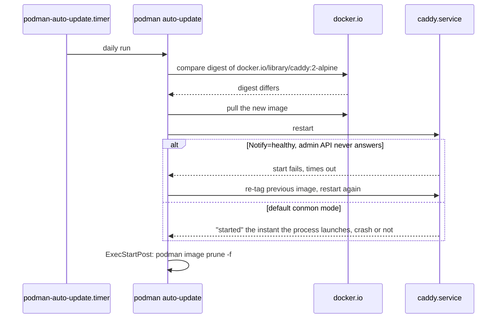

# Auto-updating the Caddy/Adminer/PHP Quadlet stack needs more than one AutoUpdate key

[The hand-written Quadlet entry](caddy-php-fpm-automatic-https.md) got Caddy and PHP-FPM surviving reboots, and [the linux-system-roles version](../ansible/podman-quadlet-caddy-adminer-php-linux-system-roles.md) added Adminer on top of the same idea, deployed declaratively. The next obvious step is having all three pick up new image versions on their own, and Podman ships that as one Quadlet key. The key is the easy part. What decides whether it actually works — and whether a bad image gets rolled back — is three things the one-liner doesn't show, checked here against both entries' actual files rather than a generic example.

## The one line, in both idioms this site already uses

Hand-written, added to the existing `caddy.container`:

```ini
# ~/.config/containers/systemd/caddy.container
[Container]
Image=docker.io/library/caddy:2-alpine
ContainerName=caddy
Network=webnet.network
PublishPort=80:80
PublishPort=443:443
AutoUpdate=registry
```

Same thing, added to the existing `podman_quadlet_specs` entry for `caddy`:

```yaml
- name: caddy
  type: container
  Install:
    WantedBy: default.target
  Container:
    Image: docker.io/library/caddy:2-alpine
    ContainerName: caddy
    Network: appnet.network
    PublishPort: "80:80"
    AutoUpdate: registry
```

Both produce the identical generated label — per [`podman-systemd.unit(5)`](https://docs.podman.io/en/latest/markdown/podman-systemd.unit.5.html), `AutoUpdate=registry` maps 1:1 to `--label "io.containers.autoupdate=registry"` — which is exactly the generic Quadlet-key-to-YAML-key mapping [the linux-system-roles entry already established](../ansible/podman-quadlet-caddy-adminer-php-linux-system-roles.md): nothing role-specific needed to support this key, because the role doesn't special-case individual keys at all. `registry` means compare the local image's digest against the registry's and restart on a mismatch; `local` only compares against what's already pulled locally, which isn't useful here since nothing else in this stack does the pulling for it.

## The short-name trap this stack's own files already avoid

[`podman-auto-update(1)`](https://docs.podman.io/en/latest/markdown/podman-auto-update.1.html) requires a fully-qualified image for the `registry` policy, since a short name doesn't say *which* registry to check. Every image in both existing entries already is fully qualified — `docker.io/library/caddy:2-alpine`, `docker.io/library/php:8.3-fpm-alpine`, `docker.io/library/adminer:latest` — so this isn't a live bug here. It's worth seeing what would have happened if Adminer's line had been written the more casual way, since that's a completely plausible thing to type:

```ini
Image=adminer:latest
AutoUpdate=registry
```

The enforcement isn't a warning — it's in libpod's own container validation, [`libpod/container_validate.go`](https://github.com/containers/podman/blob/main/libpod/container_validate.go), which runs every time the container is created, i.e. every time the service starts:

```go
if value == "registry" || value == "image" {
    if err := validateAutoUpdateImageReference(c.config.RawImageName); err != nil {
        return err
    }
}
```

And the error string that function returns, confirmed directly from the same file:

```
short name: auto updates require fully-qualified image reference: "adminer"
```

So the short form doesn't produce an Adminer container that "just won't auto-update" — it produces an `adminer.service` that fails to start at all, with the reason sitting in `journalctl --user -u adminer` rather than anywhere obvious.

## The timer is per user, same as `loginctl enable-linger` already was

Podman ships `podman-auto-update.service`/`.timer` twice — once under [`contrib/systemd/system/`](https://github.com/containers/podman/tree/main/contrib/systemd/system) for root, once under [`contrib/systemd/user/`](https://github.com/containers/podman/tree/main/contrib/systemd/user) for a user's own containers. This stack is rootless in both entries, so it's the *user* timer:

```sh
systemctl --user list-timers podman-auto-update.timer
systemctl --user enable --now podman-auto-update.timer
```

The [Caddy entry already established](caddy-php-fpm-automatic-https.md) that `loginctl enable-linger $USER` is what keeps a rootless user's systemd instance running when nobody's logged in — the same requirement applies here, for the identical reason: without it, this timer simply isn't running on a headless box between logins.

Check what it would actually do before letting it:

```sh
podman auto-update --dry-run --format "{{.Unit}} {{.Image}} {{.Updated}}"
```

## Rollback only fires if the failure is visible — and Caddy has a real way to make it visible

`--rollback` defaults to true, but per the man page, detecting a bad update depends on the container sending `READY` via `sd_notify` — otherwise the restart can succeed even though the app inside dies moments later. Quadlet's generated unit is `Type=notify`, and per [`podman-systemd.unit(5)`](https://docs.podman.io/en/latest/markdown/podman-systemd.unit.5.html#notify-defaults-to-false) and [`podman-run(1)`'s `--sdnotify` flag](https://docs.podman.io/en/latest/markdown/podman-run.1.html#sdnotify-container-conmon-healthy-ignore), the *default* (`Notify=` unset) is conmon-mode: *"the service is deemed started when the container runtime starts the child in the container"* — READY fires the instant the process launches, with no idea whether Caddy itself ever came up cleanly. A Caddy image that crashes on a bad config three seconds in is a **successful** restart as far as systemd is concerned. Nothing to roll back from.

```ini
Notify=healthy
HealthCmd=wget -q -O /dev/null http://127.0.0.1:2019/config/
HealthStartPeriod=10s
HealthRetries=3
```

Per the docs, in the exact words: *"setting Notify to healthy will postpone startup notifications until such time as the container is marked healthy, as determined by Podman healthchecks."* `wget`, not `curl` — `caddy:2-alpine` is an Alpine image, and BusyBox's bundled `wget` is guaranteed present where a full `curl` binary isn't. The target isn't a purpose-built health endpoint; it's Caddy's [own admin API](https://caddyserver.com/docs/api), which per Caddy's docs listens on `localhost:2019` by default and serves `GET /config/[path]` to export the active config — a real, documented endpoint, repurposed here as "is Caddy's process actually alive and answering," not an official healthcheck feature.



## `Notify=healthy` only covers the moment of the update — a second key covers everything after

Everything above answers one question: did *this specific restart*, the one `podman auto-update` just triggered, succeed or fail? It says nothing about Caddy degrading an hour later without crashing — hung, refusing connections, admin API wedged — after having passed its healthcheck once already. Podman has a name for that state, `unhealthy`, and by default, per [`podman-run(1)`'s own `--health-on-failure` docs](https://docs.podman.io/en/latest/markdown/podman-run.1.html#health-on-failure-action), it does *nothing about it*:

> Action to take once the container transitions to an unhealthy state. The default is `none`.

The other three choices are `kill`, `restart`, and `stop` — and the docs are explicit about which one belongs in a Quadlet unit, which already has `Restart=always` in its `[Service]` block:

> Do not combine the `restart` action with the `--restart` flag. When running inside of a systemd unit, consider using the `kill` or `stop` action instead to make use of systemd's restart policy.

So the addition to `caddy.container` is one more line, not a replacement for anything already there:

```ini
[Container]
HealthCmd=wget -q -O /dev/null http://127.0.0.1:2019/config/
HealthInterval=30s
HealthRetries=3
HealthOnFailure=kill

[Service]
Restart=always
```

`HealthOnFailure=kill` and `Restart=always` together mean: three consecutive failed checks kill the unit, systemd's own restart policy (already sitting there for an unrelated reason — plain crash recovery) brings it back. `Restart=always` alone never would have — it only fires when the process actually exits, and a hung-but-still-running Caddy never does that on its own.

One thing worth knowing before assuming `HealthCmd` is doing two separate jobs in the example above: Podman actually runs a distinct **startup** health check before the **regular** one ever starts, governed by its own `HealthStartupCmd`/`HealthStartupInterval`/`HealthStartupRetries`/`HealthStartupSuccess` keys — useful for a service whose bootstrap is slower or needs gentler polling than its steady-state check. Neither `caddy.container` nor this addition sets any of those, and per [the same docs](https://docs.podman.io/en/latest/markdown/podman-run.1.html#health-startup-cmd-command-command-arg1), that's a defined fallback, not an oversight: *"If `--health-cmd` option was set, but `--health-startup-cmd` one was missed, then value of `--health-cmd` option is used for startup health check."* `HealthStartPeriod` is the actual mechanism doing the "give it time to boot" job here — a grace window during which failures don't count toward `HealthRetries` at all, simpler than standing up a whole second check for a container that starts as fast as Caddy does.

## What's actually named `caddy`, and what's gone after a successful update

Both existing entries set `ContainerName=caddy`/`ContainerName: adminer` explicitly. That matters for anything written after the fact: per the same Quadlet docs, *"a `$name.container` file creates a `$name.service` unit and a `systemd-$name` Podman container. The `ContainerName` option allows for overriding this default name."* Since both entries already override it, `podman inspect caddy` is correct — `podman inspect systemd-caddy` is not, despite `systemd-<name>` being what a Quadlet file *without* an explicit `ContainerName` would produce.

The shipped `podman-auto-update.service` unit ends with one more line worth knowing about:

```ini
ExecStartPost=@@PODMAN@@ image prune -f
```

Once a successful update leaves the previous `caddy:2-alpine` layer untagged and unused, that's exactly what `image prune` removes — reasoned from what `prune` targets, not stated outright in the docs. An automatic rollback happens inside the same run, before this line, so it's unaffected. A *manual* rollback discovered the next morning — Caddy technically up, serving something subtly broken that never failed its healthcheck — means pulling the old tag again from the registry, since the local copy is already gone. Worth recording what's actually running before trusting the timer with any of the three:

```sh
podman inspect --format '{{.ImageDigest}}' caddy adminer php
```

## Where auto-update fits, and where it doesn't, across these specific three

`AutoUpdate=registry` suits `caddy` and `php` here — they're pinned to a moving tag (`2-alpine`, `8.3-fpm-alpine`) specifically so security patches land automatically, and each has (or now has) a real way to signal it's actually up. Adminer is the opposite case in this same stack: it's a manually-driven admin UI, not something serving unattended traffic, and an unannounced upstream UI or behavior change landing overnight is a worse outcome than the tiny security-patch lag from updating it deliberately. Pinning it by digest instead —

```ini
Image=docker.io/library/adminer@sha256:...
```

— means `AutoUpdate=registry` has nothing to compare against and nothing to do, which is the point: a digest is the right tool for "promote this deliberately," and a tag plus `AutoUpdate=registry` is the right tool for "let this drift on purpose."
