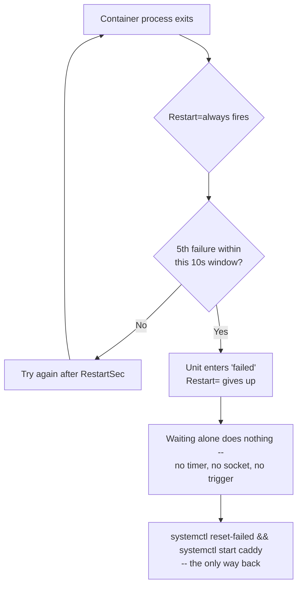

# Five failed starts in ten seconds, and a Quadlet unit stops trying — even unattended

Three entries on this site build toward "unattended": [Quadlet units survive a reboot](caddy-php-fpm-automatic-https.md), [the linux-system-roles version manages the same units declaratively](../ansible/podman-quadlet-caddy-adminer-php-linux-system-roles.md), and [auto-update plus a real healthcheck catches a bad image or a hung process](quadlet-autoupdate-caddy-adminer-php.md). None of them mention the one thing that undercuts all three at once: `Restart=always` has a limit, hitting it looks nothing like a crash, and nothing about "unattended" fixes it — a human has to notice and intervene, which is exactly the thing unattended is supposed to remove.

## Podman's part ends at generating the unit

Every guarantee these entries rely on — reboot survival, crash recovery, auto-update — is a systemd guarantee, not a Podman one. [`podman-systemd.unit(5)`](https://docs.podman.io/en/latest/markdown/podman-systemd.unit.5.html) turns `[Container]` keys into a `.service` file; from that point on, Podman's job is done and systemd is running an ordinary service it knows nothing about being a container. Whatever "unattended" means for this stack is whatever plain systemd promises for any service — no more, no less. That's worth stating plainly because it's also why the failure mode below isn't a Podman bug or a Quadlet oversight. It's systemd behaving exactly as documented, for a Quadlet unit the same as any other.

## `Restart=always` is rate-limited, and the default is tight

Per [`systemd.unit(5)`](https://www.freedesktop.org/software/systemd/man/latest/systemd.unit.html#StartLimitIntervalSec=interval):

> Units which are started more than `burst` times within an `interval` time span are not permitted to start any more.

The defaults, per [`systemd-system.conf(5)`](https://www.freedesktop.org/software/systemd/man/latest/systemd-system.conf.html): `DefaultStartLimitIntervalSec=10s`, `DefaultStartLimitBurst=5`. Five failed starts inside ten seconds, and the unit stops — this applies identically whether it's the system manager or a rootless user's own instance; nothing in the docs carves out an exception for either. `caddy.container`/`php.container`/`adminer.container` don't set `StartLimitIntervalSec=`/`StartLimitBurst=` themselves, so all three inherit exactly this.

Ten seconds sounds generous until the failure is something a container start genuinely takes longer than an instant to resolve: a network-backed volume that isn't mounted yet at boot, a `Requires=` dependency whose own container is still pulling its image, DNS not answering for the first second after `aardvark-dns` itself starts. `RestartSec=` (defaulting to 100ms per the same systemd defaults) controls the gap between attempts, not whether they count — a tight restart loop against a dependency that takes twelve seconds to become ready burns through five attempts and hits the limit before the dependency was ever going to succeed.

## What actually happens, and why it doesn't self-heal

Per [`systemd.unit(5)`](https://www.freedesktop.org/software/systemd/man/latest/systemd.unit.html), continuing from the same section:

> Units which are configured for `Restart=`, and which reach the start limit are not attempted to be restarted anymore; however, they may still be restarted manually or from a timer or socket at a later point, after the interval has passed. From that point on, the restart logic is activated again.

The part worth sitting with: **waiting doesn't fix it**. The interval passing doesn't cause a fresh attempt on its own — something external has to trigger one, "manually or from a timer or socket." A plain `.container` unit with no timer and no socket pointed at it — every unit in this stack — has no such external trigger built in. It sits in `failed` state until a person runs a command. [`systemctl(1)`](https://www.freedesktop.org/software/systemd/man/latest/systemctl.html#reset-failed%20%5BPATTERN%E2%80%A6%5D) is explicit about which one:

> Thus, if a unit's start limit... is hit and the unit refuses to be started again, use this command to make it startable again.



This is a different failure shape than everything the auto-update entry covers. `Notify=healthy` and `HealthOnFailure=kill` both assume the container *starts* and then either stays healthy or doesn't — they have nothing to say about a container that can't complete a start at all, five times running, inside a ten-second window. A crash loop that clears the limit keeps getting the benefit of `Restart=always`'s designed resilience; a crash loop that doesn't clear it gets exactly one thing — quiet, and gone from `podman ps` output until someone goes looking specifically because something's missing, not because anything alerted them.

## Reducing how often it's reached

Two things help, and they're complementary, not alternatives.

**Ordering avoids most of the attempts in the first place.** [The Caddy entry already established](caddy-php-fpm-automatic-https.md) that `After=`/`Requires=` sequences a unit behind its actual dependencies — a container that doesn't even try to start until its network and its upstream are already up never burns through the rate-limit budget on a dependency that was always going to become ready given a few more seconds.

**Widening the budget covers what ordering can't.** `After=` only orders against other systemd units; it can't know that a mounted network share takes longer to actually respond than the mount unit takes to report itself active. For a dependency in that category, setting the limit explicitly is the honest fix:

```ini
[Unit]
StartLimitIntervalSec=120
StartLimitBurst=10
```

Ten attempts spread across two minutes gives a genuinely slow dependency room to become ready without changing what happens once it actually is one — `Restart=always` behaves identically either way, just with more room before it gives up.

## Where this leaves "unattended," as a whole

Reboot survival, crash recovery, hang detection, and update safety are four separate, independently-failing guarantees, not one feature — this entry is the fifth: **restart itself has a budget**, and every prior entry's example already lives inside it without saying so. None of the four individually mentions checking `systemctl status`/`journalctl` for a `failed` unit that quietly stopped retrying hours or days ago — worth doing once, on a system meant to run without anyone watching it, before trusting that it actually will.
