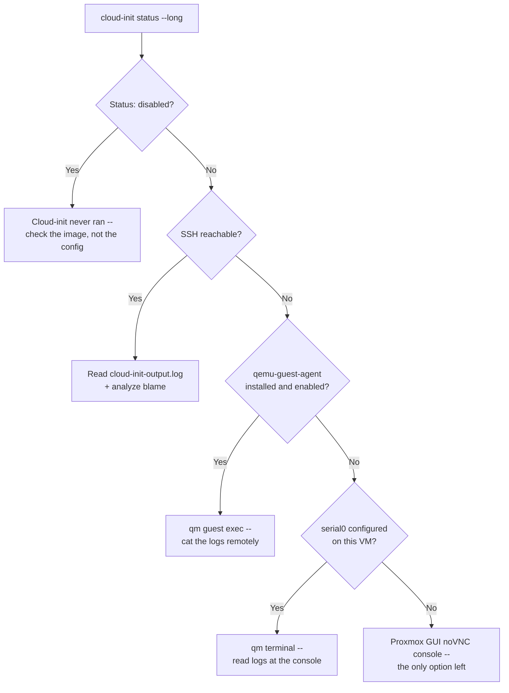

# Debugging a Proxmox VM whose cloud-init config didn't apply

A VM boots but the user, SSH key, or network config from cloud-init never showed up. Before guessing, cloud-init's own diagnostic commands narrow this down to "cloud-init never ran," "cloud-init ran but a module failed," or "cloud-init did what it was told, and what it was told was wrong" — three different problems with three different fixes, and none of them need a rebuild to tell apart.

## Start with what cloud-init itself reports

```bash
cloud-init status --long
```

Reports whether cloud-init is running, finished, disabled, or has hit an error — with the datasource it detected and any error summary. If this says `disabled`, nothing below will find a config problem, because cloud-init never executed at all; check the image, not the config.

```bash
cloud-init analyze show
cloud-init analyze blame
```

`show` gives a time-ordered report of every boot stage; `blame` sorts the same data by cost, so the slowest or hung module is the first line. A module that hangs here (commonly a network step waiting on DHCP, or a package install with no network) explains "boots eventually but config is late" — a different symptom from "config never applied."

```bash
sudo cat /var/log/cloud-init.log
sudo cat /var/log/cloud-init-output.log
sudo journalctl -u cloud-init --no-pager
```

`cloud-init.log` has the detailed per-module trace; `cloud-init-output.log` is what each module printed to stdout/stderr, which is usually where the actual Python traceback or YAML error shows up first. Per [cloud-init's own CLI docs](https://docs.cloud-init.io/en/latest/reference/cli.html), these two files are also what `cloud-init collect-logs` bundles for you if you'd rather grab everything in one archive than read three sources separately.

## Getting to those logs when SSH isn't answering

If cloud-init failed on the network module specifically, SSH may never come up — the two commands below assume different things are working, and only one of them is available by default.

```bash
qm terminal 100
```

This opens the VM's serial console over a Unix socket — but only if that VM actually has one. Per the [`qm` chapter of the Proxmox docs](https://pve.proxmox.com/pve-docs/chapter-qm.html), the Cloud-Init template recipe explicitly adds `--serial0 socket --vga serial0` because, in the docs' own words, "for many Cloud-Init images, it is required to configure a serial console." If the template this VM was cloned from skipped that step, `qm terminal` has nothing to attach to — check `qm config <vmid>` for `serial0` before assuming the command itself is broken.

```bash
qm guest exec 100 -- cat /var/log/cloud-init-output.log
```

This one needs the opposite thing working: the QEMU Guest Agent already running *inside* the guest, reachable over its own virtio channel independent of the network stack SSH needs. A cloud-init network failure doesn't take this down — but a template built from a stock cloud image without `qemu-guest-agent` pre-installed does, since the agent itself has to already be present and enabled before first boot for this to answer at all.



## Checking what Proxmox actually generated, before blaming cloud-init

Two Proxmox-specific things are worth ruling out before the problem is assumed to be inside the guest at all.

The **Cloud-Init drive** is a small CD-ROM-like device Proxmox attaches — conventionally `ide2` — that carries the generated `user-data`/`meta-data`/`network-config`. If it's missing or empty, cloud-init runs but finds nothing to apply, which looks identical to "my settings were ignored." `qm config <vmid>` should show `ide2: <storage>:cloudinit` (or similar); if that line is absent, the drive was never attached.

If it is attached, Proxmox will regenerate it from `ciuser`, `sshkeys`, `ipconfig0`, and friends the next time the VM starts — but what it *actually* generated is easy to inspect directly rather than guessed at:

```bash
qm cloudinit dump 100 user
```

Per the same `qm` docs, this "dumps" the exact generated config Proxmox is handing to cloud-init — the fastest way to tell "Proxmox generated the wrong thing" apart from "Proxmox generated the right thing and cloud-init failed to apply it."

## Where this usually actually goes wrong: generated, not hand-written, config

None of the VMs this applies to typically have their `ciuser`/`sshkeys`/`ipconfig0` set by hand — they come from a Terraform/OpenTofu `initialization` block via the [`bpg/proxmox` provider](https://registry.terraform.io/providers/bpg/proxmox), the same provider [this site's vendor-data entry](../cloud-init/vendor-data-alongside-terraform-user-data.md) covers. `qm cloudinit dump` is exactly as useful in that case as manually written config: it shows what the provider actually rendered, which is the first thing to check when a `runcmd` added through a `user_data_file_id` or `vendor_data_file_id` attribute doesn't show up — a YAML indentation slip in the Terraform-managed file reads identically to "cloud-init ignored my config" until you dump the generated output and see it verbatim.

And if `qm guest exec` above came back empty because the agent was never installed, that's [this site's qemu-guest-agent entry](inject-qemu-guest-agent-ubuntu-template.md) — the same template recipe that adds `--serial0 socket --vga serial0` is what makes `qm terminal` work as a fallback too, so a template built following it has both diagnostic paths open rather than just one.
