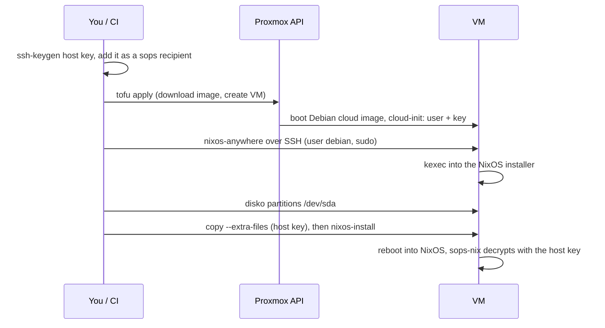

# A Proxmox VM on demand, NixOS from Git: OpenTofu builds a skeleton, nixos-anywhere replaces it, and the host key exists before the VM

The goal is a Proxmox VM created on demand that ends up as a NixOS machine described in Git, with its secrets, and with no hand-made template. It takes three tools, each doing one thing:

1. **OpenTofu** creates a *skeleton*: a stock Debian cloud image, a static IP and one SSH key.
2. **nixos-anywhere** logs into the skeleton, kexecs (boots a new kernel straight from the running system, with no reboot through firmware) into a NixOS installer, lets **disko** (declarative disk partitioning for NixOS) repartition the disk, and installs the flake's configuration.
3. **sops-nix** (the NixOS integration of SOPS, a tool that keeps secrets encrypted in files that are safe to commit) decrypts the secrets on first boot with the VM's SSH host key. That key was generated **before the VM existed**, so the secrets could already be encrypted to it.

Everything here is in [dar-nixos/proxmox](https://github.com/abdelhousni/dar-nixos/tree/main/proxmox). It installs the same machine as [the first-steps entry](../nixos/first-steps-configuration-generations-rollback.md), including [its Zsh setup](../nixos/zsh-oh-my-zsh-declarative.md). Versions: bpg/proxmox 0.114, and from nixpkgs 26.05 OpenTofu 1.11, nixos-anywhere 1.13.0 and sops 3.13, and the disko and sops-nix revisions pinned in the flake.



## The skeleton: OpenTofu, through the API only

The [bpg/proxmox](https://github.com/bpg/terraform-provider-proxmox) provider's docs list the few things that need SSH access to the Proxmox node: snippet uploads, some file types, and `source_file.path` disk imports. Everything else goes through the API. The skeleton avoids all three:

- The cloud image comes in with **`proxmox_download_file`**, `content_type = "import"`. The VM's disk then takes it with **`import_from`**.
- cloud-init gets its user, key and IP through **`initialization.user_account`** and `ip_config`, not a custom `user_data_file_id` snippet.

The result needs only an API token, in `PROXMOX_VE_API_TOKEN`, and no SSH key for the node. The details that took reading:

- **The download resource was renamed.** In 0.114, `proxmox_virtual_environment_download_file` is deprecated in favor of `proxmox_download_file`, and it "will be removed in v1.0". The VM resource is still `proxmox_virtual_environment_vm`. The `proxmox_vm` resource sitting next to it in the docs is marked **DO NOT USE**.
- **`import` isn't enabled on storages by default.** Add *Import* to the target storage's content types first. Before PVE 8.4, a `.qcow2` file name is also rejected.
- **The "latest" image changes upstream.** With the default `overwrite = true`, a new Debian build replaces the downloaded file, and the VM imports from that file. The skeleton's Debian version is irrelevant because nothing of it survives, so the module sets `overwrite = false` and `ignore_changes = [disk[0].import_from]`.
- **cloud-init upgrades packages by default** (`upgrade` defaults to `true`). That's minutes spent on a system that's about to be wiped, so the module sets `upgrade = false`.
- **The guest agent will be NixOS's.** Debian's genericcloud image has no `qemu-guest-agent`: its manifest lists 322 packages, and that isn't one of them. So `agent { enabled = true }` adds the virtio port that NixOS's agent will use, and `wait_for_ip { disabled = true }` stops the provider from waiting up to 15 minutes for an agent that doesn't exist yet. Proxmox needs both halves, as [the Ubuntu template entry](inject-qemu-guest-agent-ubuntu-template.md) found.
- **UEFI without Secure Boot keys:** `bios = "ovmf"`, an `efi_disk` with `pre_enrolled_keys = false`. NixOS's systemd-boot isn't signed.
- **The state is encrypted.** OpenTofu's `encryption` block (`pbkdf2` + `aes_gcm`, `enforced = true`) covers both state and plans, with the passphrase in `TF_VAR_state_passphrase`. OpenTofu also ships an `openbao` key provider, which suits CI better than a passphrase.

`tofu plan` for a new VM doesn't contact the API at all, because there's nothing to refresh. CI can therefore validate and plan the module with a fake endpoint.

## Skeleton to NixOS: nixos-anywhere

nixos-anywhere needs **at least 1.5 GB of RAM** on the target to hold its kexec installer, so the VM gets 2048 MB. It logs in as the cloud-init user and uses `sudo`, which Debian's cloud-init user gets without a password. Then it runs four phases: kexec, disko, install, reboot. Three things caught me out:

- **The target downloads the installer itself.** The kexec tarball is fetched *by the skeleton* from GitHub releases, not by the machine running nixos-anywhere. A skeleton behind a TLS-intercepting proxy, which is common on-prem, fails with `The certificate of 'github.com' is not trusted`. The sandbox this was written in reproduced exactly that. `--kexec <local file>` makes nixos-anywhere **upload** the tarball over SSH instead, and `deploy.sh` exposes it as `KEXEC_TARBALL`.
- **`--post-kexec-ssh-port` defaults to 22, whatever `--ssh-port` says.** After the kexec, nixos-anywhere reconnects as `root` to the installer. Behind a port forward, as in the CI test (`2222 → 22`), it went to port 22 of the CI runner itself. It hit `Permission denied (publickey,password)` every five seconds until the 45-minute job timeout. Pass the same port to both options.
- **The boot loader can't rely on UEFI variables.** Writing EFI variables from a kexec'd installer isn't guaranteed, so the host sets `boot.loader.efi.canTouchEfiVariables = false`. NixOS then runs `bootctl install --no-variables`, which still installs the fallback `\EFI\BOOT\BOOTX64.EFI`. The firmware boots that once the skeleton's Debian boot entry points at a wiped disk.

disko partitions `/dev/sda`. That name is stable because the VM's disk is `scsi0` on the provider's default `virtio-scsi-pci` controller.

## Secrets: the host key comes first

sops-nix decrypts at activation with an age key derived from the host's SSH key. When `services.openssh` is on, its default `sshKeyPaths` is the ed25519 host key. A brand-new VM would normally generate that key on first boot, too late to have encrypted anything to it. So the order is reversed:

1. **`new-host-key.sh`** runs `ssh-keygen` on your machine, derives the age recipient with `ssh-to-age`, adds it to `.sops.yaml`, and runs `sops updatekeys`. The private key goes to a password manager or OpenBao/Vault KV, never into Git.
2. **`deploy.sh`** passes it with `--extra-files`, as `/etc/ssh/ssh_host_ed25519_key`.

The nixos-anywhere docs say the extra files are copied "after installation". In [`src/nixos-anywhere.sh`](https://github.com/nix-community/nixos-anywhere/blob/main/src/nixos-anywhere.sh), both in version 1.13.0 (nixpkgs 26.05) and on `main`, the `tar … | ssh … tar -C /mnt -xf-` copy runs **before** `nixos-install`. So the key is already there when sops-nix activates for the first time, inside the install.

Two more things come from this:

- **The repository authorizes nobody.** Deployment access (`/root/.ssh/authorized_keys`) arrives through `--extra-files` too. The host only sets `PermitRootLogin prohibit-password`, which later `nixos-rebuild --target-host root@…` runs need.
- **A test key is committed on purpose.** CI needs to decrypt something, so `ci/test-host-key` is a private key in the repository. It decrypts only a dummy `secrets/demo.yaml`. The repository's gitleaks configuration allowlists **that one file**, and a second key placed next to it is still reported.

For a pipeline creating many VMs, per-host keys have a cost: every new host means a `sops updatekeys`, and that needs a key that can already decrypt, so the pipeline holds an admin key. A per-*role* key avoids re-encrypting: every VM of a role gets the same injected key, fetched from OpenBao at deploy time. The trade-off is that revoking one VM means rotating the role. Neither variant is implemented here.

## Flake inputs without the GitHub API

`github:` flake inputs resolve branches through `api.github.com`. The sandbox this was built in allowed Git over HTTPS but not that API, so `nix flake lock` failed with HTTP 403. Using `git+https://github.com/NixOS/nixpkgs?ref=nixos-26.05&shallow=1` resolves the branch with Git itself: the lock took 18 seconds. The same URLs work unchanged against a Git mirror, such as an on-prem GitLab.

## What was tested, and what wasn't

| Check | Where | Result |
|---|---|---|
| `tofu fmt`, `validate`, `plan` (fake endpoint) | CI `static` | passes, `Plan: 2 to add` |
| System and disko script build | CI `static` | builds |
| NixOS VM test: boot, secret decrypted with the injected key, owner `demo`, mode `400` | CI `vm-test`, KVM | passes |
| `new-host-key.sh`: new recipient added, the new key decrypts, a rerun refuses to overwrite | local | passes |
| End to end: Debian 13 skeleton in QEMU/KVM (UEFI, virtio-scsi, cloud-init) → `deploy.sh` → NixOS, then checks over SSH | CI `e2e`, KVM | passes, 4 min 39 s for the whole job |
| Against a real Proxmox | — | **not run**: no Proxmox was available |

The end-to-end log shows the order described above, including sops-nix decrypting inside the install, before the first boot:

```text
### Formatting hard drive with disko ###
### Uploading the system closure ###
### Copying extra files ###
### Installing NixOS ###
installing the boot loader...
sops-install-secrets: Imported /etc/ssh/ssh_host_ed25519_key as age key with fingerprint age1477u45…
Copied ".../systemd-bootx64.efi" to "/boot/EFI/BOOT/BOOTX64.EFI".
### Rebooting ###
…
ok: hostname is dar-pve
ok: sops-nix decrypted the secret with the injected host key (owner demo, mode 400)
ok: disko layout on /dev/sda, booted through the fallback EFI loader
ok: the host reaches the guest agent over its virtio port (dar-pve)
ok: the base configuration came along (demo's login shell is zsh)
```

The first run of that job didn't get that far. It hung on the `--post-kexec-ssh-port` problem above until the 45-minute timeout. The script now caps `deploy.sh` at 25 minutes, so a hang fails with the VM's console output instead.

The end-to-end check connects with `StrictHostKeyChecking=yes` against the committed test public key, so it only succeeds if sshd serves the injected host key. It then checks that the secret was decrypted, that `/` is disko's `/dev/sda2`, that the fallback EFI loader exists, and that the host reaches NixOS's guest agent over its virtio port. The one step it can't cover is the Proxmox API itself; `tofu plan` covers the module's shape, not a real apply.
