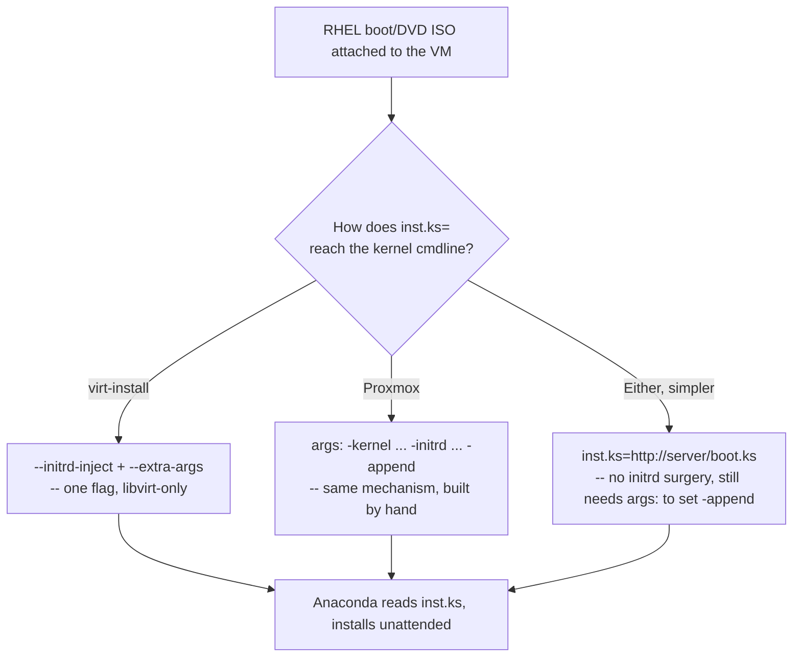

# A libvirt RHEL Kickstart example ported to Proxmox, minus the one flag with no equivalent

[flozanorht/kickstart](https://github.com/flozanorht/kickstart) is a small, real, MIT-licensed pair of Kickstart files and `virt-install` scripts written to accompany a Red Hat Developer article on libvirt. Read directly from the repo rather than described secondhand, both variants (`boot-iso/` — a minimal netinstall image — and `dvd-iso/` — the full install DVD) do the same job: an unattended RHEL 9 install, an unprivileged sudo user with an SSH key instead of root login, and a locally-built `httpd` serving a demo page. Almost every line of it is exactly as portable to Proxmox as it is to libvirt — Kickstart is an Anaconda concept, not a hypervisor one — except the one mechanism that actually gets the kickstart file in front of the installer, which is `virt-install`-specific down to the flag.

## What's genuinely hypervisor-agnostic in the file itself

```
rootpw --lock
```

```
useradd -g wheel core
echo "core:redhat123" | chpasswd
mkdir /home/core/.ssh
cat > /home/core/.ssh/authorized_keys << EOFSSH
REPLACE_WITH_SSH_PUB_KEY
EOFSSH
```

Locking root outright and creating a `wheel`-group user with a key instead isn't just a stylistic choice — it's the *recommended* shape. [`rootpw`'s own option reference](https://pykickstart.readthedocs.io/en/latest/kickstart-docs.html) documents a `--allow-ssh` flag that would let root log in over SSH with only the locked password, and describes it as something to "only use as a last resort." The source repo never reaches for it. `REPLACE_WITH_SSH_PUB_KEY` is a literal placeholder, not a templating variable — filling it in for real means substituting it before the file is served, e.g. `sed -i "s|REPLACE_WITH_SSH_PUB_KEY|$(cat ~/.ssh/id_ed25519.pub)|" boot.ks`.

```
rhsm --organization REPLACE_WITH_ORG_ID --activation-key REPLACE_WITH_ACTIVATION_KEY
```

Only in `boot.ks` — the minimal netinstall image has no packages of its own, so it needs a subscribed content source before `%packages` can pull `httpd`. Per [the `rhsm` command's own docs](https://pykickstart.readthedocs.io/en/latest/kickstart-docs.html), added in RHEL 8's kickstart syntax, activation-key registration needs both an organization ID and at least one key — `dvd.ks` skips this entirely because the full DVD carries its own package set and only declares `cdrom` as the install source.

```
systemctl enable httpd.socket
```

Not `httpd.service` — this is real, current, and worth knowing precisely rather than assuming it's a typo. Fedora/RHEL's own shipped [`httpd.socket` unit](https://src.fedoraproject.org/rpms/httpd/raw/rawhide/f/httpd.socket) listens on port 80 itself (`WantedBy=sockets.target`) and only starts `httpd.service` on the first actual connection — socket activation, not eager startup.

## The one thing that's virt-install-specific, and what it's actually doing

```sh
virt-install --name rhel-boot --os-variant rhel9.5 \
  --location ~/Downloads/rhel-9.6-x86_64-boot.iso \
  --initrd-inject ./boot.ks \
  --extra-args "console=ttyS0 inst.ks=file:/boot.ks"
```

`--location` on an ISO makes `virt-install` mount it, pull the installer's own kernel and initrd out of it, unpack the initrd, drop `boot.ks` in at the root (`--initrd-inject`), repack it, and boot QEMU directly from that modified kernel/initrd pair with `console=ttyS0 inst.ks=file:/boot.ks` on the command line — all of that from one flag. It's a genuine convenience, and it's also entirely a `virt-install` behavior, not a libvirt or QEMU one: nothing about kernel/initrd extraction-and-boot is exclusive to libvirt, but nothing in Proxmox wraps it in a single flag either.

Proxmox's `qm` has no `--location`/`--initrd-inject` equivalent — no dedicated kernel/initrd config keys at all, confirmed by their absence from [the full `qm` configuration reference](https://pve.proxmox.com/pve-docs/qm.1.html). What it does have is `args`, documented plainly as *"Arbitrary arguments passed to kvm... this option is for experts only"* — a generic passthrough for exactly the kind of raw QEMU flag Proxmox's own config keys don't wrap. That's a real, if manual, path to the identical mechanism virt-install automates: extract `vmlinuz`/`initrd.img` from the ISO's own `images/pxeboot/` directory onto the Proxmox host, repack the initrd with the kickstart file added the same way virt-install does it, and set:

```
args: -kernel /var/lib/vz/template/iso/rhel9-vmlinuz -initrd /var/lib/vz/template/iso/rhel9-initrd-with-ks.img -append "console=ttyS0 inst.ks=file:/boot.ks"
```

No convenience flag does this in one step on Proxmox the way `--initrd-inject` does on libvirt — the extraction and repacking are the reader's own to script.

## The simpler alternative, if repacking an initrd is more than the job needs

The kernel argument doesn't have to point at a file baked into the initrd at all. Per [pykickstart's own boot-argument reference](https://pykickstart.readthedocs.io/en/latest/kickstart-docs.html):

```
inst.ks=http://<server>/<path>
```

*"The installation program will look for the kickstart file on the HTTP server... The installation program will use DHCP to configure the Ethernet card."* Serve the filled-in `boot.ks` from anything that can run a web server on the same network the VM's virtual NIC reaches — `python3 -m http.server` on the Proxmox host itself is enough for a lab — and the same `args: ... -append "inst.ks=http://..."` line above no longer needs a modified initrd, only the stock kernel/initrd extracted straight from the ISO with nothing injected into them. Getting that argument onto the command line still needs `args:` (or, per [pykickstart's own kickstart-boot-CD-ROM documentation](https://pykickstart.readthedocs.io/en/latest/kickstart-docs.html), copying `ks.cfg` into the ISO's own `isolinux/` directory before it's attached — a longer-standing, Red-Hat-documented alternative for the boot-media case specifically, not verified here to the same depth as the two paths above).



Worth knowing before scripting any of the above by hand: [Packer](../packer/what-is-packer-and-how-it-works.md) — [second entry in this site's HashiCorp series](../terraform/terraform-opentofu-nomad-packer-how-they-relate.md) — automates exactly this pattern as a first-class feature rather than something to assemble from `args:` and a manually-run web server. Its dedicated `proxmox-iso` builder's `boot_command` types keystrokes at the boot prompt the same way pressing Tab and typing `inst.ks=http://...` by hand does, and `http_directory` spins up the HTTP server for the kickstart file itself — no separate `python3 -m http.server` needed. The generic `qemu` builder documents the identical shape for a plain QEMU/libvirt target: `boot_command = ["<tab> text ks=http://{{ .HTTPIP }}:{{ .HTTPPort }}/centos6-ks.cfg<enter><wait>"]`. The manual version above is what to reach for once, to understand what's actually happening; Packer is what turns it into something reproducible on every build.

## Kickstart versus what this site's other Proxmox entries already use

Every other Proxmox entry here — [injecting `qemu-guest-agent` into a template](inject-qemu-guest-agent-ubuntu-template.md), [debugging cloud-init on first boot](../cloud-init/vendor-data-alongside-terraform-user-data.md) — starts from an already-installed cloud image and configures it at first boot. Kickstart is the other half of unattended provisioning: it drives the *installer itself*, starting from nothing but a stock vendor ISO. Neither replaces the other — cloud images generally don't exist for every OS or every custom partition layout a Kickstart file can express, and Kickstart doesn't help once the OS is already on disk. Which one is the right tool depends on whether there's a suitable cloud image to start from at all.

## What to change from the source before using it anywhere real

`echo "core:redhat123" | chpasswd` is a working demo default, hardcoded in plain text in a file meant to be reused — fine for a scratch VM torn down the same day, a real problem the moment the file is copied into a template that outlives that. The SSH-key placeholder pattern already forces a substitution step before use; the password line is exactly as easy to template the same way, or to drop and rely on the key alone since `rootpw --lock` plus a wheel-group SSH-only user makes the password unnecessary for actual access in the first place.
