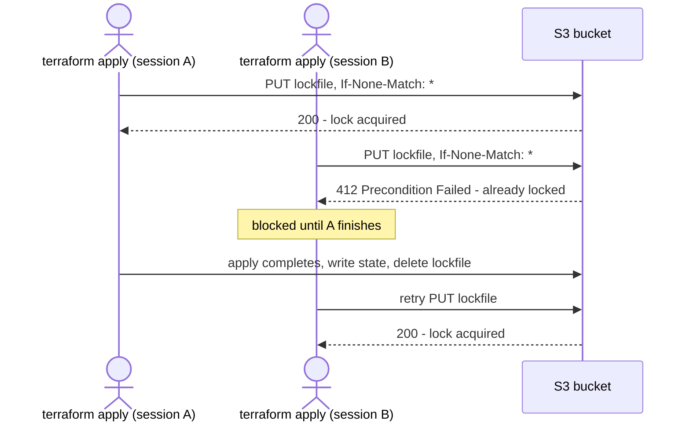

# Terraform state locking just dropped its DynamoDB requirement

Fourth entry in the HashiCorp series. The [Terraform/OpenTofu fundamentals entry](what-is-terraform-opentofu-and-how-it-works.md) covered the state file as "Terraform's memory of what it created" and moved on; this one is the deep dive it deferred — locking, inspecting, refactoring, and reconciling that file, plus a genuinely recent change worth knowing if the last thing you read about state locking was "use DynamoDB."

## Locking: what it's actually for, and what just changed

Locking exists for one reason: two `apply` runs writing state at the same time corrupt it, full stop. For years the answer for the S3 backend was a companion DynamoDB table (`dynamodb_table`) acting as a separate lock service, because S3 itself had no atomic "claim this or fail" primitive.

That's no longer true. S3 added conditional writes (`If-None-Match`), and Terraform built native locking on top of them — introduced experimentally in **1.10**, generally available in **1.11** via a single new argument:

```hcl
# Terraform 1.11+
terraform {
  backend "s3" {
    bucket       = "my-tfstate"
    key          = "prod/network.tfstate"
    region       = "eu-west-1"
    use_lockfile = true
  }
}
```

No second AWS resource, no IAM policy for a DynamoDB table, no separate thing that can drift out of sync with the bucket it's supposed to be locking. Per [Terraform's own 1.11 changelog](https://github.com/hashicorp/terraform/blob/v1.11/CHANGELOG.md), HashiCorp has explicitly deprecated the DynamoDB arguments in favor of this — both can run side by side during a migration, but DynamoDB-based locking is the one going away.



**Where OpenTofu diverges, worth knowing for this series specifically**: OpenTofu also ships `use_lockfile` — same mechanism, same config key — but per [OpenTofu's own S3 backend docs](https://opentofu.org/docs/language/settings/backends/s3/), it explicitly isn't dropping the alternative: *"Both S3 and DynamoDB locking mechanisms are fully supported, and the OpenTofu team has no plans to deprecate either option."* Same feature, opposite long-term stance on the thing it's replacing.

A stuck lock — a crashed CI job, a killed SSH session — doesn't resolve itself; `terraform force-unlock <lock-id>` removes it manually. That's a break-glass command, not a routine one: it exists for when you're certain the process that held the lock is actually dead, not for when `apply` is merely taking a while.

## Looking inside state without editing the file by hand

The `terraform state` subcommands are the supported way to inspect and adjust the file. Per [Terraform's CLI reference](https://developer.hashicorp.com/terraform/cli/commands/state):

```sh
terraform state list                       # every resource address currently tracked
terraform state show aws_instance.web      # full attributes for one resource, as state has them
terraform state mv aws_instance.a aws_instance.b   # rename an address in state, no destroy/create
terraform state rm aws_instance.old        # stop tracking it, without touching the real resource
terraform state pull                       # print the raw remote state as JSON
terraform state push                       # overwrite remote state from a local file (rare, deliberate)
```

Every subcommand that modifies state writes a local backup first — not optional, not configurable off. `state push` additionally refuses to run if the source and destination state have different lineage, or if the destination's serial number is higher than what you're pushing — both signs you're about to silently discard data. `-force` overrides that check; the docs are blunt that it's not recommended.

## Refactoring without a destroy: `moved` and `removed`

`terraform state mv` does the same job as the two blocks below — it's just imperative and typed once at the terminal, rather than declared in code where the next `plan` shows it as a reviewable change.

**`moved`** (Terraform 1.1+) records that a resource's address changed — a rename, a move into a module — so Terraform updates the existing state entry in place instead of destroying the old address and creating the new one:

```hcl
moved {
  from = aws_instance.web
  to   = aws_instance.app
}
```

**`removed`** (Terraform 1.7+) is the declarative version of `state rm` — take something out of management, optionally without destroying the real infrastructure:

```hcl
removed {
  from = aws_instance.legacy

  lifecycle {
    destroy = false
  }
}
```

Both are already-fully-supported in OpenTofu (`removed` shipped there too, despite landing in Terraform after the fork point), and both share the same advantage over the CLI equivalents: they live in version control, so a teammate reviewing the PR sees exactly what's about to happen to state before it happens, rather than trusting that whoever ran the `mv`/`rm` command did it correctly.

## Importing: the CLI command, and the block that replaced it for most cases

`terraform import <address> <id>` is the original way to bring an existing resource under management — imperative, one resource per invocation, and it gives you no preview: the import just happens.

Since **Terraform 1.5**, the `import` block does the same job declaratively, as part of a normal plan:

```hcl
import {
  to = aws_instance.web
  id = "i-0123456789abcdef0"
}
```

`terraform plan` then shows the import as a planned action alongside everything else, and pairing it with `-generate-config-out=generated.tf` has Terraform write a first-draft HCL resource block for anything imported this way that doesn't already have configuration — a real time-saver for adopting existing infrastructure, with the generated file meant to be reviewed and cleaned up, not applied blindly.

## Drift: `plan` already checks, `-refresh-only` is for reconciling on purpose

Every `terraform plan` starts by refreshing its view of real infrastructure and diffing that against state — drift detection isn't a separate feature, it's step one of the normal workflow described in [the fundamentals entry](what-is-terraform-opentofu-and-how-it-works.md). What's worth knowing separately is the case where the drift is *expected* and you want state to catch up without touching the real resources at all:

```sh
terraform plan -refresh-only
terraform apply -refresh-only
```

This updates state to match reality — a tag someone added by hand in the console, for instance — without generating any change to actually apply against the infrastructure. Skipping the `-refresh-only` apply and going straight to a normal `apply` after a manual change risks Terraform "fixing" the drift by reverting it, which is correct behavior for an unwanted change and exactly wrong for one you meant to keep.

## Where this series goes next

Modules — input/output contracts, and local paths versus the Registry — followed by ephemeral values and write-only arguments for handling secrets, and finally the handful of things OpenTofu has that Terraform genuinely doesn't.
