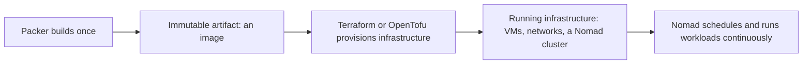

# What Terraform/OpenTofu, Nomad, and Packer are, and how they relate

Third entry in the HashiCorp infrastructure series. Each tool so far has been introduced on its own; this one is the point of doing that — seeing where each one's job actually starts and stops, using Nomad (not yet covered) to complete the set.

## Three tools, three different relationships to state

| | Packer | Terraform/OpenTofu | Nomad |
|---|---|---|---|
| **What it manages** | One build, once | Infrastructure resources, over time | Running workloads, over time |
| **State it keeps** | None — nothing survives past the artifact | A state file, updated on each `apply` | A live Raft-replicated cluster state |
| **What's running after the tool "finishes"** | Nothing. The build instance is destroyed; only the artifact remains | Nothing — the CLI exits; the infrastructure keeps existing but nothing is watching it | The cluster itself. Nomad agents keep running indefinitely |

Packer and Terraform/OpenTofu both *exit* — neither leaves a process behind watching anything. Nomad is the odd one out: it's the only one of the three that's actually a long-running system with something continuously deciding things, the same way a Kubernetes control plane is.

## Nomad, briefly: what it actually is

Nomad is HashiCorp's workload scheduler — given a job description, it decides which machine in the cluster runs it, and keeps it running there. A few things that make it a genuinely different shape than Terraform/OpenTofu or Packer:

- It's **one binary**, `nomad`, [running in either server or client mode](https://developer.hashicorp.com/nomad/docs/deploy/nomad-agent) (or both, in dev mode) — not a control plane assembled from several different binaries the way Kubernetes needs `kube-apiserver`, `etcd`, `kube-scheduler`, and `kube-controller-manager` as separate processes.
- Nomad servers replicate cluster state to each other using [the Raft consensus algorithm](https://developer.hashicorp.com/nomad/docs/concepts/consensus) — there's no separate datastore to run and back up the way Kubernetes needs etcd.
- Placement is a live, continuous decision: per [Nomad's own architecture docs](https://developer.hashicorp.com/nomad/docs/concepts/architecture), servers "compute task placements" using bin packing, constantly matching jobs to available client capacity — this is Nomad's own version of a reconcile loop, running the whole time the cluster is up, not something you trigger.

## How the three actually chain together

A realistic order of operations: **Packer** builds a machine image with Nomad pre-installed and configured. **Terraform/OpenTofu** takes that image's ID as an input variable and provisions the actual VMs, networking, and load balancers that become the Nomad cluster — a one-time (well, one-`apply`-at-a-time) act of standing up infrastructure. Once that infrastructure exists, **Nomad**'s own agents take over and keep running, continuously scheduling whatever jobs get submitted to it — the only one of the three still doing anything an hour later.

## The pattern across all three (and Kubernetes)

Packer's job is bounded: build, hand off an artifact, done. Terraform/OpenTofu's job is triggered: nothing happens until you run it, and nothing keeps happening after it exits. Nomad's job — like Kubernetes' — never really finishes: it's a live loop, continuously reconciling what should be running against what actually is. Knowing which category a tool falls into before touching it says a lot about what kind of surprises to expect: a stale Packer image doesn't drift on its own, an un-reapplied Terraform config can drift silently underneath you, and a misbehaving Nomad job gets rescheduled whether you asked it to or not.
