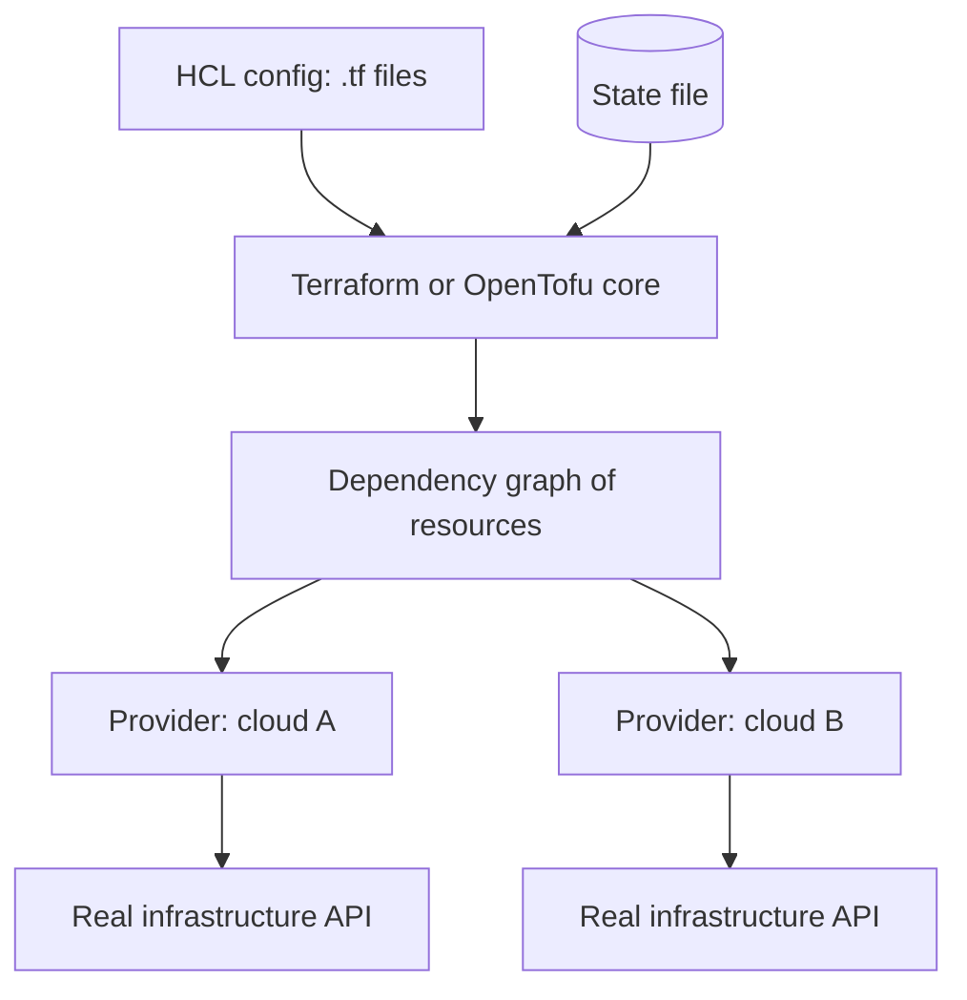
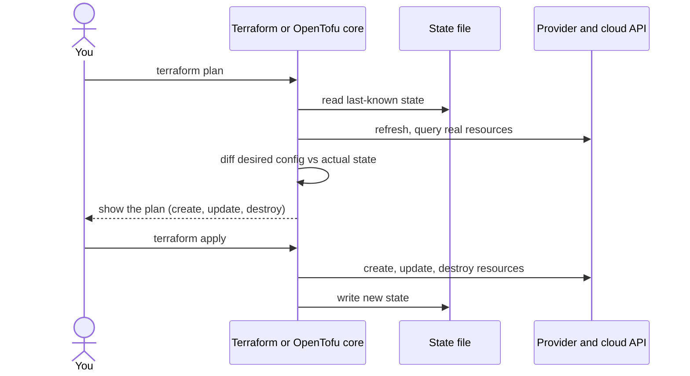

# What Terraform/OpenTofu actually is, and how it works

Starting a second from-scratch series, this time on HashiCorp's infrastructure tooling: Terraform/OpenTofu, Packer, and Nomad. First subject: what Terraform/OpenTofu actually does under the hood, since almost everything else about it follows from one thing — it only ever converges when you tell it to, unlike a system with a live controller watching state continuously.

## Terraform and OpenTofu are the same tool, split by a license change

[OpenTofu is a fork of Terraform](https://opentofu.org/faq/), created after HashiCorp switched Terraform's license to the BUSL. The fork is now governed by the Linux Foundation and aims to stay at feature parity with Terraform going forward. Practically: same HCL syntax, same state file format, same provider ecosystem, same commands — everything in this TIL applies to both, and either binary would run the examples.

## The pieces

- **HCL config** is what you write: `resource`, `data`, `variable`, `module` blocks describing the infrastructure you want.
- **The state file** is Terraform's memory of what it created last time — resource IDs, attributes, the works. Without it, Terraform has no way to know a resource it manages already exists.
- **Providers** are plugins that translate generic resource blocks into actual API calls — the AWS provider knows how to create an EC2 instance, the Cloudflare provider knows how to create a DNS record. Terraform core itself doesn't know how to talk to any cloud; every provider does.
- Terraform core's own job is building a **dependency graph** from your config (this resource references that one's output, so it must be created first) and walking it in the right order.

## Write, plan, apply — and nothing runs in between

Per [Terraform's own docs](https://developer.hashicorp.com/terraform/intro/core-workflow), the core workflow is three steps: **write**, **plan**, **apply**. `plan` refreshes its view of real infrastructure by querying providers, compares that against both the state file and your HCL, and shows you exactly what it would create, change, or destroy — without touching anything yet. `apply` is the only step that actually calls providers to change infrastructure.

The thing worth sitting with: **there is no daemon.** Between one `apply` and the next, nothing is watching whether the real infrastructure has drifted from what's in the state file. If someone changes a security group rule by hand in the cloud console, Terraform doesn't notice or correct it until you run `plan` again. That's the opposite of a system built around a continuously running controller — Terraform's convergence is something you trigger, not something that's always happening.

## Where this series goes next

Packer builds the images Terraform then provisions infrastructure from, and Nomad is what actually runs workloads on infrastructure Terraform stood up. The next two entries cover each in turn, then a final one on how the three actually fit together.
