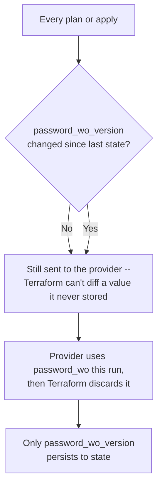

# What Terraform, OpenTofu, and Packer promise about secrets, and where each promise stops

The Ansible Vault entry on this site was framed around a boundary Ansible states outright: encryption there "ONLY protects data at rest." Terraform's equivalent — the `sensitive` argument — makes no such promise, and it's worth being precise about which of the three tools actually has a way to keep a value off disk at all, because only two of them do, and Packer isn't either one.

## `sensitive` never touches state, and Terraform's own docs say so

`sensitive = true` on a variable looks like the vault tag's HCL cousin — mark the value, and Terraform hides it:

```hcl
variable "db_password" {
  type      = string
  sensitive = true
}
```

Plan output shows `(sensitive value)` instead of the string, and any expression that depends on a sensitive value inherits the same masking. That's the entire feature. Per [Terraform's own docs on the subject](https://developer.hashicorp.com/terraform/language/values/variables#suppressing-values-in-cli-output), stated as plainly as Ansible's own vault warning:

> Terraform will still record sensitive values in the state, and so anyone who can access the state data will have access to the sensitive values in cleartext.

`sensitive` is a display filter over the CLI, nothing more — the same category of protection as Podman's file secrets driver being "read-protected" rather than encrypted, [already covered on this site](../ansible/ansible-vault-podman-secrets.md). The docs go further, naming a second gap in the same section: *"A `sensitive` variable is a configuration-centered concept, and values are sent to providers without any obfuscation. A provider error could disclose a value if that value is included in the error message."* A masked plan diff says nothing about what a provider's own stack trace might print.

## Ephemeral values: the thing that actually keeps a value out of state

Terraform 1.10 added a property that does what `sensitive` never did — keep the value out of the artifact entirely:

```hcl
variable "session_token" {
  type      = string
  ephemeral = true
}
```

Per [Terraform's variables docs](https://developer.hashicorp.com/terraform/language/values/variables#exclude-values-from-state): *"Terraform omits ephemeral values from state and plan files... unlike `sensitive` inputs, Terraform ensures ephemeral values are not available beyond the lifetime of the current Terraform run."* That's a real, structural difference from `sensitive`, not a stronger flavor of the same thing.

The tradeoff is that an ephemeral value is contagious and narrowly usable. Referencing one anywhere makes the referencing expression ephemeral too — *"`local.database_password` is implicitly ephemeral because it depends on `var.password`"* — and an ephemeral value can only be used in a specific list of contexts: a write-only argument, another ephemeral variable, a local value, an ephemeral resource, or an ephemeral output. Anywhere else, Terraform errors rather than silently keeping the value around.

## Write-only arguments, and the workaround their statelessness requires

Ephemeral variables need somewhere to actually land on a resource, and that's what write-only arguments (1.11+) are for — a resource argument whose value Terraform hands to the provider and then discards, never writing it to state or plan:

```hcl
resource "aws_db_instance" "example" {
  # ...
  password_wo         = ephemeral.random_password.db_password.result
  password_wo_version = 1
}
```

The mechanism this creates is worth tracing rather than assuming: without a stored value, Terraform has nothing to diff a write-only argument against on the next run. Per [Terraform's own write-only argument docs](https://developer.hashicorp.com/terraform/language/resources/ephemeral/write-only): *"Terraform does not store write-only arguments in state files, so Terraform has no way of knowing if a write-only argument value has changed. Because Terraform cannot track write-only argument values, it sends write-only arguments to the provider during every operation."* Every plan, every apply, whether or not the password actually changed — statelessness here isn't free, it's a standing cost paid on every run. The paired `_version` argument (`password_wo_version`) is how a provider recovers change detection despite that: Terraform *does* store the version number, so incrementing it is what actually signals "use the new value" — the write-only argument itself carries no signal at all.



## Local state was always plain-text JSON, and remote state is a maybe

None of the above changes a fact that predates ephemeral values entirely. Per [Terraform's own docs on sensitive data in state](https://developer.hashicorp.com/terraform/language/state/sensitive-data): *"When using local state, state is stored in plain-text JSON files."* Remote state fares better only conditionally — *"It may be encrypted at rest, but this depends on the specific remote state backend."* The S3 backend needs its `encrypt` option explicitly turned on; HCP Terraform "always encrypts state at rest," per the same page — but a backend choice is not a language feature, and nothing enforces it. Ephemeral values and write-only arguments exist specifically because this baseline was never going to change: the only way to keep a value out of a plain-text state file is to never let Terraform write it there in the first place.

## OpenTofu's actual answer, and what it still doesn't cover

This is the fork divergence the site's [Terraform/OpenTofu fundamentals entry](what-is-terraform-opentofu-and-how-it-works.md) already flagged as a headline feature without detailing it — and it's the one item from that queue worth pulling forward here, since it's squarely a secrets feature rather than a full OpenTofu-only survey (that comparison is its own future entry). Per [OpenTofu 1.7.0's own CHANGELOG](https://github.com/opentofu/opentofu/blob/v1.7/CHANGELOG.md), verbatim: *"We're introducing optional end-to-end encryption for state files."* AES-GCM as the encryption method, with a passphrase (via PBKDF2), AWS KMS, GCP KMS, and OpenBao as the original key providers — Azure Key Vault has since joined the list. Terraform has no equivalent; this is the actual, load-bearing "handful of things OpenTofu genuinely has" fact, not a footnote.

Even here, OpenTofu's own docs are careful about exactly what the feature buys, in a caveat that lands in the same place as everything above: *"OpenTofu does not and cannot protect the sensitive values in the state file from the person running the `tofu` command."* [State encryption](https://github.com/opentofu/opentofu/blob/main/website/docs/language/state/encryption.mdx) closes the stolen-file threat — an attacker who gets the state file off disk or out of a bucket gets ciphertext. It does nothing about the operator who is supposed to be running `tofu plan` in the first place, which is exactly the boundary Ansible's own vault guide draws around "data at rest" too: a promise about a file sitting still, not about anyone legitimately allowed to touch it.

## Packer has no state file, and its `sensitive` flag says so by what it doesn't claim

Packer's own `sensitive` argument reads almost identically to Terraform's:

```hcl
variable "admin_password" {
  sensitive = true
  default   = "SECR3TP4SSW0RD"
}
```

Per [Packer's own docs](https://developer.hashicorp.com/packer/docs/templates/hcl_templates/variables#suppressing-sensitive-variables), what it actually does is narrower even than Terraform's version: *"all string-values from that variable will be obfuscated from Packer's output"* — demonstrated with exactly one example, `packer inspect`. Nothing in the same page addresses provisioner console output during an actual build, or anything about the artifact `packer build` produces.

That gap is structural, not an oversight. Terraform and OpenTofu both have a state file to protect and a well-defined "run" boundary to keep a value inside. Packer has neither — its one artifact is the image itself, and once a provisioner writes a value into that image's filesystem, into a baked-in config file, or into its own shell history inside the build, there's no equivalent of "data at rest" left to protect it. The closest thing to a real secrets story Packer has is its [`vault()` HCL function](https://developer.hashicorp.com/packer/docs/templates/hcl_templates/functions/contextual/vault), which reaches out to an actual running HashiCorp Vault server at build time — `vault("secret/data/hello", "foo")` — paired with a `local` block's own `sensitive = true` to keep the fetched value out of console output. It's a real integration, but it answers "where does the secret come from," not "what happens to it once a provisioner has it." That second question is entirely on whatever script runs inside the build.

## The shape underneath all four

Ansible Vault, Terraform's `sensitive`, and Packer's `sensitive` all share a naming trap: each looks like the strong guarantee, and each is actually the weak one — a display filter, not an encryption boundary. The features that do the real work are named for what they specifically exclude — `ephemeral`, `write-only`, OpenTofu's `encryption` block — not for the general idea of secrecy. Reaching for the term that sounds most like "vault" is the reliable way to reach for the wrong tool across every one of these ecosystems.
