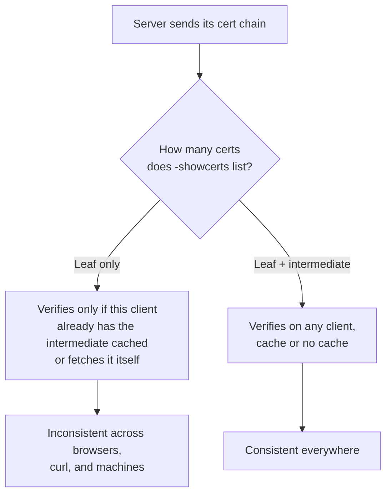

# Diagnosing "works in some browsers, fails in others" with a missing intermediate

A site loads fine in one browser and fails TLS verification in another, or in `curl`, or in a Java client — the classic symptom of a server that sends its own certificate but not the intermediate CA certificate that vouches for it. Confirmed by building a real broken chain locally rather than describing the symptom secondhand.

## Pull the chain straight off the wire

```sh
openssl s_client -showcerts -connect example.com:443 -servername example.com </dev/null
```

`-servername` matters for the same SNI reason it does everywhere else on this site: without it, a server hosting multiple certificates might hand back its default one rather than the one for the host actually asked about. `-showcerts` is what makes this command useful for chain diagnosis specifically — without it, `s_client` only shows the leaf certificate, and an incomplete chain looks identical to a complete one at a glance.

The line to check is at the bottom of the output:

```text
Verify return code: 0 (ok)
```

## What that line actually depends on — reproduced locally

`Verify return code: 0` doesn't mean "the server's chain is complete" in the abstract — it means *this specific run, on this specific machine, could complete a chain to a trusted root using what the server sent plus what's already in the local trust store*. Those are different claims, and the gap between them is exactly why a broken chain can pass on one machine and fail on another.

Built a throwaway 3-tier PKI (root → intermediate → leaf for `example.test`) to see the exact failure rather than assume it:

```sh
# Server configured to send ONLY the leaf certificate -- the actual bug
openssl s_server -accept 14443 -cert leaf.crt -key leaf.key -naccept 1 -quiet &

openssl s_client -showcerts -connect 127.0.0.1:14443 \
  -servername example.test -CAfile root.crt </dev/null
```

```text
Verification error: unable to verify the first certificate
...
Verify return code: 21 (unable to verify the first certificate)
```

Adding the intermediate to what the server sends — nothing else changes, same root, same client — flips it:

```sh
openssl s_server -accept 14444 -cert leaf.crt -key leaf.key \
  -cert_chain inter.crt -naccept 1 -quiet &
```

```text
 0 s:CN = example.test
   i:CN = Test Intermediate CA
 1 s:CN = Test Intermediate CA
   i:CN = Test Root CA
Verify return code: 0 (ok)
```

`-showcerts` numbers what the server actually transmitted, in order: index `0` is always the leaf, each following one certifies the one before it. The root is correctly absent from both runs — the server was never configured to send it, and shouldn't be; every client that would trust the chain at all already has the root, and sending it just wastes a handshake round trip.

## Why "it works for me" doesn't settle it

Code 21 above only happens because the test client's trust store had *just* the root and nothing else. A real machine's trust store sometimes already has a copy of the missing intermediate cached — from a previous connection to some other site signed by the same CA, or one some OS trust bundles ship directly — in which case the same broken server would verify fine there and nowhere else. Some browsers go further and actively fetch a missing intermediate over the network using the certificate's own Authority Information Access URL when the server didn't send one; `openssl s_client` does no such fetching — `-untrusted` (used below) only builds a chain from files handed to it explicitly, per [`openssl-verify`'s own documentation](https://www.openssl.org/docs/man3.0/man1/openssl-verify.html). That asymmetry is the actual mechanism behind "works in Chrome, fails in curl": it's not that Chrome is more lenient about incomplete chains, it's that some clients quietly complete the chain themselves and others don't. A clean `openssl s_client` run from a fresh machine or container — one that hasn't accumulated any cached intermediates — is a more reliable signal than checking from whatever machine happens to be sitting on your desk.



## Extracting and inspecting the chain

```sh
openssl s_client -showcerts -connect example.com:443 -servername example.com </dev/null 2>/dev/null \
  | sed -n '/BEGIN CERTIFICATE/,/END CERTIFICATE/p' > chain.pem

openssl crl2pkcs7 -nocrl -certfile chain.pem | openssl pkcs7 -print_certs -noout
```

`crl2pkcs7 -nocrl` repurposes a command built for a different job — bundling certificates alongside a CRL — to just bundle certificates, since `-nocrl` says there's no CRL to include. Piping into `pkcs7 -print_certs -noout` then prints subject and issuer for every certificate `chain.pem` contains, in order, which is the fastest way to confirm how many links are actually in what the server sent without opening each PEM block by hand. [The single-certificate version of this](openssl-checking-cert-dates-and-details.md) — `openssl x509 -noout -subject -issuer` on one cert at a time — is the right tool once it's the chain itself, not just the leaf, that needs a closer look.

## Fix it at the source, not in the browser

If the chain is incomplete, the fix is the server or load balancer configuration — usually a `fullchain.pem`/intermediate bundle setting, not a separate leaf-only cert file — never something to work around client-side. A client that happens to verify anyway is verifying by accident, not because the server is actually configured correctly.
