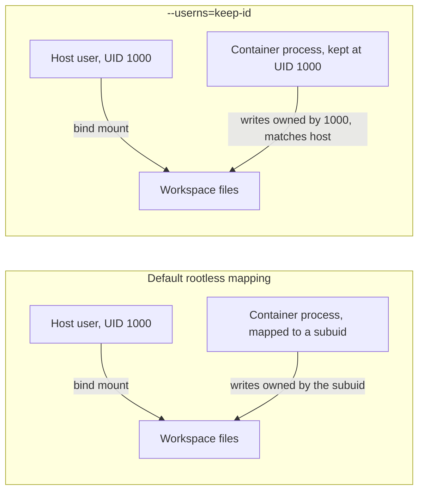

# Pointing VS Code's Dev Containers extension at Podman

One setting switches the Dev Containers extension from Docker to Podman — but a `devcontainer.json` written with only that setting still breaks the moment it bind-mounts the workspace, for a reason specific to rootless Podman.

## The one setting

Per [VS Code's own docs](https://code.visualstudio.com/remote/advancedcontainers/docker-options):

```json
// .vscode/settings.json
{
  "dev.containers.dockerPath": "podman"
}
```

That's the entire redirect — the extension shells out to `podman` for every build/run/exec it would otherwise send to `docker`, on Linux, Windows, or macOS alike. Podman's CLI is Docker-compatible enough that most `devcontainer.json` files need no other change to build and start.

## Where it still breaks: file ownership on the mounted workspace

The default `workspaceMount` bind-mounts your project directory straight into the container. Rootless Podman, left to its default user-namespace mapping, runs the container's processes under a *subuid* range that doesn't match your own UID — so files the container creates land owned by some UID like `100999`, not the `1000` (or whatever) your host user actually is. Nothing is broken from the container's own point of view; it's the host side where "wait, why can't I edit this file I didn't create as root" shows up.

The fix is one `runArgs` entry:

```json
{
  "runArgs": ["--userns=keep-id"]
}
```

Per [Podman's own documentation](https://docs.podman.io/en/latest/markdown/podman-run.1.html), `keep-id` does exactly what the name says — it maps your host UID to the *same* UID inside the container, rather than into the subuid range: *"the processes running in the container run as the user's UID, they can read/write files owned by the user."*



## The other one, SELinux-specific — and why AppArmor doesn't need it

On Fedora or RHEL (SELinux enforcing by default), a bind mount also needs a relabel suffix or the container's process gets denied access to files it should be able to read:

```json
{
  "mounts": [
    "source=${localEnv:HOME}/.ssh,target=/home/vscode/.ssh,type=bind,readonly,Z"
  ]
}
```

Per [Podman's own volume docs](https://docs.podman.io/en/latest/markdown/podman-run.1.html), the `:Z` suffix "tells Podman to label the content with a private unshared label" so SELinux permits the container to use it. On a non-SELinux host (most Ubuntu/Debian desktops) it's simply ignored — harmless to include everywhere, but easy to forget until the first `Permission denied` on a machine that actually enforces it.

**Ubuntu/Debian's AppArmor has no equivalent flag, and that's not an oversight** — the two confinement models work differently at the level that matters here. SELinux labels individual files and checks the label on every access, which is exactly why a *bind-mounted* file needs relabeling before a confined process can touch it. AppArmor confines a process by profile, not by labeling filesystem objects, so there's nothing per-mount to set: per [`containers.conf`'s own documentation](https://github.com/containers/common/blob/main/docs/containers.conf.5.md), Podman generates and loads a default `container-default` AppArmor profile automatically, and a bind mount just works under it without a `:Z`-style suffix. The AppArmor equivalent of reaching for `label=disable` on SELinux is `--security-opt apparmor=unconfined` — a whole-container escape hatch, only needed if the container does something the default profile actually blocks (loading kernel modules, raw sockets, that class of thing), which a devcontainer running `terraform`/`ansible-playbook` normally doesn't.

Neither of these two is Docker-specific advice ported over; both are rootless-Podman realities that only surface once you've actually made the switch — the same territory this site's [rootless Podman entry](../podman/root-vs-rootless-rhel10-ubuntu2604.md) covers from the CLI side rather than the devcontainer side.

## Put together: a container for running Terraform and Ansible, not just editing them

This is the shape it actually takes for infrastructure-as-code work — a container with `tofu`/`terraform` and `ansible-playbook` installed and runnable, not just their file types syntax-highlighted:

```json
// .devcontainer/devcontainer.json
{
  "name": "iac-toolbox",
  "build": { "dockerfile": "Dockerfile" },
  "runArgs": ["--userns=keep-id"],
  "mounts": [
    "source=${localEnv:HOME}/.ssh,target=/home/vscode/.ssh,type=bind,readonly,Z"
  ],
  "postCreateCommand": "make setup",
  "customizations": {
    "vscode": {
      "extensions": ["hashicorp.terraform", "redhat.ansible"]
    }
  }
}
```

The extensions are what make this an IaC container specifically — `hashicorp.terraform` for HCL formatting and validation, `redhat.ansible` for YAML/Jinja linting against real role and playbook schemas — while `--userns=keep-id` and the `:Z`-suffixed SSH mount from above are what make `terraform apply` and `ansible-playbook -i inventory` actually usable from inside it: an SSH key rootless Podman can't read, or a state file the host user can't write back to after the container edits it, defeats the point of running either tool in a container at all.

The [HashiCorp series](../terraform/what-is-terraform-opentofu-and-how-it-works.md) and [RKE2/Kubernetes series](../kubernetes/what-is-kubernetes-and-how-it-works.md) on this site are exactly the kind of work a container built this way is for — a reproducible place to run `terraform`/`tofu` and `ansible-playbook` without installing either toolchain on bare metal.

## Ansible Execution Environments raise a different question: containers inside the container

`redhat.ansible` — already in the example above — supports a second mode: instead of running the `ansible` on whatever's installed in the devcontainer, it can shell out to an **Execution Environment**, a container image with a pinned `ansible-core` version and collections baked in (the same mechanism `ansible-navigator`/`ansible-builder` use in CI). That's a real fork in the road once the devcontainer is already a container, because an EE run from inside it means Podman launching a *second* container from within the first one.

Two settings decide whether that question even comes up. Per the extension's own [`package.json` schema](https://github.com/ansible/vscode-ansible/blob/main/package.json):

```json
{
  "ansible.executionEnvironment.enabled": false,
  "ansible.executionEnvironment.containerEngine": "auto"
}
```

`enabled` defaults to **`false`** in the VS Code extension — worth knowing precisely because `ansible-navigator`'s own CLI default is the opposite (`execution-environment.enabled: true`, `container-engine: auto`, meaning podman first, docker second). Left at the extension's default, `redhat.ansible` just runs `ansible-lint`/`ansible-playbook` against whatever `ansible-core` is on the devcontainer's own `PATH` — no nested container, no question to answer. That's also why the earlier example installs Ansible into the devcontainer image directly via `postCreateCommand: "make setup"` rather than pointing at an EE image: for a devcontainer that's already a controlled, reproducible environment, the devcontainer *is* the execution environment, and there's nothing further to nest.

Flip `executionEnvironment.enabled` to `true` — say, to run the exact same EE image (default `ghcr.io/ansible/community-ansible-dev-tools:latest`) that CI uses — and now Podman inside the devcontainer has to launch another container, genuinely nested. Rootless Podman-in-rootless-Podman is generally workable (unlike Docker-in-Docker, it doesn't need a privileged daemon), but it's a real added layer, not a free abstraction — worth reaching for only when matching CI's exact EE image is the actual goal, not by default. If you do enable it, the EE's own volume mounts carry the identical SELinux concern this entry already covered: `execution-environment.volume-mounts` takes an `options` field, and setting it to `"Z"` is `ansible-navigator` relabeling its own bind mounts into the EE container for exactly the same reason `:Z` shows up on the devcontainer's mounts above.
