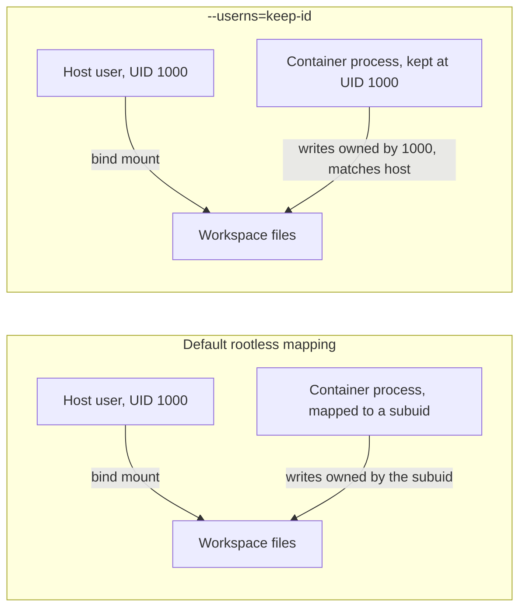

# Pointing VS Code's Dev Containers extension at Podman

One setting switches the Dev Containers extension from Docker to Podman — but a `devcontainer.json` written with only that setting still breaks the moment it bind-mounts the workspace, for a reason specific to rootless Podman.

## The one setting

Per [VS Code's own docs](https://code.visualstudio.com/remote/advancedcontainers/docker-options):

```json
// .vscode/settings.json
{
  "dev.containers.dockerPath": "podman"
}
```

That's the entire redirect — the extension shells out to `podman` for every build/run/exec it would otherwise send to `docker`, on Linux, Windows, or macOS alike. Podman's CLI is Docker-compatible enough that most `devcontainer.json` files need no other change to build and start.

## Where it still breaks: file ownership on the mounted workspace

The default `workspaceMount` bind-mounts your project directory straight into the container. Rootless Podman, left to its default user-namespace mapping, runs the container's processes under a *subuid* range that doesn't match your own UID — so files the container creates land owned by some UID like `100999`, not the `1000` (or whatever) your host user actually is. Nothing is broken from the container's own point of view; it's the host side where "wait, why can't I edit this file I didn't create as root" shows up.

The fix is one `runArgs` entry:

```json
{
  "runArgs": ["--userns=keep-id"]
}
```

Per [Podman's own documentation](https://docs.podman.io/en/latest/markdown/podman-run.1.html), `keep-id` does exactly what the name says — it maps your host UID to the *same* UID inside the container, rather than into the subuid range: *"the processes running in the container run as the user's UID, they can read/write files owned by the user."*



## The other one, only on SELinux hosts

On Fedora or RHEL (SELinux enforcing by default), a bind mount also needs a relabel suffix or the container's process gets denied access to files it should be able to read:

```json
{
  "mounts": [
    "source=${localEnv:HOME}/.ssh,target=/home/vscode/.ssh,type=bind,readonly,Z"
  ]
}
```

Per [Podman's own volume docs](https://docs.podman.io/en/latest/markdown/podman-run.1.html), the `:Z` suffix "tells Podman to label the content with a private unshared label" so SELinux permits the container to use it. On a non-SELinux host (most Ubuntu/Debian desktops) it's simply ignored — harmless to include everywhere, but easy to forget until the first `Permission denied` on a machine that actually enforces it.

Neither of these two is Docker-specific advice ported over; both are rootless-Podman realities that only surface once you've actually made the switch — the same territory this site's [rootless Podman entry](../podman/root-vs-rootless-rhel10-ubuntu2604.md) covers from the CLI side rather than the devcontainer side.
